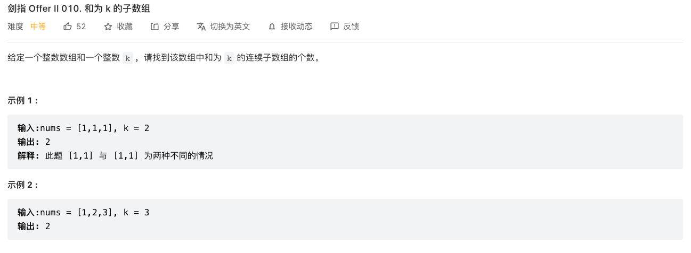
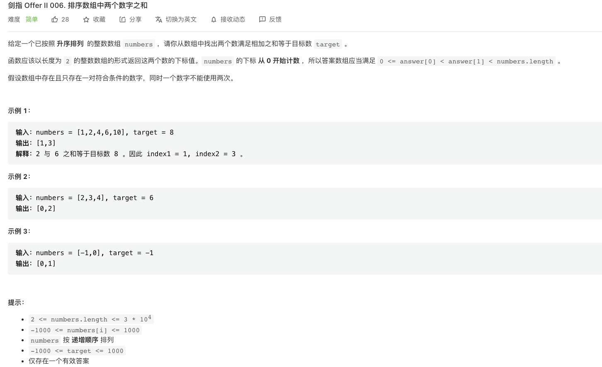
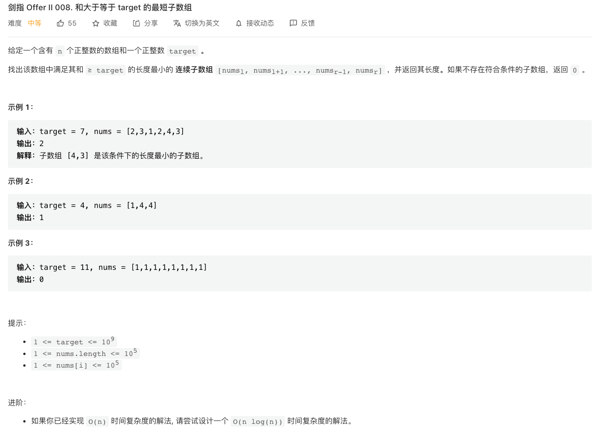
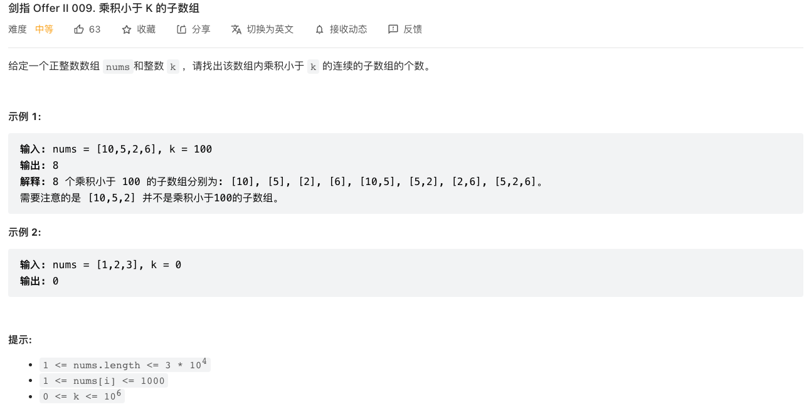
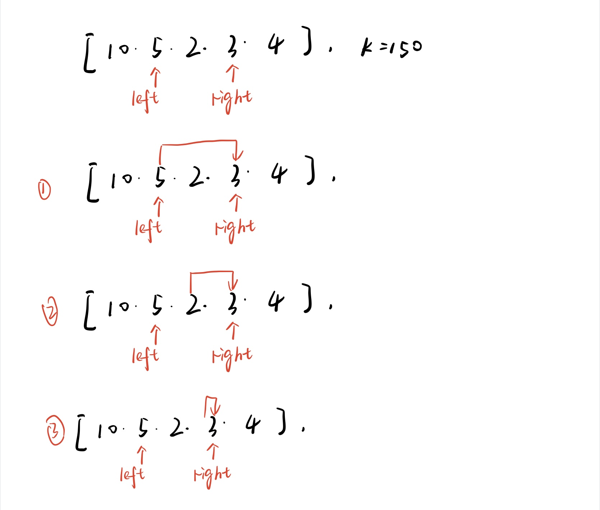
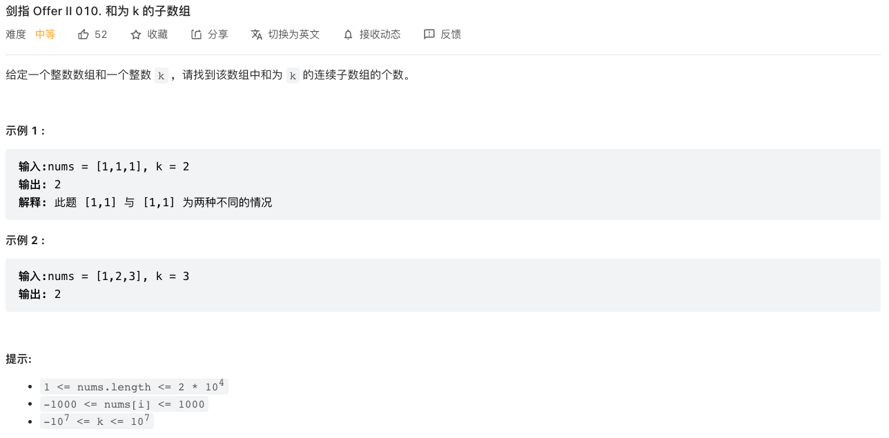
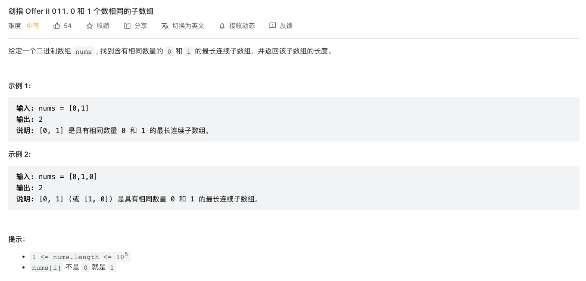
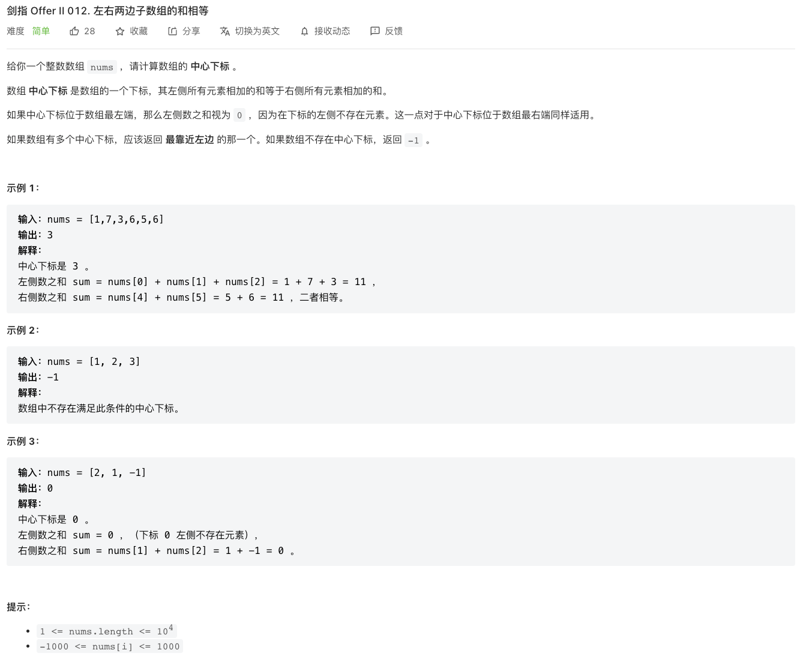

# Array

## 思路总结

数组的很多题目实际和指针比较类似，解题思路也可以相互借鉴。

### 双指针

数组中的双指针指的是通过两个指针分别指向了数组的两个不同的元素，通过移动两个指针的位置来求解一下和数组中的元素相关的信息。

两个指针通常可以确认的东西很多，包括有

- 两个元素
- 一段范围内的多个元素，一个子数组
- 两个元素之间的一个间隔
- 定位某个元素
- ....

常见的适用问题类型有

- 数组中两个元素之和、乘积之类的问题
- 数组中子数组的乘积、求和之类的问题

另外要注意的一个是，双指针使用于数组中元素都是相同符号的情况，例如都是正数或者负数，这样当指针移动，双指针内的元素增加的时候，我们计算的结果是恒增或者恒减的。

如果数组中元素有正数和负数，那在移动指针时，双指针内元素增多的时候，元素的求和、乘积等不一定会增大。

#### 同向双指针

- 两个方向相同的双指针，通常用来求解与数组中某一段子数组的乘积、求和相关的题目，或者是间隔k的两个元素之间的关系等。

- 同向的双指针还可以用来处理一下最短子数组的问题

#### 反向双指针

- 反向的两个双指针在一些有序的数组中查找元素时候非常有效，相当于是优化版的二分查找。常见的问题类型可能有求解两个或者多个元素的和的问题
- 反向的双指针可以用来处理一些最长子数组的问题

### 前缀和

#### 抽象过程

前缀和指的是对一个数组中的每个元素a[i]，我们计算从数组第一个元素开始，到这个a[i]之间的所有元素的求和 sum[i]，也就是说

- $sum[i]= a[0] + a[1] + ... + a[i]$
- $sum[i] = a[i] + sum[i-1]$
- $sum[j] - sum[i-1] = a[i] + a[i+1] + ... + a[j]$

更为抽象得来看，我们不一定是要对前缀进行求和，还可能是求乘积等等。

假设题目给了数组$a$和一个目标数字$k$，以及对数组元素的某种操作$f(a_i)$，要求解数组中满足$k = f(a_j,a_{j+1},...,a_i)$的连续子数组

- 按照操作$f(a_i)$，一次求出数组对应的前缀数组$F$，其中$F(i) = f(a_0,a_1,...,a_i)$

- 然后对前缀数组进行遍历

  - 对于每个下标$i$，我们假设存在另外一个下标$j$，满足$k = f(a_j,a_{j+1},...,a_i)$，也即是$k=F(i)  - F(j-1)$

  - 因为$k=F(i)  - F(j-1)$，也即是$F(j-1) = F(i)  - k$，进而问题转化成求解满足$F(j-1) = F(i)  - k$的下标$j$
  - 如果存在下标$j$满足$F(j-1) = F(i)  - k$,因为$F(j-1) = F(i) - f(a_j,a_{j+1},...,a_i)$，也就是说下标$j$到$i$的这一段子数组是满足条件的

这里$F(j-1) = F(i) - f(a_j,a_{j+1},...,a_i)$的加号和减号是个抽象的操作，表示的就是一对相反的操作，例如乘法和除法、加法和减法。

#### 举个例子

举个例子，例如下面的一个题目，我们要求解的是满足$k = a[j] + a[j+1] + ... + a[i]$ 的子数组的数目



我们要找到和为K的连续子数组，对于下标为$i$的元素，假设存在下标$j$，满足$k = sum[i] - sum[j-1] = a[j] + a[j+1] + ... + a[i] $，则$sum[j-1] = sum[i] - k$，也就是说问题转变成了，在下标$i$的位置中寻找满足前缀和$sum[j-1] = sum[i] - k$的下标$j$

我们可以使用一个`Map<sum[i],count>`来存储前缀和和对应出现的次数，这样就可以快速的知道是否有$j$满足$sum[j-1] = sum[i] - k$

## CI.06 排序数组中的两个数字之和

 [剑指 Offer II 006. 排序数组中两个数字之和](https://leetcode-cn.com/problems/kLl5u1/)



### 解法

这个题目给的数组是升序的，这就很容易想到用双指针的解法，一个头指针从数组开头开始，另一个指针在数组结尾开始，每次计算两个指针指向元素的和sum

- 如果sum大于给定的数target，则说明右边的数偏大了，则尾指针向前移动
- 如果sum小于给定的数target，则说明左边偏小了，则头指针向后移动

对可能的边界考虑

- 数值的范围：题目给出的数值的范围是 -1000 < x < 1000，用int可以存储
- 数组的长度最长为 $3*10^4$，也在int的范围内

根据上面的思路很快得到下面的代码

```c++
class Solution {
public:
    vector<int> twoSum(vector<int>& numbers, int target) {
        int front = 0,tail = numbers.size()-1;
        while(front < tail){
            int tempSum = numbers[front] + numbers[tail];
            if(tempSum == target) return vector<int>{front,tail};
            if(tempSum > target) {
                tail--;
                continue;
            }
            if(tempSum < target) {
                front++;
                continue;
            }
        }
        return vector<int>{};
    }
};
```

### 扩展

#### 无序数组

这个题目中限定了数组是升序的数组，所以我们只需要从头和尾两个指针进行求和，与目标值进行比较就可以知道下一步指针的移动方向。

但是如果题目给的是一个无序的数组，用上面的双指针思路可能就行不通。

##### 暴力检索

一种解决思路是，直接暴力搜索，对数组进行两层循环遍历，对于每一个数，从数组中遍历一遍查找是否有符合条件的另外一个数。这种解法的时间复杂度是$O(n^2)$

##### 排序

另外一种思路是，既然排好序后的数组就可以通过双指针来实现快速的查找，那我们可以先对数组进行一个排序，排序的算法复杂度大多数在$O(nlogn)$之间，这样算上查找的复杂度，就是$O(nlogn) + O(n)$，总体还是$O(nlogn)$，也是要比暴力检索要好。

#### 多组可能的值

题目中限定了数组中只会出现一组符合条件的值，所以我们在找到符合条件的两个值时候，就直接返回了。

如果数组可能有多组符合条件的值，那只需在找到一组符合条件的值以后，继续移动指针查找剩余的值即可，这个时候，先移动哪个指针都是可以的。

## CI.07 数组中和为0的3个数字

### [剑指 Offer II 007. 数组中和为 0 的三个数](https://leetcode-cn.com/problems/1fGaJU/)


这个题目显然和上面的第6题是类似的，都是求几个元素的和等于某个值的类似。但是还是有几个不同的地方

- 数组是无序的：这个在上面也有提到，可以通过先对数组进行排序来解决，复杂度是$O(nlogn)$
- 三个元素之和：题目中要求的是三个元素之和，所以没法直接使用双指针来解决。但是其实很容易相当三个指针来解决，也即是再多用一个指针，先把其中一个值$x$固定，然后只需要用双指针来求和为$-x$的两个元素了
- 有多组可能的值：这个题目中，可能存在多组符合条件的值，所以找出第一对符合条件的值以后，还需要继续遍历数组，找到其他符合条件的值

根据这个分析，我们的代码大概是下面的思路

1. 对数组先进行升序排序
2. 对数组进行遍历
3. 对于每个数字$x$，用双指针方法求后面的剩余的元素中，两个和为$-x$的元素

代码的实现如下

```c++
class Solution {
public:
    vector<vector<int>> threeSum(vector<int>& nums) {
        if(nums.size() < 3) return {};
        sort(nums.begin(), nums.end());
        vector<vector<int>> result;
        int i = 0;
        while(i < nums.size() -1){
            int temp = nums[i];
            this->twoSum(nums, -temp, i, result);
            // 遍历向后移动时候，也要跳过相等的值，否则会有重复的结果
            while(i < nums.size() && nums[i] == temp ){
                i++;
            }
        }
        return result;
    }
    void twoSum(vector<int>& nums,int target, int current,vector<vector<int>>& result){
        int front = current + 1,tail = nums.size() -1;
        while(front < tail){
            int tempSum = nums[front] + nums[tail];
            if(tempSum == target) {
                result.push_back({ nums[current], nums[front], nums[tail] });
                int temp = nums[front];
                // 指针向后移动时候，跳过相等的值，否则会有重复的结果
                while(nums[front] == temp && front < tail){
                    front++;
                }
            }else if(tempSum > target) {
                tail--;
            } else if(tempSum < target) {
                front++;
            }
        }
    }
};
```

上面代码有几个要注意的地方

- 计算两个元素和为target的时候，得到第一对符合条件的结果，移动front指针前，要先判断下一个值是不是和当前值相同，相同的话就需要跳过这个值，否则就会有重复的结果
- 在遍历的时候同样，如果下一个值是相同的，也要跳过
- 在执行这面这个语句的时候

```c++
while(i < nums.size() && nums[i] == temp ){
  i++;
}
```

要先判断`i<nums.size()`，再判断两个值是否相等，否则在最后一个元素的时候会导致越界。

这里有一个要注意的地方，如果使用`for`循环来做遍历，例如下面代码，有一个bug

```c++
vector<vector<int>> threeSum(vector<int>& nums) {
  if(nums.size() < 3) return {};
  sort(nums.begin(), nums.end());
  vector<vector<int>> result;
  for(int i=0;i<nums.size();i++){
    int temp = nums[i];
    this->twoSum(nums, -temp, i, result);
    // 遍历向后移动时候，也要跳过相等的值，否则会有重复的结果
    while(nums[i] == temp && i < nums.size()){
      i++;
    }
  }
  return result;
}
```


## CI.08 和大于等于k的最短子数组

### [剑指 Offer II 008. 和大于等于 target 的最短子数组](https://leetcode-cn.com/problems/2VG8Kg/)



题目中给了一个无序的数组和一个目标数字target，要求最短的连续子数组，最后返回最短连续子数组的长度。同时要注意到，题目中限定了每个数字都是正整数。

### 同向双指针

我们可以想到用一对同向的双指针来标记一段子数组，每次计算这段子数组中所有元素的和sum，然后与target比较

- sum < target，说明子数组的长度还不够，所以将右指针向前移动，扩大子数组的长度
- sum >= target，说明当前数组已经满足子数组的和大于等于target这个条件
  - 我们需要用这个长度和已经保存的长度来比较，取短的一个值
  - 同时，我们将左指针向后移动一个位置，这样就把子数组中最左边的一个数从子数组删除，然后重新计算这个子数组的和，然后执行sum和target的判断

具体的代码实现如下

```c++
class Solution {
public:
    int minSubArrayLen(int target, vector<int>& nums) {
        int left =0;
        int sum = 0;
        int length = INT_MAX;
        for(int right=0;right < nums.size();right ++){
            sum += nums[right];
            while(left <= right && sum >= target){
                length = min(length, right -left + 1);
                sum -= nums[left];
                left ++;
            }
        }
        return length >= INT_MAX ? 0: length;
    }
};
```

要注意的几个问题

- length变量的初始值设为了INT_MAX，如果循环结束还是INT_MAX，说明整个数组所有元素的和都小于target，那应该返回0

- 算法的复杂度：算法总的循环次数就是left和right两个指针的移动次数，因为两个指针都是只会往前移动的，所以最大的长度就是两个都从头移动到最末尾，也即是循环了 2n -2，时间复杂度为$O(n)$，空间复杂度为$O(1)$

### 前缀和 + 二分查找

[官方题解](https://leetcode-cn.com/problems/2VG8Kg/solution/he-da-yu-deng-yu-target-de-zui-duan-zi-s-ixef/)中给出了另外一种通过求解前缀和，然后对前缀和进行二分查找的方法

方法的思路如下

- 先求解数组中每个元素的前缀和，保存到一个数组sums中
- 在sums中对每一个前缀`sums[i-1]`进行遍历，查找sums数组中第一个大于等于 `target + sums[i-1]`的元素的下标index
- 因为`sums[i-1]`就是数组前i个元素的和，而`sums[index] = sums[i-1] + A[i]+A[i+1]+ ...+A[index]`如果有找到对应的index满足`sums[index] >= target + sums[i-1]`，说明在`i` 到`index`这段子数组的和大于等于target，满足我们的条件，所以我们比较这个长度`index - i + 1`和已经保存的长度的值，取短的一个即可

代码实现如下

```c++
class Solution {
public:
    int minSubArrayLen(int s, vector<int>& nums) {
        int n = nums.size();
        if (n == 0) {
            return 0;
        }
        int ans = INT_MAX;
        vector<int> sums(n + 1, 0); 
        // 为了方便计算，令 size = n + 1 
        // sums[0] = 0 意味着前 0 个元素的前缀和为 0
        // sums[1] = A[0] 前 1 个元素的前缀和为 A[0]
        // 以此类推
        for (int i = 1; i <= n; i++) {
            sums[i] = sums[i - 1] + nums[i - 1];
        }
        for (int i = 1; i <= n; i++) {
            int target = s + sums[i - 1];
            auto bound = lower_bound(sums.begin(), sums.end(), target);
            if (bound != sums.end()) {
                ans = min(ans, static_cast<int>((bound - sums.begin()) - (i - 1)));
            }
        }
        return ans == INT_MAX ? 0 : ans;
    }
};
```

其中`lower_bound`函数是用来在迭代器中找到第一个不小于（大于等于）指定值的元素，具体可以查看[官方文档](https://en.cppreference.com/w/cpp/algorithm/lower_bound)

> Returns an iterator pointing to the first element in the range `[first, last)` that is *not less* than (i.e. greater or equal to) `value`, or `last` if no such element is found.

## CI.09 乘积小于k的连续子数组的数量

### [剑指 Offer II 009. 乘积小于 K 的子数组](https://leetcode-cn.com/problems/ZVAVXX/)



这个题目看起来和连续子数组的和是类似的，只是这里求的是子数组的乘积，相应的加减法要替换成乘除法。

### 同向双指针

按照上面的思路，我们可以通过一个同向的双指针，`left`和`right`，初始时两个指针都指向了数组的第一个元素，然后右指针不断向后移动，并计算此时两个指针之间的子数组乘积product，与k进行比较

- product < k，说明当前的子数组还是满足条件的，还可以将右指针继续往前移动。在左指针保持不动的情况下，右指针每往前移动一个位置，新增的符合条件的子数组的数量就刚好是右指针和左指针之间的元素数量
- product >= k，说明当前窗口已经达到了满足条件的最大长度，所以需要将左指针往前移动，使得窗口重新满足条件

```c++
class Solution {
public:
   int numSubarrayProductLessThanK(vector<int>& nums, int k) {
        int left = 0;
        int count = 0;
        int product  =1;
        for(int right = 0;right < nums.size();right ++){
            // 计算窗口所有元素的乘积
            product *= nums[right];
            // 窗口乘积超过了k，则移动左边界，否则就继续向前移动右指针
            while(left <= right && product >= k){
                product /= nums[left];
                left ++;
            }
            // left == right的时候，子数组的数量只有一个
            // right > left的时候，连续子数组的数量（不重复），其实就是考虑右边新增的一个元素和前面的 right - left + 1个元素的组合，也就是 right -left +1个
            count += right >= left ? right -left+1 : 0;
        }
        return count;
    }
};
```

上面的代码关键的地方在于对`count`的计算，也就是`count += right >= left ? right -left+1 : 0`，这个代码可以先从前面这个循环来看

```c++
while(left <= right && product >= k){
  product /= nums[left];
  left ++;
}
count += right >= left ? right -left+1 : 0;
```

在执行完while循环以后，如果`right >= left`，说明此时两个指针还是形成了一个满足条件的子数组的，也就是满足了`product < k`，这样才可能出现在while循环后面有`right >= left`，所以这一段范围内满足条件的子数组数量为`right - left + 1`

如下图的一个示例



其中[5,2]这个子数组没有包括在内，因为在`right`指针指向3的时候已经计算过这个数组了，所以每一次只需要计算右边界是right指针所指向的元素的子数组数量即可。

## CI.10 和为k的子数组的数量

### [剑指 Offer II 010. 和为 k 的子数组](https://leetcode-cn.com/problems/QTMn0o/)



我们要找到和为K的连续子数组，对于下标为$i$的元素，假设存在下标$j$，满足$k = sum[i] - sum[j-1] = a[j] + a[j+1] + ... + a[i] $，

则$sum[j-1] = sum[i] - k$，也就是说问题转变成了，在下标$i$的位置中寻找满足前缀和$sum[j-1] = sum[i] - k$的下标$j$

我们可以使用一个`Map<sum[i],count>`来存储前缀和和对应出现的次数，这样就可以快速的知道是否有$j$满足$sum[j-1] = sum[i] - k$

```c++
class Solution {
public:
    int subarraySum(vector<int>& nums, int k) {
        unordered_map<int, int> mp;
        mp[0] = 1;
        int count = 0, pre = 0;
        for (auto& x:nums) {
            pre += x;
            if (mp.find(pre - k) != mp.end()) {
                count += mp[pre - k];
            }
            mp[pre]++;
        }
        return count;
    }
};
```

代码中要注意先在Map中设置`mp[0] = 1`，表示的是第0个元素的前缀和出现了一次，缺少这个会导致以第一个元素为开头的子数组被漏算。

js

```js
/**
 * @param {number[]} nums
 * @param {number} k
 * @return {number}
 */
var subarraySum = function(nums, k) {
  let count = 0;
  let sum = 0;
  const sumToCount = new Map();
  sumToCount.set(0,1);
  for(const n of nums){
    sum += n;
    if(sumToCount.has(sum - k)){
      count += sumToCount.get(sum -k);
    }
    const prevCount = sumToCount.get(sum) || 0;
    sumToCount.set(sum,prevCount+1);
  }
  return count;
};
```

## CI.11 0和1个数相同的子数组

### [剑指 Offer II 011. 0 和 1 个数相同的子数组](https://leetcode-cn.com/problems/A1NYOS/)



对于这种输入只有两种数字$x$,$y$，然后要求$x$和$y$个数相同的子数组的类型，可以将$y$映射成$-x$，则$x$和$y$个数相同这个条件，就可以转换成和为0的子数组的问题了。问题的解决方法和之前求解和为k的子数组的问题相同。

因为题目中要求的不是子数组的数量，而是最大的子数组的长度，所以我们用Map存储的数据需要做一些改变，以sum为key，对应的下标为value，这样我们可以快速知道满足$sum[j-1] = sum[i]$的下标$j$的值，进而确定当前满足条件的子数组为$a_{j+1},a_{j+2},...+a_i$，长度为$i-j$。

考虑以数组第一个元素为起点的子数组，相当于此时的$j+1 == 0$，也就是说map中初始应该设置sum为0的索引为$-1$

```js
/**
 * @param {number[]} nums
 * @return {number}
 */
var findMaxLength = function(nums) {
  const sumToIndex = new Map();
  sumToIndex.set(0,-1);
  let sum =0,length= 0;
  for(let i =0;i<nums.length;i++){
    const value = nums[i] == 0 ? -1 : 1;
    sum += value;
    if(sumToIndex.has(sum)){
      const j = sumToIndex.get(sum);
      length = Math.max(length,i-j);
    }else {
      sumToIndex.set(sum,i);
    }
  }
  return length;
};
```

## CI.12 左右两边子数组的和相等的元素

### [剑指 Offer II 012. 左右两边子数组的和相等](https://leetcode-cn.com/problems/tvdfij/)



先计算所有元素的总和，然后对每个元素进行遍历，判断一下左右两边子数组的和是否相等即可

- 左边子数组的和为：$sum[i-1]$
- 右边子数组的和为：$total - sum[i]$

```js
/**
 * @param {number[]} nums
 * @return {number}
 */
var pivotIndex = function(nums) {
  let total = 0;
  for(const n of nums) total+= n;
  let sum = 0;
  for(let i=0;i<nums.length;i++){
    if(sum === (total - sum - nums[i])){
      return i;
    }
    sum += nums[i];
  }
  return -1;
};
```

## CI.13 二维子矩阵的和

### [剑指 Offer II 013. 二维子矩阵的和](https://leetcode-cn.com/problems/O4NDxx/)

