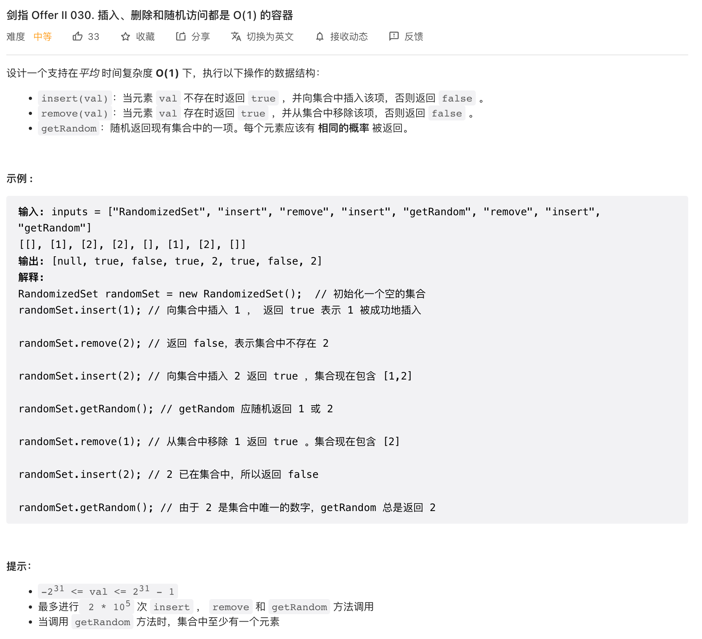
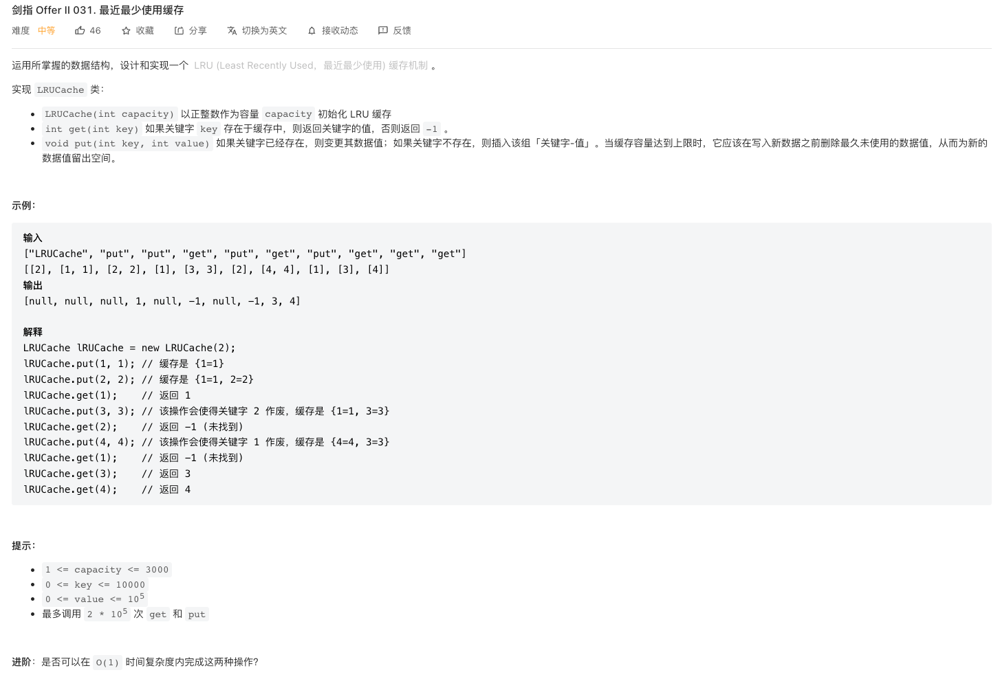
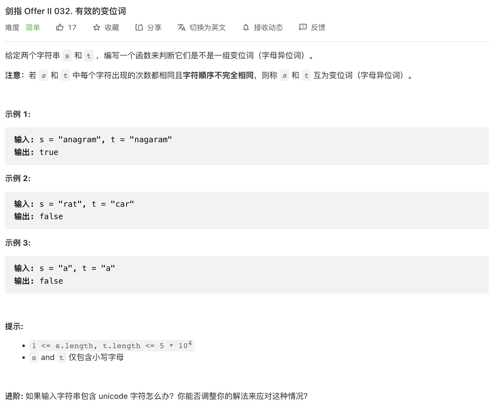
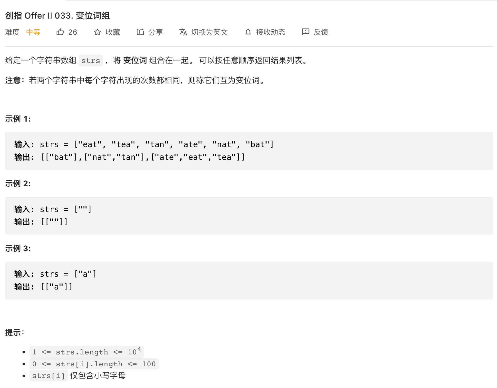
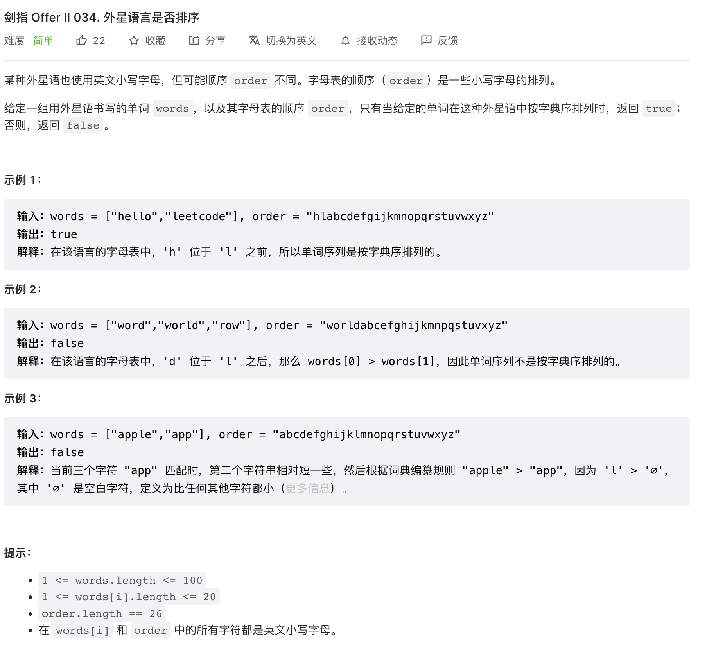
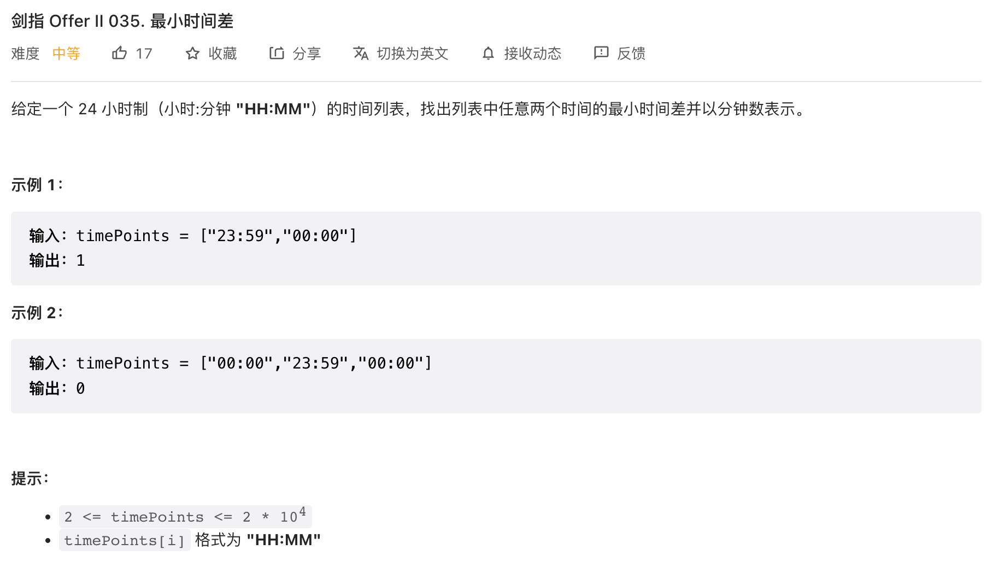

## CI.30 插入和删除都是O(1)的容器

### [剑指 Offer II 030. 插入、删除和随机访问都是 O(1) 的容器](https://leetcode-cn.com/problems/FortPu/)



题目中要求插入、删除和随机访问操作都需要是O(1)的容器，所以我们要考虑的是通过什么数据结构来存储我们的数据。

这里我们很容易想到用哈希表来实现O(1)复杂度的插入和删除操作。但是哈希表不方便实现等概率且复杂度是O(1)的随机访问操作。

和哈希表类似的可以实现O(1)的插入、删除和访问操作的还有数组结构，并且数组可以很方便的实现等概率的随机访问，只需要生成一个随机的索引值即可。

但是数组的O(1)复杂度是基于索引值确定的情况而言的，对于只是给定了`val`的场景要从数组中删除这个值，如果不知道这个值对应的索引的话，我们就得遍历，这样复杂度就不是O(1)了。

基于上面哈希表和数组的优缺点，我们可以使用数组来存储数据，使用哈希表来存储每个数值val对应的数组的索引index，这样我们的插入、删除和随机访问操作实现思路如下

- 插入

只需要在数组末尾插入这个值，同时记录val和index的对应关系即可

- 随机访问

只需要随机生成一个索引值，然后然后数组中对应位置的元素即可

- 删除

因为我们采用的是数组进行数据存储，在数组中删除某个元素之后，我们的数组还应该保持连续，这样对于中间位置的元素的删除就不能直接删除了。数组中如果要删除末尾位置的元素，则不需要考虑连续的问题，因为在末尾删除元素，数组依旧是连续的。

所以我们的思路是将末尾的元素复制一份到我们要删除的val对应的位置index上，然后将末尾删除，也就是相当于是将末尾的元素移动到index位置上，来实现将val删除的目的。

```c++
class RandomizedSet {
  private:
  unordered_map<int,int> numToLocation;
  vector<int> nums;
  public:
  /** Initialize your data structure here. */
  RandomizedSet() {
    srand((unsigned)time(NULL));
  }

  /** Inserts a value to the set. Returns true if the set did not already contain the specified element. */
  bool insert(int val) {
    if(numToLocation.count(val)){
      return false;
    }
    numToLocation[val] = nums.size();
    nums.push_back(val);
    return true;
  }

  /** Removes a value from the set. Returns true if the set contained the specified element. */
  bool remove(int val) {
    if(!numToLocation.count(val)){
      return false;
    }
    int index = numToLocation[val];
    int lastVal = nums.back();
    numToLocation[lastVal] = index;
    numToLocation.erase(val);
    nums[index] = lastVal;
    nums.pop_back();
    return true;
  }

  /** Get a random element from the set. */
  int getRandom() {
    int i = rand() % nums.size();
    return nums[i];
  }
};

/**
 * Your RandomizedSet object will be instantiated and called as such:
 * RandomizedSet* obj = new RandomizedSet();
 * bool param_1 = obj->insert(val);
 * bool param_2 = obj->remove(val);
 * int param_3 = obj->getRandom();
 */
```

## CI.31 最近最少使用缓存LRU

### [剑指 Offer II 031. 最近最少使用缓存](https://leetcode-cn.com/problems/OrIXps/)



LRU的实现方式比较清楚，数据的存储可以通过一个双向链表来实现，因为双向链表可以很方便的以O(1)复杂度从链表中删除一个元素。

每次操作元素的时候，就将元素移动到链表的最末尾位置，也就是说双向链表中，排在越前面位置的元素，最近使用得就最少，所以当链表容量超出以后，就可以直接将链表前面位置的元素删掉即可。

但是使用链表存在一个问题，我们没法直接以O(1)复杂度从链表中读取一个节点的值，因为我们不知道节点在链表中的哪个位置。

所以我们可以再使用一个哈希表，和链表结合起来存储数据。使用哈希表的目的是能够以O(1)复杂度读取到链表中节点的值。

按照这个思路，我们几个操作的实现思路如下

- `put(int key, int value)`

存储数据的时候，如果链表中没有这个元素的值，则直接将元素放到链表末尾即可。如果链表中已经存在这个值，则更新节点的值，同时将节点移动到链表最末尾的位置。

存储数据的时候，我们需要将key和链表节点存储到哈希表中，这样我们可以快速的根据key读取到链表中的值。

除此之外，我们存储数据的时候，还需要判断容量，当链表容量超出以后，需要删除链表中的最近最少使用的节点。

- `get(int key)`

读取数据的时候，我们只需要从哈希表中读取到节点的值即可。

读取数据也是对数据的操作，所以也需要将节点移动到链表的末尾。

实现如下

```c++
class DListNode {
  public:
  int value;
  int key;
  DListNode* prev;
  DListNode* next;
  DListNode(int _key,int _value){
    key = _key;
    value = _value;
  }
};
class LRUCache {
  private:
  unordered_map<int, DListNode*> keyToNode;
  int size;
  int capacity;
  DListNode *head, *tail;
  public:
  LRUCache(int _capacity) {
    size = 0;
    capacity = max(_capacity, 0);
    head = new DListNode(-1,-1);
    tail = new DListNode(-1,-1);
    head->next=tail;
    tail->prev = head;
  }

  int get(int key) {
    if(!keyToNode.count(key)) return -1;
    DListNode* node = keyToNode[key];
    this->moveToTail(node);
    return node->value;
  }

  void put(int key, int value) {
    if(keyToNode.count(key)){
      DListNode* node = keyToNode[key];
      node->value = value;
      this->moveToTail(node);
      return;
    }
    DListNode* node = new DListNode(key,value);
    keyToNode[key] = node;
    this->appendToTail(node);
    this->size++;
    this->removeLRUWhenCapacityExceeded();
  }
  void appendToTail(DListNode* node){
    node->prev = tail->prev;
    node->next=tail;
    tail->prev->next = node;
    tail->prev = node;
  }
  void moveToTail(DListNode* node){
    node->prev->next=node->next;
    node->next->prev = node->prev;
    this->appendToTail(node);
  }
  void removeLRUWhenCapacityExceeded(){
    while(this->size > this->capacity){
      DListNode* first = head->next;
      head->next = first->next;
      first->next->prev = head;
      keyToNode.erase(first->key);
      delete first;
      this->size--;
    }
  }
};

/**
 * Your LRUCache object will be instantiated and called as such:
 * LRUCache* obj = new LRUCache(capacity);
 * int param_1 = obj->get(key);
 * obj->put(key,value);
 */

```


## CI.32 有效的变位词

### [剑指 Offer II 032. 有效的变位词](https://leetcode-cn.com/problems/dKk3P7/)



变位词的顺序是不相同的，我们需要用一个表来记录字符串中每个字符出现的次数。

先对字符串s遍历，记录每个字符出现的次数。然后对t进行遍历，将每个出现的字符对应的在哈希表中减一。

在遍历之前先要确保字符串的长度是相等的，如果两个字符串长度是不相等，则一定不是变位词。

```c++
class Solution {
  public:
  unordered_map<char, int> charCount;
  bool isAnagram(string s, string t) {
    if(s.length() != t.length() || s== t)return false;
    for(int i =0;i<s.length();i++){
      charCount[s[i]] ++;
    }
    for(int i =0;i<t.length();i++){
      char  ch = t[i];
      if(charCount[ch] == 0) return  false;
      charCount[ch] --;
    }
    return true;
  }
};
```

如果某个字符x在s中不存在，而在t中存在，此时遍历t时，x出现的次数就是0，此时可以返回false.

如果某个字符串在s中存在，在t中不存在，则说明t中一定会含有某个字符y是t中存在而s中不存在，这样还是可以通过某个字符出现的次数是不是为0来判断到。

算法时间复杂度为$O(n)$，空间复杂度也近似为$O(n)$，具体取决于重复字符的数量。

## CI.33变位词组

### [剑指 Offer II 033. 变位词组](https://leetcode-cn.com/problems/sfvd7V/)



因为要将变位词组组合到一起，所以需要一个表格来记录每一组的变位词组。

- 变位词判断

要判断两个字符串之间是否为变位词了，这个可以通过表格记录出现的次数来判断。因为题目中规定了仅包含小写字母，所以出现的次数可以用一个数组来代替哈希表。

- 找到变位词对应的数组

这里还有关键的问题是怎么找到一个字符串对应的变位词组是哪一个？或者换句话说，我们存储变位词组的哈希表的key应该是什么？这个需要根据变位词的一些和顺序无关的特性来确定。

### 排序

最简单的方法就是将字符串进行排序，这样每个变位词排序后的结果都是一致的。

```c++
class Solution {
  public:
  vector<vector<string>> groupAnagrams(vector<string>& strs) {
    unordered_map<string, vector<string>> groups;
    for(string str: strs){
      string s =str;
      sort(s.begin(), s.end());
      groups[s].push_back(str);
    }
    vector<vector<string>> result;
    for(auto it = groups.cbegin();it != groups.cend();it++){
      // 将value push到result
      result.push_back(it->second);
    }
    return result;
  }
};

```

时间复杂度为$O(nklogk)$ ，n是字符串数组strs的长度，k是字符串的最长的一个字符串的长度。因为字符串数组的遍历需要$O(n)$复杂度，而每个字符串的排序需要$klogk$的复杂度，所以总的复杂度为$O(nklogk)$

### 构造唯一key

另外一个思路是，既然每个变位词的字符出现的次数是相同的，那我们统计一下字符和字符出现的次数，构造一个字符串。

例如字符串abacd和bdcaa，构造的key都是a2b1c1d1，这样就可以作为哈希表的key了。

还有另一种方法构造key是直接将26个位置上的出现的次数拼接成字符串即可，不需要拼接字符了。

```js
/**
 * @param {string[]} strs
 * @return {string[][]}
 */
var groupAnagrams = function(strs) {
  const result = {};
  for(const str of strs){
    const arr = new Array(26).fill(0);
    for(const ch of str){
      arr[ch.charCodeAt() - 'a'.charCodeAt()]++;
    }
    const key = arr.join('_');
    result[key] ? result[key].push(str) : result[key] = [str];
  }
  return Object.values(result);
};
```


## CI.34 外星语言是否排序

### [剑指 Offer II 034. 外星语言是否排序](https://leetcode-cn.com/problems/lwyVBB/)



先按照字母表的顺序，将每个字符的顺序记录下来。

然后对字符串数组进行遍历，两个字符串一组进行比较，依次根据字符表的顺序进行比较，判断是否符合字符表的顺序即可。

```c++
class Solution {
  public:
  unordered_map<char, int> charToIndex;
  bool isAlienSorted(vector<string>& words, string order) {
    for(int i=0;i<order.size();i++){
      charToIndex[order[i]] = i;
    }
    for(int i=0;i<words.size()-1;i++){
      if(!this->isSorted(words[i], words[i+1]))return false;
    }
    return true;
  }
  bool isSorted(string s1,string s2){
    for(int j=0;j<s1.size() && j<s2.size();j++){
      char ch1 = s1[j];
      char ch2 = s2[j];
      int index1 = charToIndex[ch1],index2 = charToIndex[ch2];
      if(index1 > index2) return false;
      if(index1 < index2) return true;
    }
    return s1.size() <= s2.size();
  }
};

```

上面的哈希表也可以使用数组来代替，因为题目中限定了字符都是小写字母，所以哈希表可以通过一个长度为26的数组来代替。

索引的存储方式就是按照正常的字母表中的顺序，a在第一个位置，z在最后一个位置，数组存储的值就是题目给的字母表中，这些字符对应的索引。


## CI.35 最小时间差

### [剑指 Offer II 035. 最小时间差](https://leetcode-cn.com/problems/569nqc/)



这个题目要求的是最小时间差，而且要的是分钟。

因为题目给的时间是一个`HH:MM`的表示形式，直接以这个形式比较时间不太方便，所以我们第一个想法是将时间统一的转换成分钟来比较。

```c++
int minute(string point){
  int hour = stoi(point.substr(0,2));
  int minute = stoi(point.substr(3,2));
  int time = hour * 60 + minute;
  return time;
}
```

然后问题是，我们怎么找到最小的时间差？

- 暴力检索

直接的思路是通过暴力检索，比较任意两个时间点的时间差，然后求最小值，这个算法的复杂度是$O(n^2)$。

但是实际这种方法有很多的时间间隔是完全没必要计算的，因为一定不会是我们要的最小的间隔。例如00:01, 00:03, 00:05,00:07，其中00:01和00:05,00:07的时间差是完全没必要计算的，因为前面已经有00:01和00:03的时间间隔一定更小。

- 排序

实际上，只有时间上相邻的两个时间点才可能是最小的时间差，才有必要去比较去计算差值。所以我们可以先对时间点进行排序，排序以后只需要对相邻的时间计算差值，然后求最小的时间差即可。

这样算法的复杂度就是$O(nlogn + n)$，也就是$O(nlogn)$。

- 枚举

实际上，我们连排序也可以省略，一天的时间的分钟数是一个固定的值，是一个可枚举的值。如果只考虑分钟数，那一天有1440分钟，我们可以把一天分隔成1440段。

并且因为时间点本身就是带有顺序的，一天的时间，我们都可以转换成分钟数，然后放入到一天中的1440段对应的位置即可，这样遍历一遍时间点，就可以自然将时间点排好序了。

然后就只需要计算相邻的时间间隔的差值，找出最小的时间差即可。

```c++
class Solution {
  public:
  int MINUTE_ONE_DAY = 60*24; // 1440
  int findMinDifference(vector<string>& timePoints) {
    int length = timePoints.size();
    if(length > MINUTE_ONE_DAY) return 0;
    array<int, 1440> sequence{};
    int result = INT_MAX;
    for(string point: timePoints){
      int time = this->minute(point);
      if(sequence[time] != 0) return 0;
      sequence[time] = 1;
    }
    int prevTime = -1;
    int firstPoint = -1;
    for(int i=0;i<sequence.size();i++){
      if(sequence[i] != 0){
        if(prevTime >=0){
          result = min(result, i - prevTime);
        }
        prevTime = i;
        firstPoint < 0 && (firstPoint = i);
      }
    }
    result = min(result, firstPoint + MINUTE_ONE_DAY- prevTime);
    return result;
  }
  int minute(string point){
    int hour = stoi(point.substr(0,2));
    int minute = stoi(point.substr(3,2));
    int time = hour * 60 + minute;
    return time;
  }
};

```

要注意的是最小的这个时间点，可以是当天的时间，也可以是第二天的时间去和最大的时间点比较，所以我们最后还要考虑这个场景

```c++
result = min(result, firstPoint + MINUTE_ONE_DAY- prevTime);
```

按照上面是算法，只需要$O(n)$的时间复杂度，额外开辟的数组的长度是1440，是常量级的，也即是$O(1)$

## 总结

### 枚举

对于一些可枚举值的场景，我们可以用一个数组来代替哈希表，例如字母、时间、长度等。

### O(1)复杂度

哈希表的存和取操作都是O(1)的，这个是哈希表的很大的特点。对于一些要求是O(1)复杂度的操作，可以尝试用哈希表解决。

而同时，数组的存和取也是O(1)复杂度，所以在一些场景，我们可以用数组来模拟哈希表，或者是两者结合。

