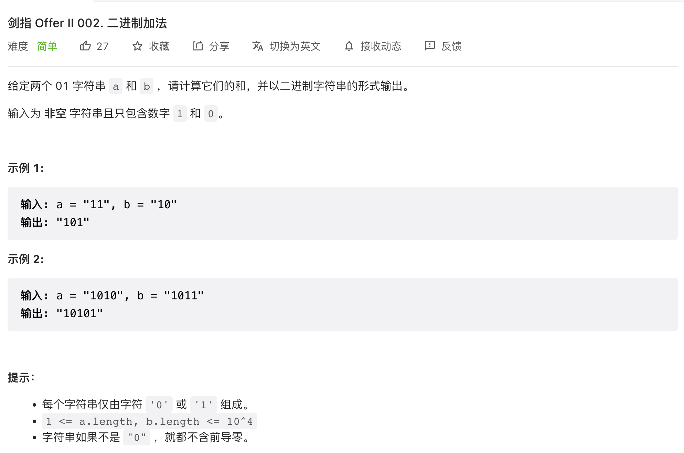

## CI.01 整数除法

[剑指 Offer II 001. 整数除法](https://leetcode-cn.com/problems/xoh6Oh/)

### 思路

我们可以思考一下除法的定义，一个数A除一个数B，实际就是要看A是B的几倍。而乘法可以转换成加法，所以A除B相当于是看多少个B相加才能得到A。

通过这个分析，我们可以按照这个角度来实现我们的代码。传入A和B，要求出A/B的结果，我们不断用A减去B，然后计算一下一共减了多少个B即可。

另外还考虑到，当A很大，B很小的时候，可能要做减法的次数会很多，所以我们可以将多个减法合并一下，变成 `A - k*B` ，这样只需要将每一次的k加起来就可以得到结果了。

### 实现

按照我们的思路，我们可以得到下面的初步代码

```c++
class Solution {
  public:
  int divide(int a, int b) {
    int result = 0;
    int nagative = 2;
    if(a <0){
      nagative --;
      a = -a;
    }
    if(b <0){
      nagative --;
      b = -b;
    }
    result = this->divideCore(a,b);
    return nagative == 1 ? -result : result;
  }
  int divideCore(int dividend, int divisor){
    int result = 0;
    while( dividend >= divisor){
      int value = divisor;
      int k = 1; // value = divisor * k
      while(dividend >= value + value){
        value += value;
        k += k;
      }
      result += k;
      dividend -= value;
    }
    return result;
  }
};
```

但是考虑到一些可能出现溢出的场景

- 输入a=$-2^{31}$, b=-1，这个时候得到的结果超出了int32的表示范围：这种情况我们可以单独判断一下，直接返回INT_MAX

```C++
if(a == 0)return 0;
if(b == 1)return a;
if( b==-1){
  if(a == INT_MIN) return INT_MAX;
  if (a == INT_MAX) return INT_MIN;
}
```

- 另外，`value + value`和`result += k`这两个地方也可能出现溢出的，例如输入a=$2^{31}-1$,b=1，这种场景会导致`value + value`和`result += k`溢出了，因为倍数超过了INT_MAX的一半，这个时候`k += k`就会溢出。这种情况我们也可以限定`value <= INT_MAX /2`以及`k<= INT_MAX/2`

```c++
int divideCoreV2(int dividend,int divisor){
  int result = 0;
  int HALF_OF_INT_MIN = 0xc0000000,HALF_OF_INT_MAX = INT_MAX >> 1;
  while( dividend >= divisor){
    int value = divisor;
    int k = 1; // value = divisor * k
    while(
      k <= HALF_OF_INT_MAX &&
      value <= HALF_OF_INT_MAX &&
      dividend >= value + value){
      value += value;
      k += k;
    }
    result += k;
    dividend -= value;
  }
  return result;
}
```

- 输入是$-2^{31}$的时候，如果取反变成正数，也会超出INT_MAX，所以这里我们不能将数字转换成正数，要反过来转换成负数，这样可以解决这个问题

  ```c++
  int divideCoreV1(int dividend, int divisor){
    int result = 0;
    int HALF_OF_INT_MIN = 0xc0000000,HALF_OF_INT_MAX = INT_MAX >> 1;
  
    while( dividend <= divisor){
      int value = divisor;
      int k = 1; // value = divisor * k
      while(
        value >= HALF_OF_INT_MIN && 
        k <= HALF_OF_INT_MAX && 
        dividend <= value + value
      ){
        value += value;
        k += k;
      }
      result += k;
      dividend -= value;
    }
    return result;
  }
  ```

  这里要注意转换成负数以后，做比较的时候应该是负数的比较，所以是`dividend <= divisor`的时候进入循环

  完整代码如下

  ```c++
  class Solution {
    public:
    int divide(int a, int b) {
      if(a == 0)return 0;
      if(b == 1)return a;
      if( b==-1){
        if(a == INT_MIN) return INT_MAX;
        if (a == INT_MAX) return INT_MIN;
      }
      int result = 0;
      int nagative = 2;
      if(a >0){   
        nagative --;
        a = -a;
      }
      if(b >0){
        nagative --;
        b = -b;
      }
      result = this->divideCoreV1(a,b);
      return nagative == 1 ? -result : result;
    }
    int divideCoreV1(int dividend, int divisor){
      int result = 0;
      int HALF_OF_INT_MIN = 0xc0000000,
      HALF_OF_INT_MAX = INT_MAX >> 1;
      while( dividend <= divisor){
        int value = divisor;
        int k = 1; // value = divisor * k
        while(
          value >= HALF_OF_INT_MIN && 
          k <= HALF_OF_INT_MAX && 
          dividend <= value + value
        ){
          value += value;
          k += k;
        }
        result += k;
        dividend -= value;
      }
      return result;
    }
  };
  ```

## CI.02 二进制加法

### [剑指 Offer II 002. 二进制加法](https://leetcode-cn.com/problems/JFETK5/)



题目中给定的是字符串，而且这字符串的长度很大，说明数字很大，显然不能直接用数值类型来存储。

通过一个字符串来存储结果，对两个输入进行遍历，遍历的顺序是从低位到高位，计算每一位的和，然后存起来到字符串中即可。

```c++
class Solution {
  public:
  string addBinary(string a, string b) {
    int extra = 0;
    string result;
    int i = a.length()-1,j = b.length()-1;
    while( i >= 0 || j >= 0 ){
      int numA =  i >= 0 ? a[i--] - '0' : 0;
      int numB =  j >= 0 ? b[j--] - '0' : 0;
      int sum = extra + numA + numB;
      extra = sum > 1 ? 1 : 0;
      sum = sum % 2;
      result.append( to_string(sum));
    }
    if(extra != 0){
      result.append(to_string(extra));
    }
    reverse(result.begin(),result.end());
    return result;
  }
};
```

有几个地方需要关注一下

- 考虑进位，特别是最后一个位上的进位，需要在循环结束以后单独判断一下，如果还有进位就放入到字符串后面
- 结果存储的时候是按照低位在前面的顺序来存储的，所以在返回的时候需要反转一下

## CI.03 前n个数字二进制中1个个数

### [剑指 Offer II 003. 前 n 个数字二进制中 1 的个数](https://leetcode-cn.com/problems/w3tCBm/)


题目的要求很简单，就是要求出每个数字的二进制位中1的个数。

### 解法一 与运算计算1的数量

对于两个自然数，数字`i`和`i-1`之间的二进制位只是相差了1。换句话说，`i`中最低位的一个1其实就是从$(i -1)+1$ 得来的，这样就有一个思路，通过`i = i & (i-1)`可以将`i`中最低位的一个1给置为0，而高位的其他1还是保持不变。

通过这个方式，我们只要不断循环执行这个操作，就可以将依次`i`中的所有1置为0。最后只需要计算一下循环执行的次数就是1的数量了。

```c++
class Solution {
public:
    vector<int> countBits(int n) {
        vector<int> result;
        int i = 0;
        while(i <= n){
            int j =i;
            int count  =0;
            while(j != 0){
                j = j & (j -1);
                count ++;
            }
            result.push_back(count);
            i++;
        }
        return result;
    }
};
```

### 解法二 动态规划

根据上面的思路，我们是先将`i = i & (i-1)` 来将`i`中最低位的一个1置为0，然后再对运算后的`i & (i-1)`循环执行`i = i & (i-1)`来里面还有多少个1。

我们用一个函数$f(x)$ 来表示计算自然数x中的二进制位中1的数量这个过程，就可以得到$f(i) = f(i') + 1$，其中`i' = i & (i-1)` ，这样，很容易可以得到下面的代码

```c++
class Solution {
  public:
  vector<int> countBits(int n) {
    vector<int> result(n + 1,0);
    int i = 0;
    while(++i <= n){
      result[i] = result[i & (i-1)] + 1;
    }
    return result;
  }
};
```

### 解法三 动态规划

[让你秒懂的双百题解！](https://leetcode-cn.com/problems/w3tCBm/solution/rang-ni-miao-dong-de-shuang-bai-ti-jie-b-84hh/)

对于所有的数字，只有奇数和偶数两种：

- 奇数：二进制表示中，奇数一定比前面那个偶数多一个 1，因为多的就是最低位的 1。
- 偶数：二进制表示中，偶数中 1 的个数一定和除以 2 之后的那个数一样多。因为最低位是 0，除以 2 就是右移一位，也就是把那个 0 抹掉而已，所以 1 的个数是不变的。

所以我们可以得到如下的状态转移方程：

- $dp[i] = dp[i-1]$，当i为奇数
- $dp[i] = dp[i/2]$，当i为偶数

上面的方程还可进一步合并为：`dp[i] = dp[i/2] + i % 2` 

通过位运算进一步优化：

- **i / 2 可以通过 i >> 1 得到；**
- **i % 2 可以通过 i & 1 得到；**

```c++
class Solution {
public:
  vector<int> countBits(int n) 
  {
    vector<int> res(n + 1, 0);
    for (int i = 0; i <= n; i++)
    {
      res[i] = res[i >> 1] + (i & 1);
    }
    return res;
  }
};
```

>tips
>
>- **i / 2 可以通过 i >> 1 得到；**
>- **i % 2 可以通过 i & 1 得到；**

## CI.04 只出现一次的数字

### [剑指 Offer II 004. 只出现一次的数字 ](https://leetcode-cn.com/problems/WGki4K/)


这个题目可以从二进制位的角度来思考一下，对于n个相同的数字，这些数字的每一个二进制位都一定是相同的。这样的话，我们把n个数字的二进制按照每一个二进制位加起来（十进制），每个二进制位的和一定也刚好是n，因为每个二进制位都是相同的，相当于是乘了个n。

按照这个想法再来看题目，一组数字中，只有一个数字出现了一次，其他数字都出现了3次，那如果把所有的数字的二进制，按照每个二进制位加起来求和，得到一个数组data[n]。

假设这个只出现一次的数字为x，对于每一个data[i]，有

- 如果data[i]能够被3整除，说明x的这个比特位是0
- 如果data[i]不能被3整除，说明x的这个比特位为1

这样，将data[n]每个元素都整除3，得到的结果就是x的二进制了，也就知道这个数字是什么了。

这样我们代码的思路就很简单了

1. 对每个数字遍历，依次将每个比特位相加得到结果total
2. 如果`total %3 ！== 0`，说明result这个比特位结果是1，则执行`result |= (1 << i)`

```c++
class Solution {
  public:
  int singleNumber(vector<int>& nums) {
    int length = nums.size();
    int result = 0;
    int BIT_LEN = 32;
    for(int i =0;i<BIT_LEN;i++){
      int  total = 0;
      for(int j=0;j<length;j++){
        total += ((nums[j] >> i) & 1);
      }
      if( total % 3 != 0){
        result |= (1 << i);
      }
    }
    return result;
  }
};
```

官方题解[只出现一次的数字](https://leetcode-cn.com/problems/WGki4K/solution/zhi-chu-xian-yi-ci-de-shu-zi-by-leetcode-0vrt/)

## CI.05 单词长度的最大乘积

### 题目

输入一个字符串数组words，计算不包含相同字符的两个字符串words[i]和 words[j]的长度乘积的最大值。如果所有字符串都包含至少1个相同宇符，那么返回 0。假设字符串中只包含英文小写字母。

例如，输入的字符串数组 words 为`["abcw", "foo", "bar',"fxyz',"abcder]`，数组中的字符串"bar”与"foo"没有相同的宇符，它们长度的乘积为 9。"abcw”与"fxyz也没有相同的宇符，它们长度的乘积为 16，这是该数组不包含相同宇符的一字符串的长度乘积的最大值。

### 分析

这个题目应该有两个关键的问题

- 比较两个字符串是否有包含相同的字符
- 计算任选两个字符串之间长度乘积的最大值

其中，要计算两个字符串长度乘积最大值这个问题比较好解决，只需要通过一个变量来存储当前最大值即可。问题的核心是如何判断两个字符串之间是否包含有相同的字符。

题目中有限定字符串中只会包含英文小写字母，也就是26个英文小写字母，这个缩小了字符串的判断范围。

### 哈希表记录字符串出现的每个字符

对于每个字符串，我们可以用一个哈希表来存储其中的每个字符，这样在判断两个字符串是否有相同字符的时候，只需要查看当前字符的哈希在另外一个字符串中的哈希表中是否存在即可。

对于输入的每个字符串，我们都需要一个哈希表来存储其中的字符。

### 用整数二进制位记录字符串中出现的字符

上面第一个解法中，我们用哈希表来记录字符串中出现的字符，但实际上我们只关心这个字符有没有出现，也即是`true`和`false`的结果，不关心具体出现的次数，那就可以用二进制位`0`和`1`来表示字符是否存在。

因为限定了输入只是26个小写字符，所以对于每个字符串，我们创建一个32位的整数，用其中的26个二进制位来依次表示其中的字符是否有出现。

要判断两个字符串是否有包含相同字符，只需要将两个字符串对应的整数进行`&`运算，如果两个字符串中不包含相同字符，则意味着对应两个整数的二进制上，同一个二进制位不会出现两个`1`，所以`&`的结果就是`0`，这样只需要进行一次`&`运算就可以知道两个字符串是否包含相同字符。

c++

```c++
class Solution {
public:
    int maxProduct(vector<string>& words) {
        int len = words.size();
        vector<int> flags(len);
        for(int i=0;i<len;i++){
            string word = words[i];
            for(int j=0;j<word.length();j++){
                flags[i] |= (1 << (word[j] - 'a'));
            }
        }
        int result = 0;
        for( int i =0;i<len;i++){
            for(int j=i+1;j<len;j++){
                if((flags[i] & flags[j]) == 0){
                    int product = words[i].size()* words[j].size();
                    result = max(product,result);
                }
            }
        }
        return result;
    }
};
```

js

```js
/**
 * @param {string[]} words
 * @return {number}
 */
var maxProduct = function(words) {
 const flags = [];
  const a = 'a'.charCodeAt();
  for(let i =0;i<words.length; i++){
    const word = words[i];
    flags[i] = 0;
    for(const ch of word){
      flags[i] |= (1 << (ch.charCodeAt() - a));
    }
  }
  let result = 0;
  for(let i = 0;i<words.length; i++){
    for(let j = i+1; j<words.length;j++){
      if((flags[i] & flags[j]) === 0){
        const product = words[i].length * words[j].length;
        result = Math.max(result,product)
      }
    }
  }
  return result;
};
```
