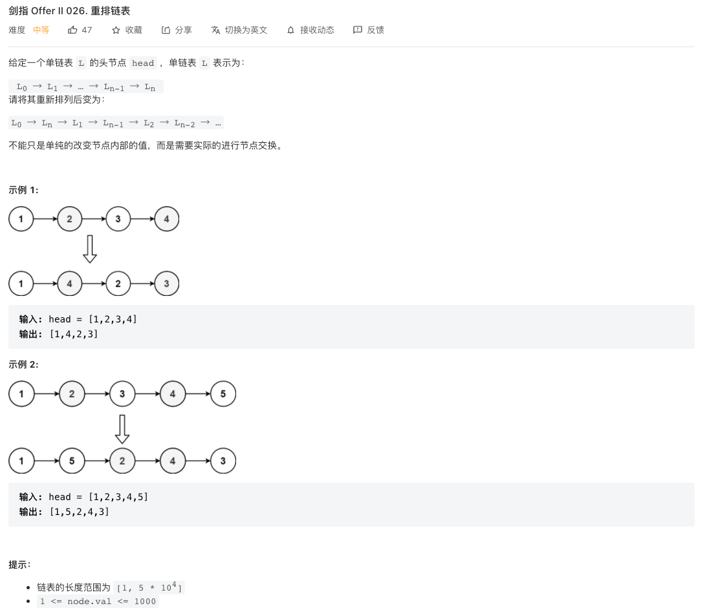

## CI.21 删除链表的倒数第K个节点

### [剑指 Offer II 021. 删除链表的倒数第 n 个结点](https://leetcode-cn.com/problems/SLwz0R/)


### 前后指针

要注意，我们要删除倒数第n个节点，那实际要定位的节点是倒数第(n+1)个节点，所以让快指针先走(n+1)步，然后快慢指针再以同样的速度前进，当快指针走完整个链表，处于end->next这个位置的时候，满指针刚好在倒数第(n+1)个节点，这个时候很方便可以将倒数第n个节点删除。

如果快指针只是先走n步，那当快指针走到end->next的时候，慢指针刚好在倒数第n个节点，这个时候并不知道前一个节点是什么，没法对倒数第n个节点进行删除。

```c++
/**
 * Definition for singly-linked list.
 * struct ListNode {
 *     int val;
 *     ListNode *next;
 *     ListNode() : val(0), next(nullptr) {}
 *     ListNode(int x) : val(x), next(nullptr) {}
 *     ListNode(int x, ListNode *next) : val(x), next(next) {}
 * };
 */
class Solution {
  public:
  ListNode* removeNthFromEnd(ListNode* head, int n) {
    ListNode* dummy = new ListNode(0);
    dummy->next = head;
    ListNode* fast = dummy;
    ListNode* slow = dummy;
    int k = 0;
    while(fast && k < n+1){
      fast = fast->next;
      k++;
    }
    while(fast){
      fast = fast->next;
      slow = slow->next;
    }
    slow->next = slow->next->next;
    return dummy->next;
  }
};

```

上面的算法对链表只遍历了一遍，时间复杂度是$O(n)$ ，空间复杂度$O(1)$

## CI.22 链表中环的入口节点

### [剑指 Offer II 022. 链表中环的入口节点](https://leetcode-cn.com/problems/c32eOV/)


### 双指针

我们假设从链表起点head到环的入口节点P之间这段长度（包含P）为X，环中长度为Y（也包含P），则链表的节点数量就是X + Y

先让一个指针first先走Y步达到第Y+1个节点，second指针在起点位置，然后first和second两个指针同时前进，则当second指针刚好到达环的入口位置的时候，first指针走过的距离刚好是X +Y+1，此时first指针刚好走完了环一圈，回到环的起点，也就是两个指针会在环的入口相遇。

所以按照这个思路，first指针先走Y步，然后两个指针同样的速度前进，那两个指针相遇的位置就是环的入口。

- 确定环的长度

基于上面的思路，我们需要知道环的长度，也就是Y的值。

要确定环的长度，我们可以先把指针移动到环内的某个位置A，然后绕环一圈再回到A，这个过程走过的长度就是环的长度了。

所以问题变成了怎么确定我们的指针处于环内？

- 确定指针处于环内

我们通过两个快慢指针fast和slow，同时从起点出发，快指针每次走两步，慢指针每次走一步，因为快指针会先走完无环的这段距离，然后进入环内转圈，所以快慢指针相遇的位置就一定是在环内的。

按照上面的思路我们可以找到环的某个节点A

```c++
ListNode *findNodeInLoop(ListNode *head) {
  if(!head) return NULL;
  if(!head->next) return head;
  ListNode* slow = head->next;
  ListNode* fast = slow->next;
  while(fast ){
    if(fast == slow) return slow;
    slow = slow->next;
    fast = fast->next;
    if(fast){
      fast = fast->next;
    }
  }
  return NULL;
}
```

找到了环中的某个节点后A，我们让用一个指针p从A位置出发，而first指针从起点出发，两个指针以相同的速度每次前进一步，当p指针再次回到A的时候，first指针就刚好前进了Y步

```c++
ListNode* nodeInLoop = this-> findNodeInLoop(head);
if(!nodeInLoop) return NULL;
ListNode* p = nodeInLoop->next;
ListNode* first = head->next;
while(p != nodeInLoop){
  p=p->next;
  first= first->next;
}
```

此时我们再根据上面的思路，前后指针同样速度前进，当两个指针相遇的时候，就是环的入口了。

```c++
/**
 * Definition for singly-linked list.
 * struct ListNode {
 *     int val;
 *     ListNode *next;
 *     ListNode(int x) : val(x), next(NULL) {}
 * };
 */
class Solution {
  public:
  ListNode *detectCycle(ListNode *head) {
    if(!head ||!head->next) return NULL;
    ListNode* nodeInLoop = this-> findNodeInLoop(head);
    if(!nodeInLoop) return NULL;
    ListNode* p = nodeInLoop->next;
    ListNode* first = head->next;
    while(p != nodeInLoop){
      p=p->next;
      first= first->next;
    }
    ListNode* second = head;
    while(first != second){
      first = first->next;
      second = second->next;
    }
    return second;
  }
  ListNode *findNodeInLoop(ListNode *head) {
    if(!head) return NULL;
    if(!head->next) return head;
    ListNode* slow = head->next;
    ListNode* fast = slow->next;
    while(fast){
      if(fast == slow) return slow;
      slow = slow->next;
      fast = fast->next;
      if(fast){
        fast = fast->next;
      }
    }
    return NULL;
  }
};

```

#### v2

上面的方法里，我们在找到快慢两个指针在环内相遇的某个节点A后，先计算出来了环的长度，然后再用两个前后指针，通过两个前后指针的相遇来确定环的入口。

但是仔细分析，我们找到了环内相遇的位置A，此时假设慢指针走了长度k，则快指针走了2k，快指针比慢指针多走了长度k。

而很明显，快指针和慢指针是在环内相遇的，所以快指针是在比慢指针多走了几圈然后和慢指针相遇的，也就是说k=mY，k是环的长度的整数倍。

此时，慢指针所处的位置是A，我们可以不需要计算环的长度，而直接用前后指针，first指针就从当前慢指针的位置A开始，而second指针从起点开始，两个指针同样速度前进，当两个指针再相遇的时候，first指针离起点的距离为 X+k，也就是$X+mY$，second指针走的距离为$X$，可以看出来，相遇的位置就是环的入口。

代码实现如下

```c++
  ListNode *detectCycle(ListNode *head) {
    if(!head ||!head->next) return NULL;
    ListNode* nodeInLoop = this-> findNodeInLoop(head);
    if(!nodeInLoop) return NULL;
    ListNode* first = nodeInLoop;
    ListNode* second = head;
    while(first != second){
      first= first->next;
      second=second->next;
    }
    return second;
  }
```

完整如下

```c++
/**
 * Definition for singly-linked list.
 * struct ListNode {
 *     int val;
 *     ListNode *next;
 *     ListNode(int x) : val(x), next(NULL) {}
 * };
 */
class Solution {
  public:
  ListNode *detectCycle(ListNode *head) {
    if(!head ||!head->next) return NULL;
    ListNode* nodeInLoop = this-> findNodeInLoop(head);
    if(!nodeInLoop) return NULL;
    ListNode* first = nodeInLoop;
    ListNode* second = head;
    while(first != second){
      first= first->next;
      second=second->next;
    }
    return second;
  }
  ListNode *findNodeInLoop(ListNode *head) {
    if(!head) return NULL;
    if(!head->next) return head;
    ListNode* slow = head->next;
    ListNode* fast = slow->next;
    while(fast){
      if(fast == slow) return slow;
      slow = slow->next;
      fast = fast->next;
      if(fast){
        fast = fast->next;
      }
    }
    return NULL;
  }
};

```

#### v3

上面代码还可以合并成如下

```c++
/**
 * Definition for singly-linked list.
 * struct ListNode {
 *     int val;
 *     ListNode *next;
 *     ListNode(int x) : val(x), next(NULL) {}
 * };
 */
class Solution {
  public:
  ListNode *detectCycle(ListNode *head) {
    if(!head ||!head->next) return NULL;
    ListNode* slow = head->next;
    ListNode* fast = slow->next;
    while(fast != nullptr){
      if(fast == slow){
        ListNode* first = slow;
        ListNode* second = head;
        while(first != second){
          first= first->next;
          second=second->next;
        }
        return second;
      }
      slow = slow->next;
      fast = fast->next;
      if(fast != nullptr){
        fast = fast->next;
      }
    }
    return nullptr;
  }
};

```

逻辑实际是一样的，只是合并了一下到同一个方法里

### 哈希表

还可以通过一个哈希表，对链表进行遍历，每个节点都存到哈希表里，当链表遍历完以后，再次回到环的入口的时候，此时哈希表里已经存有这个节点了，所以可以知道当前节点就是环的入口。

这个方法时间复杂度和前面的方法一样都是$O(n)$，但是这个方法空间复杂度为$O(n)$。

## CI.23 两个链表的第一个重合节点

### [剑指 Offer II 023. 两个链表的第一个重合节点](https://leetcode-cn.com/problems/3u1WK4/)


### 哈希解法

通过一个哈希表，先遍历一遍A，每个节点放入到哈希表中。

然后对B进行一次遍历，B中每个节点，先判断哈希表中是否存在此节点，第一个判断存在的节点便是我们要找的第一个重合节点。

这种方法的时间复杂度为$O(n)$，空间复杂度为$O(n)$

### 双指针

我们尝试通过两个指针pa,pb分别对A和B进行遍历，然后构造一种遍历方式，让两个指针能够刚好在第一个重合的节点处相遇。

这个题目可以通过长度计算来寻找链表之间的关系，假设公共部分长度为L，然后A和B两个链表除去公共部分后的长度分别为X, Y。我们发现，三端距离加起来的结果是$L + X + Y$，对于两个确定的链表而言，这个值是确定的。

我们用pa指针先对A进行遍历，遍历完以后接着pa指针对B进行遍历。同样，pb指针先对B进行遍历，遍历完以后对A进行遍历，这样，当pa、pb走到第一个重合点的时候，走过的距离都恰好是$L+X+Y$，也就是说两个指针会在这里相遇。

按照这个思路实现的代码如下

```c++
/**
 * Definition for singly-linked list.
 * struct ListNode {
 *     int val;
 *     ListNode *next;
 *     ListNode(int x) : val(x), next(NULL) {}
 * };
 */
class Solution {
  public:
  ListNode *getIntersectionNode(ListNode *headA, ListNode *headB) {
    if(headA == nullptr || headB == nullptr) return nullptr;
    ListNode* pa = headA;
    ListNode* pb = headB;
    int currentList = 1;
    while(pa != pb){
      pa = pa->next;
      pb = pb->next;
      if(pa == nullptr ){
        if(currentList == 1){
          pa = headB;
          currentList = 2;
        }else {
          return nullptr;
        }
      }
      if(pb == nullptr){
        pb = headA;
      }
    }
    return pa;
  }
};

```

这里用了currentList来记录pa指针当前所遍历的链表，如果两个链表都遍历完还没有相遇，则说明两个链表没有交叉点，则返回空指针。

不过上面的写法，是先执行了`p = p->next`，然后再判断是否为空指针的，这样就导致在判断while循环的条件的时候，pa和pb都不会是空指针，没法区分出来是否两个链表都遍历完了。

```c++
/**
 * Definition for singly-linked list.
 * struct ListNode {
 *     int val;
 *     ListNode *next;
 *     ListNode(int x) : val(x), next(NULL) {}
 * };
 */
class Solution {
  public:
  ListNode *getIntersectionNodeV1(ListNode *headA, ListNode *headB) {
    if(headA == nullptr || headB == nullptr) return nullptr;
    ListNode* pa = headA;
    ListNode* pb = headB;
    while(pa != pb){
      pa = pa==nullptr ? headB: pa->next;
      pb = pb == nullptr ? headA: pb->next;
    }
    return pa;
  }
};
```

按照上面的这个写法，先判断是否为空，再执行`p = p->next`，这样，如果两个链表没有交叉点，则两个指针pa,pb会同时到达两个链表的结尾，此时是满足pa==pb的，就能够跳出循环，不需要额外的变量来判断是否遍历结束。

## CI.24 反转链表

### [剑指 Offer II 024. 反转链表](https://leetcode-cn.com/problems/UHnkqh/)


这个题目只需要对链表进行一次遍历，对每一个节点都做处理，将next指针指向prev节点，做一次遍历即可。

```c++
/**
 * Definition for singly-linked list.
 * struct ListNode {
 *     int val;
 *     ListNode *next;
 *     ListNode() : val(0), next(nullptr) {}
 *     ListNode(int x) : val(x), next(nullptr) {}
 *     ListNode(int x, ListNode *next) : val(x), next(next) {}
 * };
 */
class Solution {
  public:
  ListNode* reverseList(ListNode* head) {
    if(head == nullptr || head->next == nullptr) return head;
    ListNode *current = head,*prev=nullptr;
    while(current != nullptr){
      ListNode* next = current->next;
      current->next = prev;
      prev = current;
      current = next;
    }
    return prev;
  }
};

```

因为只对链表做了一次遍历，时间复杂度为$O(n)$，空间复杂度为$O(1)$

## CI.25 链表中的两数相加

### [剑指 Offer II 025. 链表中的两数相加](https://leetcode-cn.com/problems/lMSNwu/)


这个和二进制加法的解法类似，按照加法的定义，从低位开始一个一个位进行相加，得到结果。

### 链表反转

这里因为是链表，要从链表的结尾向链表的开头遍历，可以通过先对链表进行反转来实现，最后得到的结果链表也要反转一次再返回。

```c++
/**
 * Definition for singly-linked list.
 * struct ListNode {
 *     int val;
 *     ListNode *next;
 *     ListNode() : val(0), next(nullptr) {}
 *     ListNode(int x) : val(x), next(nullptr) {}
 *     ListNode(int x, ListNode *next) : val(x), next(next) {}
 * };
 */
class Solution {
  public:
  ListNode* addTwoNumbers(ListNode* l1, ListNode* l2) {
    if(l1==nullptr || l2 == nullptr) return l1 == nullptr ? l2 : l1;
    l1 = this->reverseList(l1);
    l2 = this->reverseList(l2);
    ListNode* dummy = new ListNode(0),
    *result = dummy,
    *n1 = l1,
    *n2 = l2 ;
    int carry = 0;
    while(n1 != nullptr || n2 != nullptr){
      int v1 = n1 == nullptr ? 0: n1->val;
      int v2 = n2 == nullptr ? 0: n2->val;
      int sum = v1 + v2 + carry;
      carry = sum >= 10 ? 1:0;
      sum %=10;
      result->next= new ListNode(sum);
      result = result->next;
      if(n1) n1 = n1 ->next;
      if(n2) n2 = n2 ->next;
    }
    if(carry){
      result->next= new ListNode(carry);
    }
    return this->reverseList(dummy->next);
  }
  ListNode* reverseList(ListNode* head) {
    if(head == nullptr || head->next == nullptr) return head;
    ListNode *current = head,*prev=nullptr;
    while(current != nullptr){
      ListNode* next = current->next;
      current->next = prev;
      prev = current;
      current = next;
    }
    return prev;
  }
};
```

### 栈

上面我们反转链表的目的是为了能够从链表的结尾，也就是低位开始，向前遍历执行加法，但是这个过程还可以通过一个栈来实现，这样可以避免对链表的反转。

大概的思路是

- 对两个链表进行遍历，分别将两个链表的每个节点的数字放入到各自的一个栈中
- 对两个栈的元素处理，元素不断出栈，执行加法
- 加法的结果也需要用个栈来保存，低位先入栈，高位后入栈，最后只需要将栈中的结果转换成链表即可

这种方法的时间复杂度是$O(n)$，空间复杂度也是$O(n)$

## CI.26 重排链表

### [剑指 Offer II 026. 重排链表](https://leetcode-cn.com/problems/LGjMqU/)



这个题目能直接想到的解法是，找到链表的中点将链表分成前后两段l1,l2，然后将后面一段l2反转得到l3，然后对l1,l3进行遍历处理即可。

要找到链表的中点，可以通过快慢指针来实现，两个指针同时从起点出发，慢指针每次走1步，快指针每次走2步。当快指针到达结尾的时候，慢指针就在链表中点。

```c++
/**
 * Definition for singly-linked list.
 * struct ListNode {
 *     int val;
 *     ListNode *next;
 *     ListNode() : val(0), next(nullptr) {}
 *     ListNode(int x) : val(x), next(nullptr) {}
 *     ListNode(int x, ListNode *next) : val(x), next(next) {}
 * };
 */
class Solution {
  public:
  void reorderList(ListNode* head) {
    if(head == nullptr || head->next == nullptr || head->next->next==nullptr) return;
    ListNode *fast = head,*slow=head;
    // 画图看一下就能理解这里为啥要判断fast->next != nullptr了
    while(fast->next != nullptr && fast->next->next != nullptr){
    slow = slow->next;
    fast=fast->next->next;
    }
    ListNode *l2 = this->reverseList(slow->next);
    // 把右边半段断开，否则会报错
    slow->next = nullptr;
    ListNode *n1=head,*n2=l2;
    while(n2 != nullptr){
      ListNode *n1Next=n1->next,*n2Next=n2->next;
      n1->next=n2;
      n2->next=n1Next;
      n1=n1Next;
      n2=n2Next;
    }
  }
  ListNode* reverseList(ListNode* head) {
    if(head == nullptr || head->next == nullptr) return head;
    ListNode *current = head,*prev=nullptr;
    while(current != nullptr){
      ListNode* next = current->next;
      current->next = prev;
      prev = current;
      current = next;
    }
    return prev;
  }
};
```

通过快慢指针，当fast遍历完链表，slow指针刚好停在链表前半部分的最后一个节点上，如果链表节点个数为奇数个，则slow恰好就是中点。也就是说`slow->next`是链表的后半部分。

```c++
ListNode *fast = head,*slow=head;
// 画图看一下就能理解这里为啥要判断fast->next != nullptr了
while(fast->next != nullptr && fast->next->next != nullptr){
  slow = slow->next;
  fast=fast->next->next;
}
```

这里我们可以这么分析

对于含有$N$个节点的列表，按照索引从0开始，每个元素的索引分别为0,1,...,N-1，其中点元素的**索引**为

- $x=(N-1)/2$ ，$N$ 为奇数，此时元素x就是中点元素
- $x=N/2 - 1 $ ，$N$ 为偶数，此时元素x就是前半段部分的末尾

按照这个思路我们要找到链表的中点，假设slow指针从head开始，要往前走k次

- N为奇数，假设当slow指针走了k步，fast指针刚好指向链表最后一个元素的时候，此时满足$2k=N-1$ ,$k= (N-1)/2$，正好是中点。这种情况循环终止的条件就是`fast->next == nullptr`
- N为偶数，假设当slow指针走了k步，fast指针刚好指向链表倒数第二个元素，索引为(N-2)，即$2k=(N-2)$, $k=N/2 -1$，刚好是前半段的末尾。这种情况循环终止的条件就是`fast->next->next == nullptr`

## CI.27 回文链表

### [剑指 Offer II 027. 回文链表](https://leetcode-cn.com/problems/aMhZSa/)


如果不开辟额外的内存，以空间复杂度为$O(1)$的效率完成算法的话，可以将链表分成前后两半left, right，然后将后面一半反转得到right2，然后比较left和right2的每个元素是否相等，直到有right2遍历完为止

```c++
/**
 * Definition for singly-linked list.
 * struct ListNode {
 *     int val;
 *     ListNode *next;
 *     ListNode() : val(0), next(nullptr) {}
 *     ListNode(int x) : val(x), next(nullptr) {}
 *     ListNode(int x, ListNode *next) : val(x), next(next) {}
 * };
 */
class Solution {
  public:
  bool isPalindrome(ListNode* head) {
    if(head == nullptr || head->next == nullptr) return true;
    if(head->next->next ==nullptr) return head->val == head->next->val;
    ListNode *slow=head,*fast =head;
    while(fast->next != nullptr && fast->next->next != nullptr){
      slow = slow->next;
      fast=fast->next;
      fast = fast->next;
    }
    ListNode *right = this->reverseList(slow->next);
    ListNode *left = head;
    while(right){
      if(left->val != right->val) return false;
      left = left->next;
      right = right->next;
    }
    return true;
  }
  ListNode* reverseList(ListNode* head) {
    if(head == nullptr || head->next == nullptr) return head;
    ListNode *current = head,*prev=nullptr;
    while(current != nullptr){
      ListNode* next = current->next;
      current->next = prev;
      prev = current;
      current = next;
    }
    return prev;
  }
};

```

这种算法的好处是不需要额外的内存，时间复杂度为$O(n)$，空间复杂度$O(1)$，不好的是要修改原链表。

如果要求不修改链表，则需要创建新的链表来保存右半部分反转的链表，这样空间复杂度就为$O(n)$

## CI.28 展平多级链表

### [剑指 Offer II 028. 展平多级双向链表](https://leetcode-cn.com/problems/Qv1Da2/)


这个题目比较简单，主要是能理解题目的“展平”是要按照什么规则来展平。根据题目的描述，可以知道，是将一个节点current的子链表current.child展平成一维的链表，然后插入到current和current->next中间。

因为子链表中还可能有多层的子链表嵌套，所以这里可以用递归的方式来出来每一层的子链表，将子链表展平后，得到子链表的头结点和尾节点，就可以将current和current->next连接起来了。

```c++
/*
// Definition for a Node.
class Node {
public:
    int val;
    Node* prev;
    Node* next;
    Node* child;
};
*/

class Solution {
  public:
  Node* flatten(Node* head) {
    this->flattenAndGetTail(head);
    return head;
  }
  Node* flattenAndGetTail(Node* head){
    Node *current=head,*tail = head;
    while(current != nullptr){
      Node* child = current->child;
      Node *next = current->next;
      if(child != nullptr){
        Node *childListTail = this->flattenAndGetTail(child);
        current->child=nullptr;
        current->next=child;
        child->prev=current;
        childListTail->next=next;
        if(next != nullptr){
          next->prev = childListTail;
        } else {
          // current是最后一个节点，且current带有子链表，此时展平后链表最末尾一个节点就是childListTail节点
          tail = childListTail;
          break;;
        }
      }
      if(next == nullptr) {
        tail = current;
        break;
      } else current = next;
    }
    return tail;
  }
};

```

这个算法的时间复杂度，因为每个节点都只遍历了一遍，所以时间复杂度是$O(n)$，因为算法通过递归，如果链表层数为k，则空间复杂度为$O(k)$

## CI.29 排序的循环链表

### [剑指 Offer II 029. 排序的循环链表](https://leetcode-cn.com/problems/4ueAj6/)


这个题目

```c++
/*
// Definition for a Node.
class Node {
public:
    int val;
    Node* next;

    Node() {}

    Node(int _val) {
        val = _val;
        next = NULL;
    }

    Node(int _val, Node* _next) {
        val = _val;
        next = _next;
    }
};
*/
class Solution {
  public:
  Node* insert(Node* head, int insertVal) {
    if(head == nullptr) {
      Node *list= new Node(insertVal);
      list->next = list;
      return  list;
    }
    Node *current = head->next,*max = current;
    Node *n = new Node(insertVal);
    do{
      if(current->val <= insertVal && current->next->val >=insertVal){
        Node* next = current->next;
        current->next=n;
        n->next=next;
        return head;
      }
      // 到达最大的一个节点了
      if(current->val > current->next->val){
        max=current;
      }
      current = current->next;
      // 转了一圈没找到插入点，说明新插入的值比链表中的任何值都大或者小，此时只需要将节点插入到max->next即可
    }while(current != head->next);

    Node* next = max->next;
    max->next=n;
    n->next=next;
    return head;
  }
};
```


## 总结

链表是一种离散存储数据的方式，在创建链表的时候，不需要预先知道链表会有多少个元素，也不需要提前给链表分配预定的内存，而是在每次新增节点的时候，给新节点分配一次内存。

通过链表可以实现灵活的动态内存管理，且不需要大块的连续内存，可以充分利用计算机上的内存资源。

### 哨兵节点

哨兵节点是用来对链表头结点不存在的边界情况进行简化处理而引用的一个附加的链表节点，通常哨兵节点位于链表最开头，然后哨兵节点的next指向的是链表原本的头结点。

例如实现链表的delete操作

```ts
function delete(head: ListNode, value: any){
  const dummy = new ListNode(undefined);
  dummy.next = head;
  let node = dummy;
  while(node.next){
    if(node.value === value){
      node.next = node.next.next;
      break;
    }
  }
  return dummy.next;
}
```

通过引入哨兵节点就可以简化对head节点为空的处理了，整体的逻辑也更简洁统一。

### 双指针

链表也是类似数组的一维数据结构，可能会有一些求解某个子链表相关的问题，或者是定位某个节点的问题，可以从双指针的角度去思考。

#### 前后指针

前后指针是双指针中的一种，有两个指针p1和p2，p2指针先走K步，然后p1、p2两个指针再一起往前走，这样就形成了一个间隔为K个节点的一对前后指针。**简单来说就是，前后指针是速度相同，但是起点不同的一对指针**。

通过一对间隔为K的前后指针，通常的用途有几个

##### 定位距离某个位置K步的节点

通过间隔为K的前后指针，用来定位到距离某个位置（T）K步的节点X。我们通过前后指针p1 p2，其中p2领先p1指针K步，然后两个指针再同步前进，这样当p2指针到达了锚点位置T的时候，p1指针就恰好距离锚点位置K步。

##### 确定一个子链表

通过前后间隔为K的两个指针，就相当于确定了一个子链表的头和尾节点，这样就可以对子链表进行一些操作，例如以K个一组对链表进行反转之类的问题

#### 快慢指针

快慢指针是通过两个前进速度不一致的指针p1和p2，来对链表的某些分段位置进行定位。

我们通过p1和p2两个指针，同时从头节点出发，p1指针每次前进一步，而p2指针的前进速度是p1指针的k倍，也就是说，p2指针每次前进一次，比p1指针多走了(k-1)个节点，或者说是p2指针每次前进都跳过(k-1)个节点。

假设当p1节点走了N步以后，p2节点到达了某个位置T，此时p2节点所走过的距离就是 kN，也就是说 $kN=T$，即$N=T/K$，也就是说p1指针所处的位置就是从起点到T这段距离的K分点。

按照这个思路，我们通过两个快慢指针，p2指针比p1指针多走1步，这样当p2指针到达链表结尾的时候，p1指针就恰好在链表中间位置。

### 距离思想

通过计算指针走过的距离、链表的长度等来寻找一些节点之间的关系。

