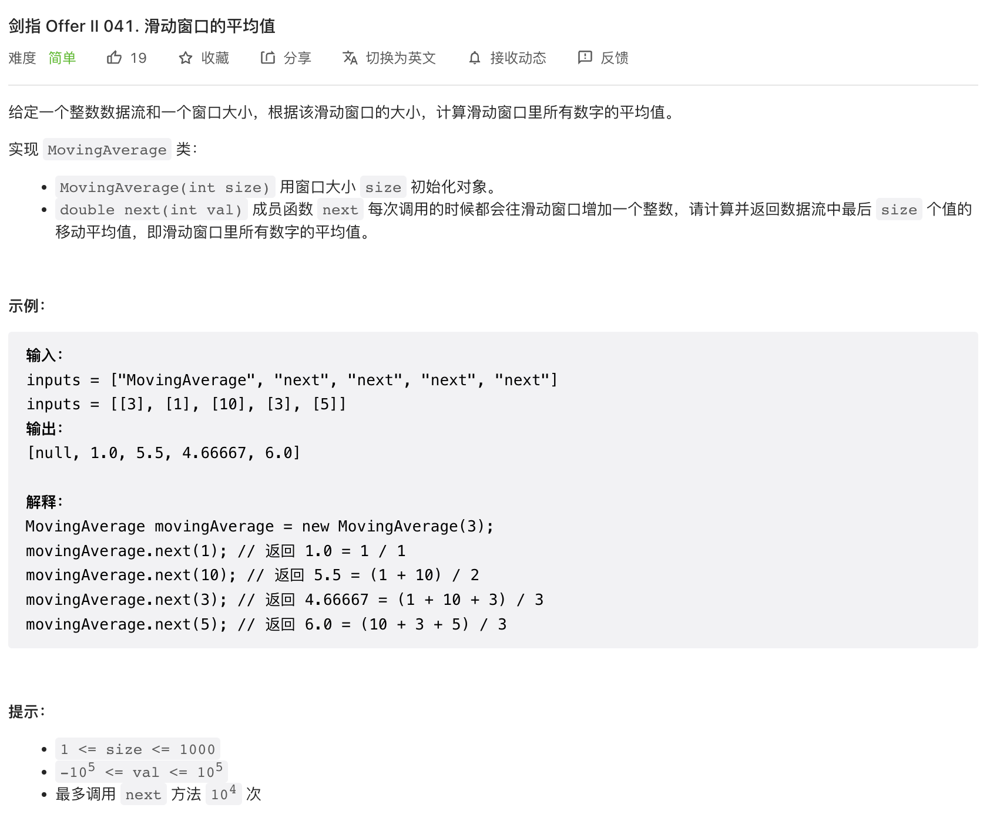
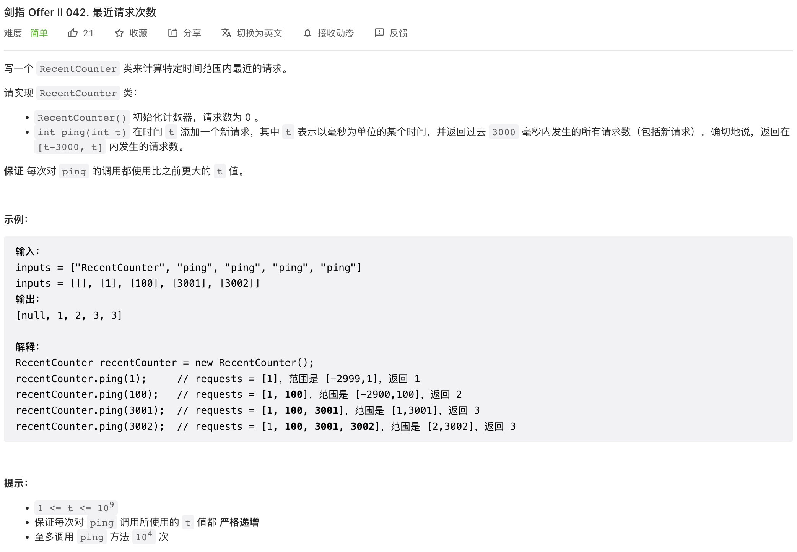
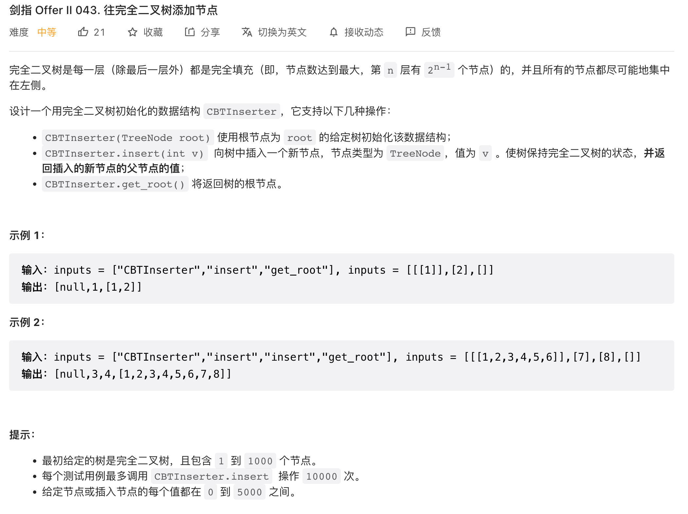
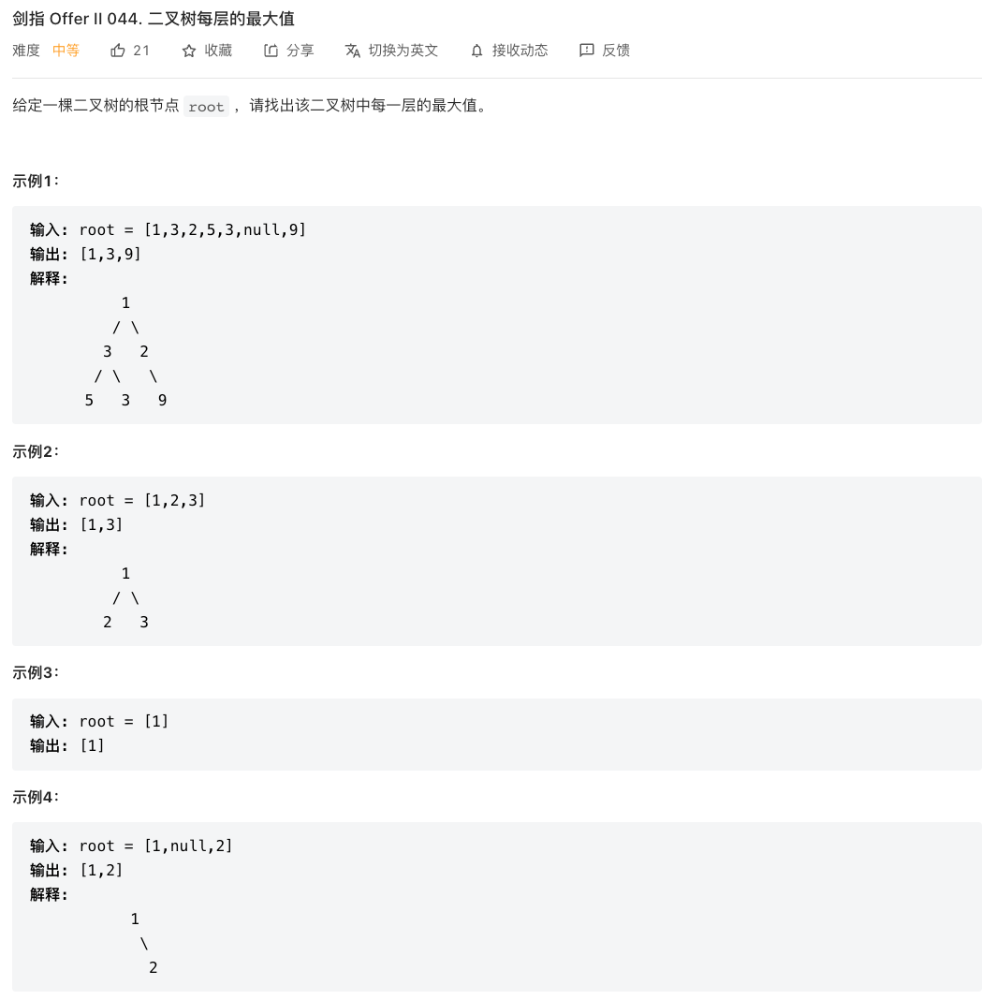
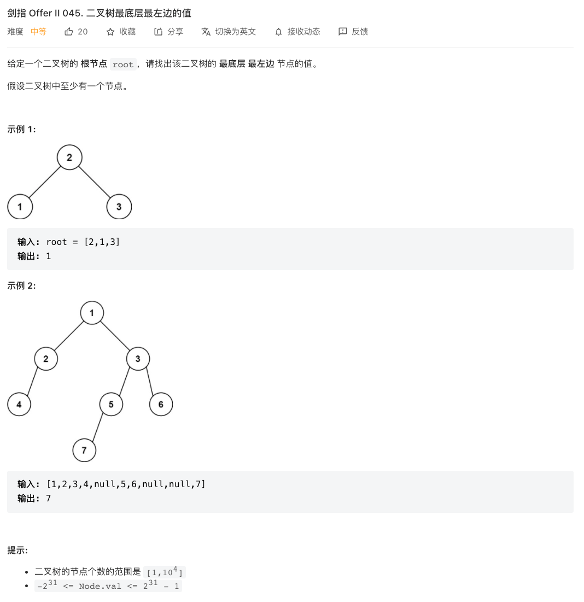

## CI.41 滑动窗口的平均值

### [剑指 Offer II 041. 滑动窗口的平均值](https://leetcode-cn.com/problems/qIsx9U/)



按照题目的意思，每次调用`next`方法新增一个值，然后求解窗口内的平均值。要求这个平均值，我们可以用一个`sum`累加每一个`val`，然后可以快速求得平均值。

当变量的值超出了窗口的大小的时候，我们将前面的值移出窗口。

按照这个思路，我们可以用一个队列存储数据，当数据量超出了窗口大小，就删除最先入队列的值即可。

```c++
class MovingAverage {
  public:
  queue<int> data;
  int size;
  double sum;
  /** Initialize your data structure here. */
  MovingAverage(int _size) {
    size=_size;
    sum=0;
  }

  double next(int val) {
    data.push(val);
    sum += val;
    if(data.size()>size){
      sum -= data.front();
      data.pop();
    }
    return sum / data.size();
  }
};

/**
 * Your MovingAverage object will be instantiated and called as such:
 * MovingAverage* obj = new MovingAverage(size);
 * double param_1 = obj->next(val);
 */

```

- 时间复杂度：我们用了`sum`变量记录队列中的值的总和，每次只需要一次加减操作就可以知道总和，时间复杂度为$O(1)$
- 空间复杂度：通过长度为`size`的队列存储数据，空间复杂度为$O(n)$，n为size的值

## CI.42 最近请求次数

### [剑指 Offer II 042. 最近请求次数](https://leetcode-cn.com/problems/H8086Q/)



将数据存储到一个数组中，每次新增一个值的时候，先将前面的小于`t-3000`的值都删去，然后将`t`放入到数组中即可。直接返回数组的长度就是当前在3000毫秒内的请求数量。

因为时间t都是递增的值，所以删除前面超出范围的值的时候，一定是从数组开头开始删除的，这可以通过队列来实现从头删除。

```c++
class RecentCounter {
  public:
  int RANGE = 3000;
  queue<int> times;
  RecentCounter() {

  }

  int ping(int t) {
    while(!times.empty()&& times.front() < t-RANGE){
      times.pop();
    }
    times.push(t);
    return times.size();
  }
};

/**
 * Your RecentCounter object will be instantiated and called as such:
 * RecentCounter* obj = new RecentCounter();
 * int param_1 = obj->ping(t);
 */

```

- 时间复杂度：每次新增一个值的时候，需要往队列中插入一个值，同时遍历数组中超时的其他值，时间复杂度为$O(k)$，k为超时的元素长度。因为超时的时间3000毫秒是固定值，所以时间复杂度近似为常数级别
- 空间复杂度：同上

## CI.43 往完全二叉树中添加节点

### [剑指 Offer II 043. 往完全二叉树添加节点](https://leetcode-cn.com/problems/NaqhDT/)



要往完全二叉树中新增节点，可能有两种情况

- 二叉树中恰好每一层的节点都已经满了，此时新增的节点就作为新的一层，其父节点就是上一层的第一个节点
- 二叉树中最后一层还没有放满节点，也就是树中还有其他父节点的子节点存在空缺，假设此时第一个存在子节点空缺的节点为P，此时只需要将新节点A作为P的子节点挂到树上即可

实际上第一个情况也被包含在第二个场景里了，往完全二叉树新增节点，只需要找到第一个存在子节点空缺的节点P，就可以知道新节点要放在哪个位置了。

### 层次遍历

而要找到二叉树中第一个存在子节点空缺的节点，可以对二叉树进行层次遍历，判断每一层的每个节点，其左右子节点是否存在即可。层次遍历的实现可以通过一个队列。

因为我们只关注那些子节点存在空缺的节点，所以当某个节点的左右子节点都存在了，那就将这个节点从队列中移除，而队列中只保存子节点存在空缺的节点。这样每次取出队列中的第一个节点，就是第一个子节点存在空缺的节点了。

```c++
class CBTInserter {
  public:
  TreeNode* root;
  queue<TreeNode*> nodes;
  CBTInserter(TreeNode* _root) {
    root = _root;
    nodes.push(root);
    // 层次遍历，下一层的节点存入队列，当前层的节点如果左右节点都存在，则推出队列
    while(!nodes.empty() && nodes.front()->left != nullptr && nodes.front()->right != nullptr){
      nodes.push(nodes.front()->left);
      nodes.push(nodes.front()->right);
      nodes.pop();
    }
  }

  int insert(int v) {
    TreeNode* node = new TreeNode(v);
    TreeNode* parent = nodes.front();
    if(parent->left ==nullptr){
      parent->left=node;
    }else {
      parent->right=node;
      nodes.push(parent->left);
      nodes.push(parent->right);
      nodes.pop();
    }
    return parent->val;
  }

  TreeNode* get_root() {
    return root;
  }
};

/**
 * Your CBTInserter object will be instantiated and called as such:
 * CBTInserter* obj = new CBTInserter(root);
 * int param_1 = obj->insert(v);
 * TreeNode* param_2 = obj->get_root();
 */

```

- 时间复杂度：每次插入新节点时，我们只需要从队列中取出第一个节点，就可以完成插入，时间复杂度为$O(1)$
- 空间复杂度：队列中保存的是二叉树中子节点存在空缺的节点，空间复杂度为$O(n)$

### 二叉树的节点规律


## CI.44 二叉树每层的最大值

### [剑指 Offer II 044. 二叉树每层的最大值](https://leetcode-cn.com/problems/hPov7L/)



题目的思路很清晰，就是要对二叉树进行层次遍历，然后计算每一层的最大值即可。这里的问题是层次遍历的时候怎么判断每个元素是在哪一层？

### 计数

可以想到的一个思路是，我们在将子节点放入队列中的时候，对子节点进行计数，每次记录下子节点的数量`nextCount`。

在层次遍历的时候，我们可以知道当前层的元素的个数`count`，还有已经遍历了的数目`i`，每一层遍历完的时候，重置这些变量即可。

```c++
class Solution {
  public:
  vector<int> largestValues(TreeNode* root) {
    queue<TreeNode*> nodes;
    vector<int> result;
    if(root == nullptr) return result;
    nodes.push(root);
    int count = 1;
    int nextCount =0;
    int i = 0;
    int maxVal = INT_MIN;
    while(!nodes.empty()){
      TreeNode* cur = nodes.front();
      nodes.pop();
      i++;
      if(cur->left){
        nodes.push(cur->left);
        nextCount++;
      }
      if(cur->right){
        nodes.push(cur->right);
        nextCount++;
      }
      maxVal = max(maxVal,cur->val);
      if(i == count){
        result.push_back(maxVal);
        maxVal = INT_MIN;
        i=0;
        count = nextCount;
        nextCount=0;
      }
    }
    return result;
  }
};
```


### 两个队列

除了计数，我们还可以将不同层的节点放入到不同的队列中，这样就不需要知道每一层的节点的数量了，只需要遍历队列即可。

```c++
class Solution {
  public:
  vector<int> largestValues(TreeNode* root) {
    queue<TreeNode*> current;
    queue<TreeNode*> next;
    vector<int> result;
    if(root == nullptr) return result;
    current.push(root);
    int maxVal = INT_MIN;
    while(!current.empty()){
      TreeNode* cur = current.front();
      current.pop();
      if(cur->left){
        next.push(cur->left);
      }
      if(cur->right){
        next.push(cur->right);
      }
      maxVal = max(maxVal,cur->val);
      if(current.empty()){
        result.push_back(maxVal);
        maxVal = INT_MIN;
        current = next;
        queue<TreeNode*> newQueue;
        next = newQueue;
      }
    }
    return result;
  }
};

```

- 时间复杂度：两个算法都对每个节点遍历了一次，时间复杂度为$O(n)$
- 空间复杂度： $O(n)$

## CI.45 二叉树最底层最左边的值

### [剑指 Offer II 045. 二叉树最底层最左边的值](https://leetcode-cn.com/problems/LwUNpT/)



这个题的思路和44题很类似，都是要找到每一层的某个位置的元素的值。这个题要的是最后一层的第一个值，我们只需要改一下，记录一下每一层的第一个值即可。

采用双队列的方式实现如下

```c++
/**
 * Definition for a binary tree node.
 * struct TreeNode {
 *     int val;
 *     TreeNode *left;
 *     TreeNode *right;
 *     TreeNode() : val(0), left(nullptr), right(nullptr) {}
 *     TreeNode(int x) : val(x), left(nullptr), right(nullptr) {}
 *     TreeNode(int x, TreeNode *left, TreeNode *right) : val(x), left(left), right(right) {}
 * };
 */
class Solution {
  public:
  int findBottomLeftValue(TreeNode* root) {
    queue<TreeNode*> current;
    queue<TreeNode*> next;
    int firstVal = root->val;
    if(root == nullptr) return firstVal;
    current.push(root);
    while(!current.empty()){
      TreeNode* cur = current.front();
      current.pop();
      if(cur->left){
        next.push(cur->left);
      }
      if(cur->right){
        next.push(cur->right);
      }
      if(current.empty()){
        current = next;
        queue<TreeNode*> newQueue;
        next = newQueue;
        if(!current.empty()){
          // 下一层的第一个节点
          firstVal=current.front()->val;
        }
      }
    }
    return firstVal;
  }
};
```

时间复杂度和空间复杂度都是$O(n)$

## CI.46 二叉树的右侧视图

### [剑指 Offer II 046. 二叉树的右侧视图](https://leetcode-cn.com/problems/WNC0Lk/)

这个题目要求的是二叉树的右侧视图，所谓的右侧视图，实际就是二叉树每一层的最后一个节点组成的列表。思路也和之前.44，.45题很类似，只是这个题目改成了记录每一层的最后一个节点的值。

采用双队列实现如下

```c++
/**
 * Definition for a binary tree node.
 * struct TreeNode {
 *     int val;
 *     TreeNode *left;
 *     TreeNode *right;
 *     TreeNode() : val(0), left(nullptr), right(nullptr) {}
 *     TreeNode(int x) : val(x), left(nullptr), right(nullptr) {}
 *     TreeNode(int x, TreeNode *left, TreeNode *right) : val(x), left(left), right(right) {}
 * };
 */
class Solution {
  public:
  vector<int> rightSideView(TreeNode* root) {
    queue<TreeNode*> current;
    queue<TreeNode*> next;
    vector<int> result;
    if(root == nullptr) return result;
    current.push(root);
    while(!current.empty()){
      TreeNode* cur = current.front();
      current.pop();
      if(cur->left){
        next.push(cur->left);
      }
      if(cur->right){
        next.push(cur->right);
      }
      if(current.empty()){
        // 当前层的最后一个节点
        result.push_back(cur->val);
        current = next;
        queue<TreeNode*> newQueue;
        next = newQueue;
      }
    }
    return result;
  }
};
```

时间复杂度和空间复杂度都是$O(n)$