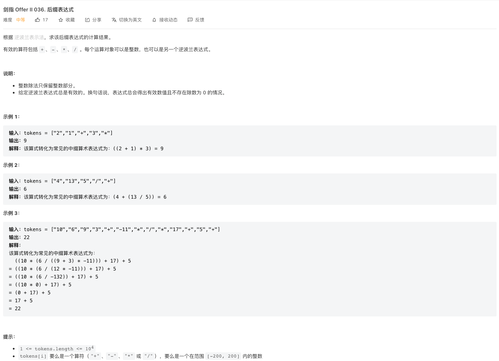
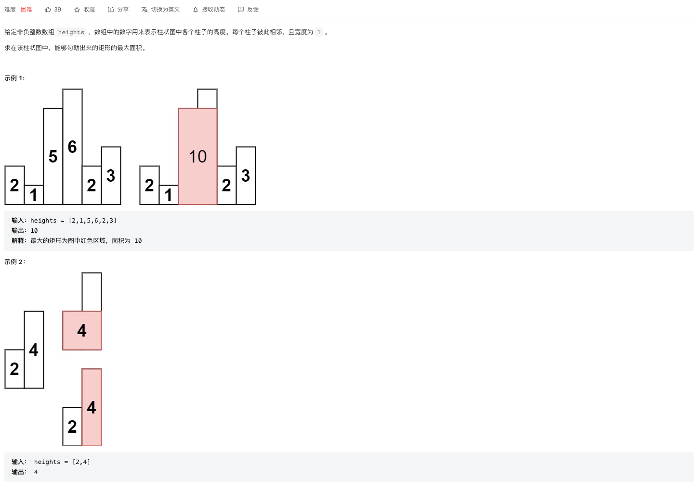

## CI.36 后缀表达式

### [剑指 Offer II 036. 后缀表达式](https://leetcode-cn.com/problems/8Zf90G/)



根据后缀表达式的含义，我们大概可以理解到

- 对于 $a + b$的后缀表达式为$a b +$，也就是操作符在操作数的后面
- 操作符的操作数就是前面两个数字，如果前面两个数字中有某一个是复杂的嵌套表达式，需要先将复杂表达式的结果求解出来

不管多复杂的表达式，我们都可以找到嵌套最深的那个表达式，最深一层的表达式，其操作符和操作数是相邻的，也就是中间没有再嵌套表达式了。

例如 ["10","6","9","3","+","-11","*","/","*","17","+","5","+"] 这个，我们可以找到最深一层的表达式是 9 3 + 这个表达式。

从最深的一层表达式开始，将每个嵌套嵌套表达式都求解出来，得到简单值，这样就可以完成后缀表达式的求值了。

要找到最深的嵌套表达式，我们可以从数组开头遍历，遇到的第一个符号就是最深一层的表达式。此时只需要取出前面两个操作数，执行计算，然后将计算后的结果存起来即可。

因为我们在遇到操作符的时候，需要回溯前面两个最近的操作数，所以需要用到栈来存储操作数。

```c++
class Solution {
  public:
  string ADD = "+",SUB = "-",MULTI = "*", DIVIDE = "/";
  int evalRPN(vector<string>& tokens) {
    stack<int> nums;
    for(int i=0;i<tokens.size();i++){
      string token = tokens[i];
      if(!(token == ADD || token ==SUB || token == MULTI || token ==DIVIDE)){
        nums.push(stoi(token));
        continue;
      }
      int n= nums.top() ;
      nums.pop();
      if(token ==ADD){
        nums.top() += n;
      } else if(token == SUB){
        nums.top() -= n;
      } else if(token == MULTI){
        nums.top() *= n;
      }else if (token == DIVIDE){
        nums.top() /= n;
      }
    }
    return nums.top();
  }
};

```

上面的算法，只需要对表达式遍历一次，时间复杂度为$O(n)$。用到了栈来存储数据，需要$O(n)$的空间复杂度。

## CI.37 小行星碰撞

### [剑指 Offer II 037. 小行星碰撞](https://leetcode-cn.com/problems/XagZNi/)


这个题目首先应该先理解下意思，每个数字代表的是一个行星，正和负表示的是行星的前进方向，数值表示的是行星的大小。

- 碰撞条件

而只有方向相反，且路程有交集的行星，才可能发生碰撞，其他条件都不可能发生碰撞。更具体的说，只有一种情况会发生碰撞，那就是向右飞行的行星A的位置indexA，位于向左飞行的行星B的位置indexB的左边，这样才会发生碰撞。

- 碰撞结果

碰撞的结果就是数值大的行星会保留下来，并且继续往前和可能会相撞的行星发生碰撞，一直到不会碰撞为止。

所以计算碰撞结果的时候，需要依次找到前面方向相反的行星，直到遇到第一个不会发生碰撞的行星（方向相同）、或者是行星爆炸为止。

当遇到方向相同的行星，或者是当前新进来的行星发生了爆炸，则结束碰撞即可。

如果前面所有行星都被撞了，那应该把当前行星保留存储起来。

- 数据结构

在出现了向左飞行的行星(<0)时，需要回溯到最近的几个方向相反(>0)的行星，所以需要用到栈。

```c++
class Solution {
  public:
  vector<int> result;
  vector<int> asteroidCollision(vector<int>& asteroids) {
    for(int item: asteroids){
      if(item > 0 || result.empty() || result.back() < 0){
        result.push_back(item);
      }else {
        this->collision(item);
      }
    }
    return result;
  }
  void collision(int item){
    int sum;
    while( !result.empty() && result.back() > 0){
      sum = result.back() + item;
      if(sum >0){
        return;
      }
      result.pop_back();
      if(sum ==0){
        return;
      }
    }
    result.push_back(item);
  }
};

```


## CI.38 每日温度

### [剑指 Offer II 038. 每日温度](https://leetcode-cn.com/problems/iIQa4I/)


```c++
class Solution {
  public:
  vector<int> dailyTemperatures(vector<int>& temperatures) {
    stack<int> pendingTemp;
    vector<int> result(temperatures.size());
    for(int i=0;i<temperatures.size();i++){
      int temp = temperatures[i];
      while(!pendingTemp.empty()&& temp > temperatures[pendingTemp.top()]){
        int top = pendingTemp.top();
        pendingTemp.pop();
        result[top] = i-top;
      }
      pendingTemp.push(i);
    }
    while(!pendingTemp.empty()){
      int top = pendingTemp.top();
      pendingTemp.pop();
      result[top] = 0;
    }
    return result;
  }
};

```


## CI.39 直方图最大矩形面积

### [剑指 Offer II 039. 直方图最大矩形面积](https://leetcode-cn.com/problems/0ynMMM/)



我们可以知道，一组直方图柱子构成的最大矩形中，矩形的高就是这一组柱子中的高度最矮的一个柱子，宽度就是这一组柱子的直方图的个数。

所以我们可以计算出，以直方图中的每一个柱子i，作为最矮的柱子的场景， 对应的矩形面积，然后求出这些矩形面积中最大的一个即可。

### 分治法

对于直方图中的高度最小的矩形i而言，整个直方图的最大的矩形面积s可能有三种情况

- 最大矩形面积s包含了矩形i
- 最大矩形面积只由i左侧的矩形组成
- 最大矩形面积只由i右侧的矩形组成

我们只需要计算出这3中情况中，各自能够形成的最大的矩形面积，然后取最大值即可。

对于只包含左侧或者只包含右侧的场景，实际又是一个单独的直方图求解最大矩形面积的问题，也就是一个递归的过程。

```c++
class Solution {
  public:
  int largestRectangleArea(vector<int>& heights) {
    return this->core(heights, 0, heights.size());
  }
  int core(vector<int>& heights,int start,int end){
    if(start == end) return 0;
    if(start == end- 1) return heights[start];
    int minIndex = start;
    for(int i=start+1;i<end;i++){
      if(heights[i] < heights[minIndex]) minIndex=i;
    }
    int center = heights[minIndex] * (end - start );
    int left = this->core(heights, start, minIndex);
    int right = this->core(heights, minIndex+1, end);
    int max;
    return (max = center > left ? center : left )> right ? max : right;
  }
};
```

- 时间复杂度
- 空间复杂度

上面这个算法的复杂度还是不能满足题目数据量的要求，会导致超大数据量的场景执行超时。

### 单调栈


上面的思路有分析，我们可以计算出以直方图中的每一个柱子i作为最矮的柱子的场景， 对应的矩形面积。

对于每个柱子i，我们需要知道这个，以这个柱子i为高（最矮的柱子）的柱子的范围是哪里，因此每个柱子i，我们需要知道前面的柱子的高度。

- 如果前面的柱子`j`的高度比柱子`i`的高度要高，则我们可以确定前面的柱子`j`作为高的场景，一定是不包含`i`在内的，因为heights[i] < height[j]，所以此时柱子`j`作为高的场景对应的柱子范围可以确定。假设在柱子j前面，高度比j要小的一个柱子是`m`，则以柱子为高的范围就是$(m , i)$ 这个区间
- 如果前面的柱子`j`的高度都比`i`要矮，则说明两个问题
  - `j`为高的右边界可能是`i`，但还得看`i`后面的高度
  - `i`为高的左边界就是离`i`最近的一个`j`，右边界则还需要看后面的高度

基于这个分析，我们对柱子进行遍历，遍历的目的是找到每个柱子i为高的场景，对应的柱子的范围。

因为要回溯到某个柱子i前面的最近的柱子j的高度，来确定i的左边界，所以我们用一个栈来保存数据。

同时为了方便我们确定柱子高度对应的索引值，我们直接在栈中存每个高度对应的索引，而不是存柱子的高度，这样某个高度为矩形高的场景，其宽度很容易可以通过索引确定。

具体的思路是，我们使用一个单调栈存储数据。对于每个柱子高度x

- 如果小于栈顶的高度，则说明栈顶高度作为矩形的高的右边界可以确定就是x了，而也可以确定就是里栈顶最近一个，高度小于栈顶的元素，也即是倒数第二个元素。这样可以计算出，以栈顶这个柱子作为矩形的高，对应的这个矩形的面积。
- 如果大于栈顶的高度，则将这个柱子的索引放入栈中即可

另外，最后如果遍历完了，栈中还剩有一些柱子没有找到右边界，那实际右边界就是数组的右边界。

为了方便确定数组的左边界，我们在栈中放入一个-1的索引。

```c++
class Solution {
  public:
  int largestRectangleArea(vector<int>& heights) {
    int LEFT_BOUND = -1;
    stack<int> pendingIndex;
    pendingIndex.push(LEFT_BOUND);
    int result = 0;
    for(int i=0;i<heights.size();i++){
      while (pendingIndex.top() != LEFT_BOUND && heights[i] < heights[pendingIndex.top()]) {
        int top = pendingIndex.top();
        pendingIndex.pop();
        // 左开右开的区间 (pending.top, i)
        int width = i - pendingIndex.top() -1;
        int height = heights[top];
        result = max(result,height * width);
      }
      pendingIndex.push(i);
    }
    while(pendingIndex.top() != LEFT_BOUND ){
      int top = pendingIndex.top();
      pendingIndex.pop();
      // 左开右开的区间 (pending.top, i)
      int width = heights.size() - pendingIndex.top() -1;
      int height = heights[top];
      result = max(result,height * width);
    }
    return result;
  }
};
```

- 时间复杂度：对于每根柱子，都会入栈、出栈一次，也就是操作两次，但是操作的复杂度都是$O(1)$，所以总体的时间复杂度为$O(n)$
- 空间复杂度：因为使用了栈存储数据，复杂度为$O(n)$

## CI.40 矩阵中的最大的矩形

### [剑指 Offer II 040. 矩阵中最大的矩形](https://leetcode-cn.com/problems/PLYXKQ/)


这个题目和前面求解直方图中最大矩形面积的方法类似，都是要求解一个图形中的矩形的最大面积。

我们可以将依次以每一行作为基线，拆开成多个直方图，然后求解每一行作为基线时候，直方图中矩形的最大面积。

矩阵中矩形最大面积就是所有行为基线构成直方图的情况中，能够形成的最大的矩形面积

```c++
class Solution {
  public:
  int maximalRectangle(vector<string>& matrix) {
    if(!matrix.size()) return 0;
    int result=0;
    vector<int> heights(matrix[0].size());
    for(int i=0;i<matrix.size();i++){
      string line= matrix[i];
      for(int j=0;j<line.size();j++){
        heights[j] = line[j] == '0' ? 0: heights[j] +1;
      }
      result = max(result,this->largestRectangleArea(heights));
    }
    return result;
  }

  int largestRectangleArea(vector<int>& heights) {
    int LEFT_BOUND = -1;
    stack<int> pendingIndex;
    pendingIndex.push(LEFT_BOUND);
    int result = 0;
    for(int i=0;i<heights.size();i++){
      while (pendingIndex.top() != LEFT_BOUND && heights[i] < heights[pendingIndex.top()]) {
        int top = pendingIndex.top();
        pendingIndex.pop();
        // 左开右开的区间 (pending.top, i)
        int width = i - pendingIndex.top() -1;
        int height = heights[top];
        result = max(result,height * width);
      }
      pendingIndex.push(i);
    }
    while(pendingIndex.top() != LEFT_BOUND ){
      int top = pendingIndex.top();
      pendingIndex.pop();
      // 左开右开的区间 (pending.top, i)
      int width = heights.size() - pendingIndex.top() -1;
      int height = heights[top];
      result = max(result,height * width);
    }
    return result;
  }
};

```

假设矩阵为m行n列，采用单调栈来求解直方图的最大矩形面积

- 时间复杂度：要遍历m行，复杂度为$O(m)$ , 每一行为基线构成的直方图的高度有n个柱子，计算最大面积的复杂度为$O(n)$，总的复杂度为$O(mn)$
- 空间复杂度：$O(n)$

## 总结

### 单调栈

以单调递增的单调栈为例，单调栈的思路是

- 只有在当前元素x的值，大于栈顶元素y的值，我们才将x放入栈中
- 如果当前元素的值x小于栈顶值y，则可以确定，小于y的两个最近的元素值，其中左边界是栈中倒数第二个值，右边界则是当前x。

