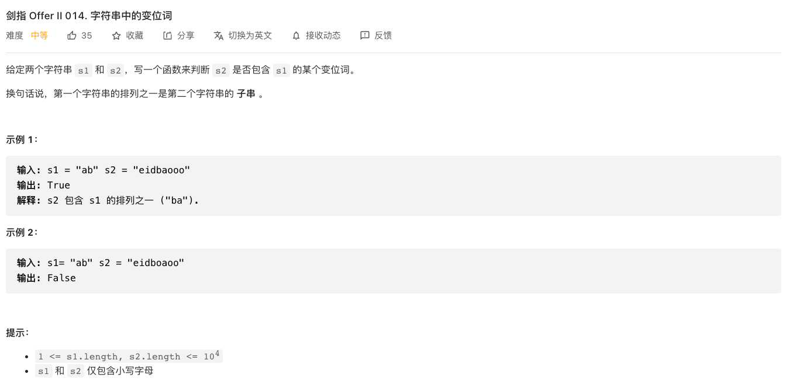
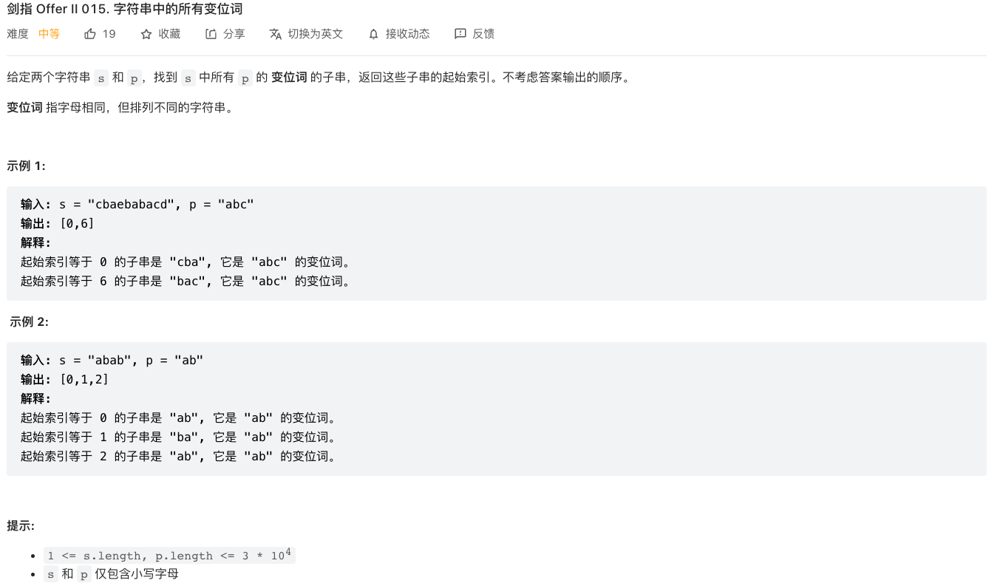
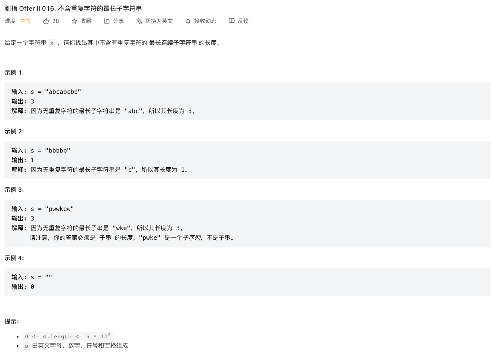
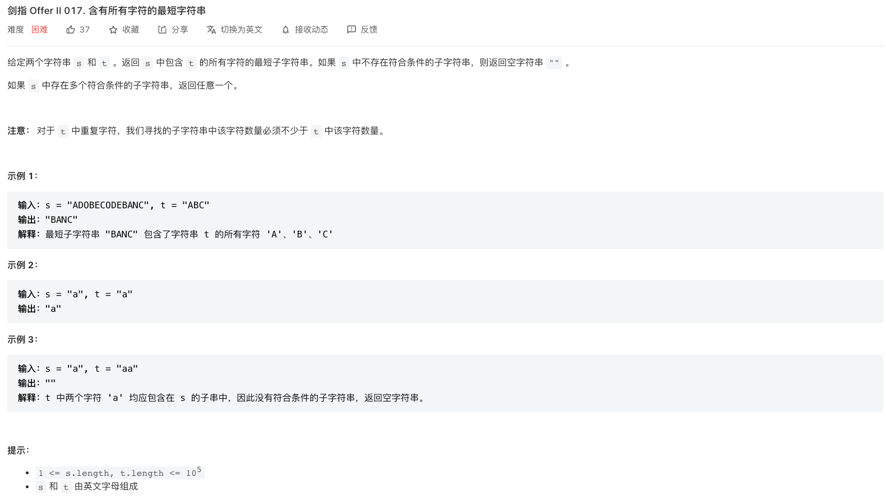
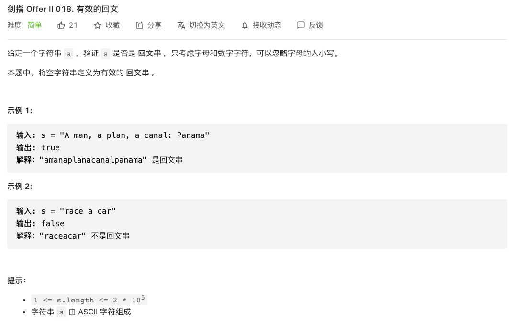
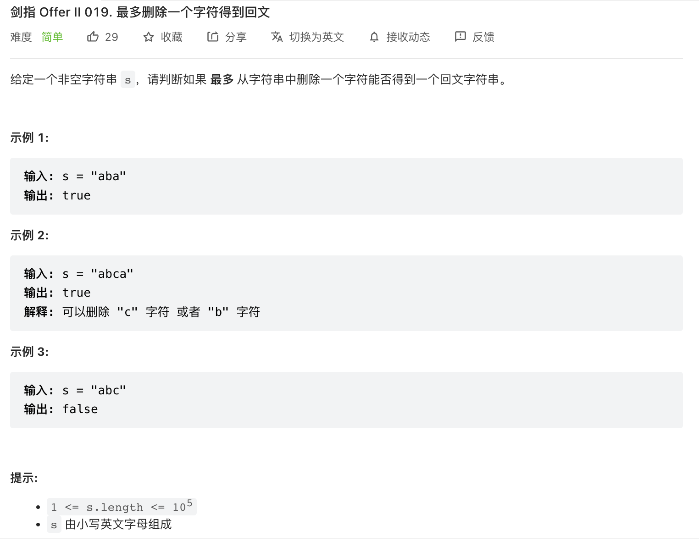
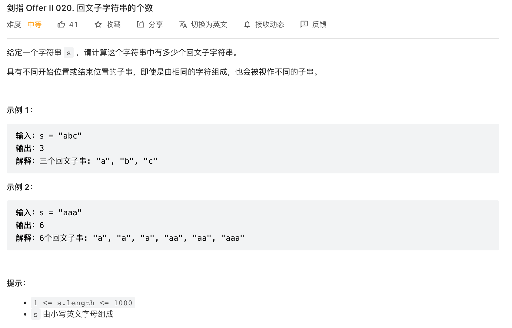

## CI.14 字符串中的变位词

### [剑指 Offer II 014. 字符串中的变位词](https://leetcode-cn.com/problems/MPnaiL/)



题目中的变位词指的是，字符串的某一个排列S是字符串s2中的一个子字符串。所以题目的意思就是要求s2中是否包含某个子字符串是s1字符串的某一个排列。

首先我们要想一下，一个字符串的不同排列下，哪些可能会变，哪些一定是不变。

- 字符串的字符数量（长度）不会变
- 字符串的字符集合不会变、出现的次数也不会变
- 字符串的字符排列方式可能会变

我们要去查找一个字符串的某个排列，需要从不变的属性中去判断，也就是字符串的长度、字符的出现次数这两个属性。字符串的长度很容易判断，问题的关键在于如何入判断两个字符串中字符出现的次数是否相同。

要判断一个字符串中字符出现的次数，可以通过下面的方式

- 通过哈希表存储每个字符出现的次数

按照这个思路，我们的解题思路是

- 遍历字符串s1，在map中记录每个字符串出现的次数
- 字符串s1的长度为n，在字符串s2中设置长度为n的窗口，窗口内的每个字符，对应的将map中字符出现次数减一，而移出窗口外的值，说明不是子字符串中的字符，所以我们要把减去的次数给加回去
- 如果map中所有字符串出现的次数都为0，则认为当前s2中的子字符串就是s1的变位词

代码实现如下

```js
/**
 * @param {string} s1
 * @param {string} s2
 * @return {boolean}
 */
var checkInclusion = function(s1, s2) {
  if(s2.length < s1.length) return false;
  const counts = Array.from({length: 26}).fill(0);
  const n = s1.length;
  let i = -1;
  const a = 'a'.charCodeAt();
  while(++i<n){
    counts[s1.charCodeAt(i)-a] += 1;
    counts[s2.charCodeAt(i)-a] -= 1;
  }
  if(allZero(counts)) return true;
  // 第一次进入循环的时候i的值为n
  while(i < s2.length){
    // 窗口右移，左边被移出的元素数量要加回去
    counts[s2.charCodeAt(i)-a] -= 1;
    counts[s2.charCodeAt(i-n)-a] += 1;
    if(allZero(counts)) return true;
    i++;
  }
  return false;
};
var allZero= arr => arr.every(item => item===0);
```

## CI.15 字符串中的所有变位词

### [剑指 Offer II 015. 字符串中的所有变位词](https://leetcode-cn.com/problems/VabMRr/)



实现思路和上面的题目类似，只是结果是多个，所以需要用个数组来存放结果。

```js
/**
 * @param {string} s
 * @param {string} p
 * @return {number[]}
 */
var findAnagrams = function(s2, s1) {
  if(s2.length < s1.length) return [];
  const counts = Array.from({length: 26}).fill(0);
  const n = s1.length;
  let i = -1;
  const a = 'a'.charCodeAt();
  const result = [];
  while(++i<n){
    counts[s1.charCodeAt(i)-a] += 1;
    counts[s2.charCodeAt(i)-a] -= 1;
  }
  if(allZero(counts)) result.push(0);
  while(i < s2.length){
    // 窗口右移，左边被移出的元素数量要加回去
    counts[s2.charCodeAt(i)-a] -= 1;
    counts[s2.charCodeAt(i-n)-a] += 1;
    if(allZero(counts)) result.push(i-n + 1);
    i++;
  }
  return result;
};
var allZero= arr => arr.every(item => item===0);
```

## CI.16 不含重复字符的最长子字符串

### [剑指 Offer II 016. 不含重复字符的最长子字符串](https://leetcode-cn.com/problems/wtcaE1/)



题目中要的是不含重复字符的、最长的子字符串，也就是说有两个关键点要满足

- 不含重复字符
- 长度最长

要满足长度最长这个条件比较容易，只需要用一个变量记录一下当前的最长的一个符合条件的字符串的长度即可，所以问题的关键是找出不含重复字符的字符串，也就是要找到判断字符是否重复的方法

要判断一个字符串中的字符是否有重复，有几个思路

- 通过哈希表记录字符串是否有出现，每次新增字符的时候只需要判断一下当前字符是否已经存在
- 如果组成字符串的字符集中，字符数较少的话，我们可以用一个整数的二进制位来表示每个字符是否有出现，每个字符对应一个二进制位，如果字符出现了，则将该位置为1。此时要判断某个字符是否出现的时候，只需要去看对应的二进制位的值即可

### 哈希解法

按照通过哈希表的思路，我们的解题思路是

- 通过两个指针left、right来指向我们的子字符串的头和尾，用一个变量length记录当前最长的子字符串的长度
- 初始状态两个指针都指向字符串的第一个元素，length置为0
- 遍历字符串
  - 如果新增字符没有在当前left和right之间出现过，则将向右移动right指针，并记录下当前长度，如果是目前最长的长度，则更新长度变量
  - 如果当前字符出现过了，则向右移动left指针，直到right指针指向的元素没有出现过为止
- 子字符串中新增或者删除字符的时候，要在哈希表中记录新增字符出现的次数

按照这个思路的代码实现如下

```js
/**
 * @param {string} s
 * @return {number}
 */
var lengthOfLongestSubstring = function (s) {
  if (s.length < 2) return s.length;
  const counts = new Map();
  let length = 1;
  counts.set(s[0], 1);
  let left = 0, right = 1;
  while (right < s.length) {
    const ch = s[right];
    const count = counts.get(ch) || 0;
    if (count && left < right) {
      length = Math.max(length, right - left);
      const chLeft = s[left];
      counts.set(chLeft, counts.get(chLeft) - 1);
      left++;
    } else {
      counts.set(ch, 1);
      right++;
    }
  }
  return Math.max(right - left, length);
};
```

要注意最后返回的时候要比较一下`right-left`和`length`的值的大小，考虑到整个字符串s都是一个无重复字符的场景，那更新length的语句在循环内就没有被执行到，所以需要单独判断一次。

上面的代码中，当发现right指针指向的元素已经出现过的时候，会只移动left指针，把左边的元素不断的减去，直到right指针指向的元素在当前子字符串中是首次出现为止。

这个过程可能用下面的嵌套的while循环来实现会更容易理解，两者实现的目的是一样的。

```js
/**
 * @param {string} s
 * @return {number}
 */
var lengthOfLongestSubstring = function(s) {
  if(s.length <2)return s.length;
  const counts = new Map();
  let length = 1;
  counts.set(s[0],1);
  let left = 0,right = 1;
  while( right < s.length){
    const ch = s[right];
    const count = counts.get(ch) || 0;
    if(count){
      length = Math.max(length,right - left);
      while(counts.get(ch)){
        const chLeft = s[left];
        counts.set(chLeft, counts.get(chLeft) - 1);
        left++;
      }
    }
    counts.set(ch,1);
    right ++;
  }
  return Math.max(right-left,length);
};
```

### 比较出现次数的差值

按照上面解法的思路，其实核心就是这个循环

```js
while( right < s.length){
  const ch = s[right];
  const count = counts.get(ch) || 0;
  if(count){
    length = Math.max(length,right - left);
    while(counts.get(ch)){
      const chLeft = s[left];
      counts.set(chLeft, counts.get(chLeft) - 1);
      left++;
    }
  }
  counts.set(ch,1);
  right ++;
}
```

更具体的说，就是当right指针指向的元素出现过的时候，我们要移动left指针，直到right指针指向的元素没有出现过为止。而移动left指针的过程，实际就是为了找到前面的子字符串中，和right指针所指的元素重复了的那个节点，然后删掉这个节点。

// TODO

## CI.17 包含所有字符的最短字符串

### [剑指 Offer II 017. 含有所有字符的最短字符串](https://leetcode-cn.com/problems/M1oyTv/)



题目的要求是在字符串s中找到包含t中所有字符的一个最短的子字符串，所以这里有两个条件

- 包含t中的所有字符
- 最短的字符串

要找到最短的字符串，只需要用一个变量记录当前的长度，然后比较所有符合条件的字符串的长度，选最短的即可。所以问题的核心是怎么在字符串s中找到包含字符串t的所有字符串子字符串，而这其实和前面的题目类似的，思路有如下

- 通过两个指针left和right形成一个滑动窗口，不断的向右滑动遍历字符
- 先遍历字符串t，将出现的字符的次数记录到map中
- 滑入窗口遍历字符串s中的字符，判断滑入窗口内的字符rightCh
  - 如果字符串t中包含rightCh，则rightCh的出现次数减一
  - t中不包含rightCh，rightCh的次数不需要记录，right指针继续移动
- 对于滑出窗口的字符，执行类似的操作，只是滑出的字符出现的次数应该是减一

按照这个思路的代码实现如下

```js
/**
 * @param {string} s
 * @param {string} t
 * @return {string}
 */
var minWindow = function (s, t) {
  if (t.length > s.length) return '';
  const counts = new Map();
  for (let i = 0; i < t.length; i++) {
    const ch = t[i];
    const prevCount = counts.get(ch) || 0;
    counts.set(ch, prevCount + 1);
  }
  let left = 0, right = 0, result = '';
  let remainingChars = counts.size; // 这里计算的是不重复字符的个数
  while (right < s.length) {
    const rightCh = s[right];
    if (counts.has(rightCh)) {
      const count = counts.get(rightCh);
      const nextCount = count - 1;
      counts.set(rightCh, nextCount);
      if (nextCount === 0) {
        remainingChars--;
      }
    }

    while (left < right) {
      const leftCh = s[left];
      if (counts.has(leftCh)) {
        const leftCount = counts.get(leftCh);
        // leftCount < 0 就意味着这个字符在s中出现的次数超过了在t中的次数，此时应该移动左边界，抛弃左边的重复字符
        if (leftCount >= 0) {
          break;
        } else {
          counts.set(leftCh, leftCount + 1);
        }
      }
      left++;
    }
    if (remainingChars === 0) {
      result = (!result || result.length > (right - left + 1)) ? s.slice(left, right + 1) : result;
    }
    right++;
  }
  return remainingChars === t.length ? '' : result;
};
```

上面的代码中，内层嵌套的while循环主要考虑的是，同样的字符可能在s或者t中多次出现，此时我们需要做一下考虑。例如s="ADEBECDFFBANC"，t="ABC"，这种情况在遍历s的时候，我们的目标字符（ABC）出现的次数可能会超出t中的次数。

我们以s="ADEBEBCDFFBANC"，t="ABC"为例，出现重复字符的情况有两种

- AXBB，字符B虽然多次出现（超出了我们要的次数），但是我们没法移动左指针，因为重复的字符并不是边界字符
- AXBA，重复的字符A是当前子字符串的边界字符，此时我们可以移动左指针，抛弃左边的A，而保留右边的A，这样我们的字符串会更短，更接近结果

而按照上面的两种情况，我们又有两个问题

- 如何判断字符出现的次数是否超出了所需要的次数：这个可以通过重复字符B在Map中的次数来判断，如果该字符在Map中的次数已经为0，也就是说前面已经有足够的字符B了，此时再遇到字符B，则其在map中的次数就会变成小于0，根据这个我们可以判断字符是否超出了所需要的次数
- 如何知道重复的字符是不是边界字符：我们在将右边字符还剩余的次数减一之后，判断一下左边界的字符次数是否变成了负数，如果是负数，则说明当前字符是左边界相同的字符，否则说明是AXBB这种场景

```js
while (left < right) {
  const leftCh = s[left];
  if (counts.has(leftCh)) {
    const leftCount = counts.get(leftCh);
    // leftCount < 0 就意味着这个字符在s中出现的次数超过了在t中的次数，此时应该移动左边界，抛弃左边的重复字符
    if (leftCount >= 0) {
      break;
    } else {
      counts.set(leftCh, leftCount + 1);
    }
  }
  left++;
}
```

所以我们在遍历字符串的时候，每次都判断一下，左边界的字符出现的次数是否`leftCount >= 0`

## CI.18 有效的回文字符串

### [剑指 Offer II 018. 有效的回文](https://leetcode-cn.com/problems/XltzEq/)



### 双指针

用两个指针left、right，left指针从字符串开头位置开始，向右边遍历，right指针从字符串结尾开始，向左边遍历。

对于每个字符，如果不是数字或者字母，则跳过当前字符，接着遍历下一个字符。如果是数字或者字母，则对边左右两边的字符是否相等，相等则接着从两边往中间遍历，否则返回FALSE。

```js
/**
 * @param {string} s
 * @return {boolean}
 */
var isPalindrome = function (s) {
  if (s.length < 2) return true;
  let left = 0, right = s.length - 1;
  const a = 'a'.charCodeAt(), z = 'z'.charCodeAt();
  while (left < right) {
    const leftCh = s[left].toLowerCase();
    const rightCh = s[right].toLowerCase();
    if (!isDigitOrChar(leftCh)) {
      left++;
    } else if (!isDigitOrChar(rightCh)) {
      right--;
    } else {
      if (leftCh !== rightCh) {
        return false;
      }
      left++;
      right--;
    }
  }
  return true;
};

const isDigitOrChar = v => /[0-9a-zA-Z]/.test(v);
```

c++

```c++
class Solution {
  public:
  bool isPalindrome(string s) {
    if(s.size()<2) return true;
    int left=0,right=s.size()-1;
    while(left < right){
      if(!isalnum(s[left])){
        left++;
      }else if(!isalnum(s[right])){
        right--;
      }else {
        if(tolower(s[left]) != tolower(s[right])) return false;
        left++;
        right--;
      }
    }
    return true;
  }
};

```

### 筛选+反转

先对字符串进行一次筛选，将不是字母、数字的都过滤掉，得到新的字符串s，然后对s进行反转得到t，判断 s==t即可


## CI.19 最多删除一个字符得到回文

### [剑指 Offer II 019. 最多删除一个字符得到回文](https://leetcode-cn.com/problems/RQku0D/)



第一次遇到左右两边字符不相等的情况，就跳出循环，然后分别看删掉左边一个字符和删掉右边一个字符的两种情况，剩余没有判断的这一部分子字符串是否有满足回文的情况。

```c++
class Solution {
  public:
  bool validPalindrome(string s) {
    if(s.length()<2)return true;
    int left=0,right=s.length()-1;
    while(left < right){
      if(s[left] != s[right] ){
        break;
      }
      left ++;
      right --;
    }
    return left >= s.length()/2 || this->isPalindrome(s, left,right-1) || this->isPalindrome(s, left+1, right);
  }
  bool isPalindrome(string s,int start,int end){
    while(start < end){
      if(s[start] != s[end]) return false;
      start ++;
      end --;
    }
    return true;
  }
};

```

## CI.20 有效的回文字符串的个数

### [剑指 Offer II 020. 回文子字符串的个数](https://leetcode-cn.com/problems/a7VOhD/)



### 中心扩展

回文字符串的一个很大的特征是，一定会有一个中心，相当于是回文字符串的对称轴。确定了一个回文字符串的中心，这个回文字符串就能确定。

- 对于奇数个字符的回文字符串，中心就是中间的字符，例如 abcba的中心是c
- 对于偶数个字符的回文字符串，可以把中间的两个字符一起看成整体，当成是回文字符串的中心，例如abccba的中心是cc这个整体

多个不同的回文字符串可能共享同一个中心，所以我们在找到一个回文中心的时候，还需要往两边延伸查找一下所有的可能的回文字符串。

按照这个思路，我们要找到一个字符串s中的所有的回文字符串，只需要找到所有的回文中心即可，根据这些回文中心就可以确定回文字符串了。

解题的思路，只需要对字符进行一次遍历

- 对于每个字符i，找到所有以字符i为中心的回文字符串即可
- 对于每一对字符i和i+1，如果i == i+1，则这也是一个回文中心

要注意的是，以字符i为中心的回文字符串，其可能的最长的一个回文字符串就是当左边或者右边达到边界位置。

```c++
class Solution {
  public:
  int countSubstrings(string s) {
    int n = s.length();
    if(n < 2) return n;
    int total = 0;
    for(int i=0;i<n;i++){
      int count = 0;
      // j表示的是以i为中心的字符串，其左右两边的字符的数量
      // j的最大值就是i离字符串边界（左边界和右边界中距离近的一个）的字符数量
      for(int j=0; j<=min(i,n-i+1);j++){
        if(s[i-j] != s[i+j])  break;
        count++;
      }
      // 如果i和i+1两个字符相等，则把这两个字符看成一个整体，作为回文字符串的中心
      if(i<n-1 && s[i] == s[i+1]){
        for(int j=0; j<=min(i,n-i);j++){
          if(s[i-j] != s[i+1+j]) break;
          count++;
        }
      }
      total += count;
    }
    return total;
  }
};
```

按照这个思路，对于最坏的情况就是每个字符i，和每一对的i & i+1都是回文中心，且所有可能的字符串都是回文字符串。

对于 i < n/2，每个字符i的遍历次数就是i作为单独的中心遍历i次和i & i+1 作为中心遍历i次，即$i + i = 2i$

对于 i > n/2，和i<n/2也是一样，只是一个递增，一个递减。

总的遍历次数就是 $n^2$，时间复杂度为$O(n^2)$，空间复杂度$O(1)$

### Manacher算法

## 总结

### 双指针

字符串其实和数组挺类似的，两者都可以通过索引来对其中某个位置上的元素进行操作，可以获取某一段子元素序列。

字符串中一些求解子字符串的问题，和数组中求解子数组的问题比较类似，也可以使用双指针的方式来尝试。

### 回文字符串

回文字符串是一个比较特殊的字符串，主要的几个特征

- 将字符串前后反转以后还是得到原来的字符串

- 回文字符串一定会有一个中心，相当于是回文字符串的对称轴。确定了一个回文字符串的中心，这个回文字符串就能确定。

  - 对于奇数个字符的回文字符串，中心就是中间的字符，例如 abcba的中心是c

  - 对于偶数个字符的回文字符串，可以把中间的两个字符一起看成整体，当成是回文字符串的中心，例如abccba的中心是cc这个整体

多个不同的回文字符串可能共享同一个中心，所以我们在找到一个回文中心的时候，还需要往两边延伸查找一下所有的可能的回文字符串。

#### 中心扩展

确定了一个回文字符串的中心以后，可以往中心的两边扩展字符，找到最长的一个字符串。

#### Manacher
