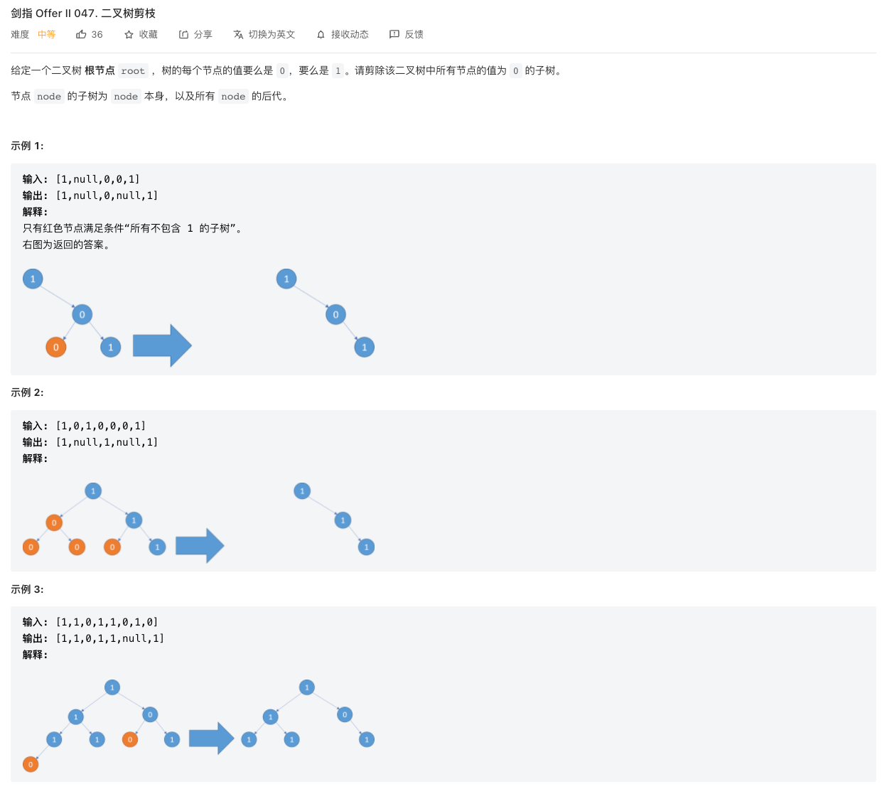
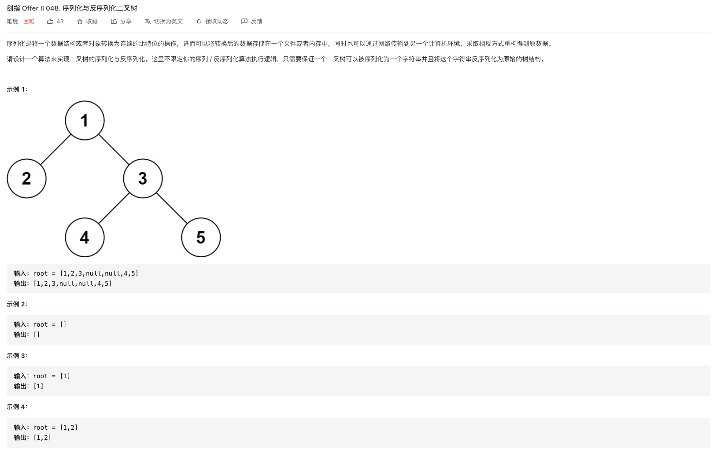
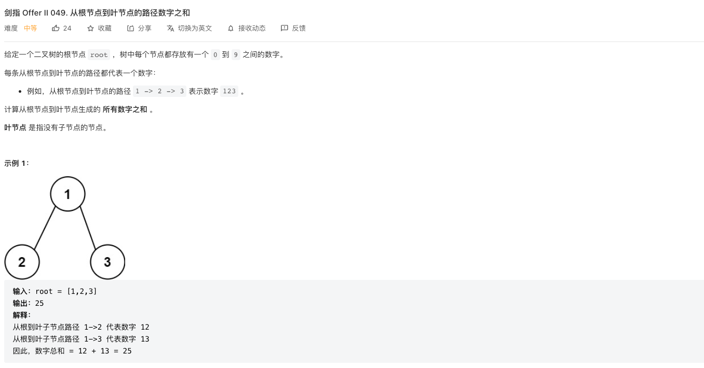
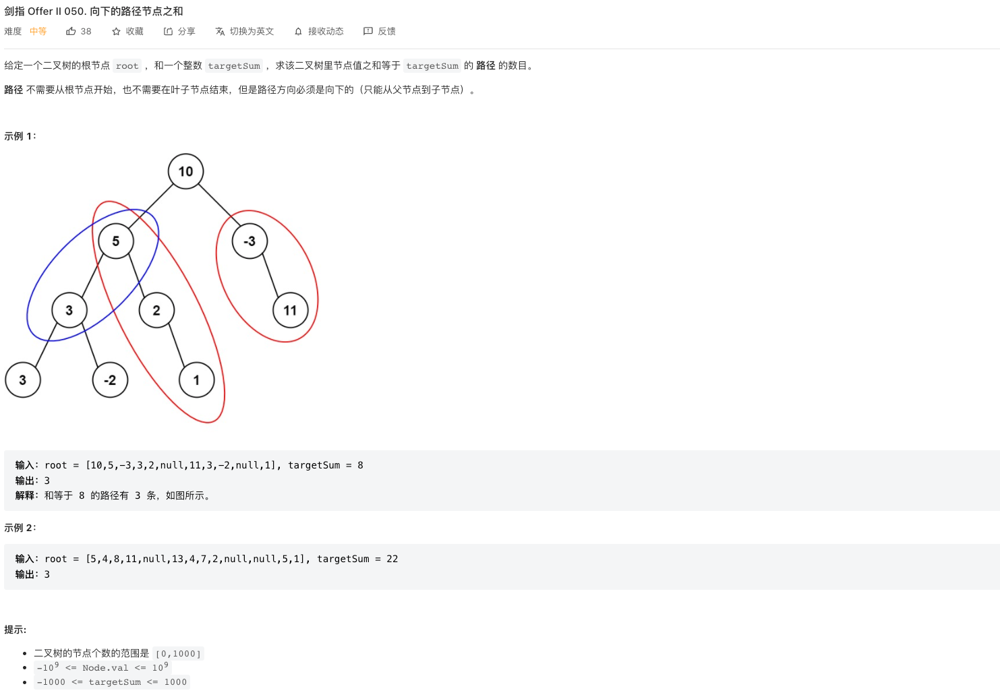
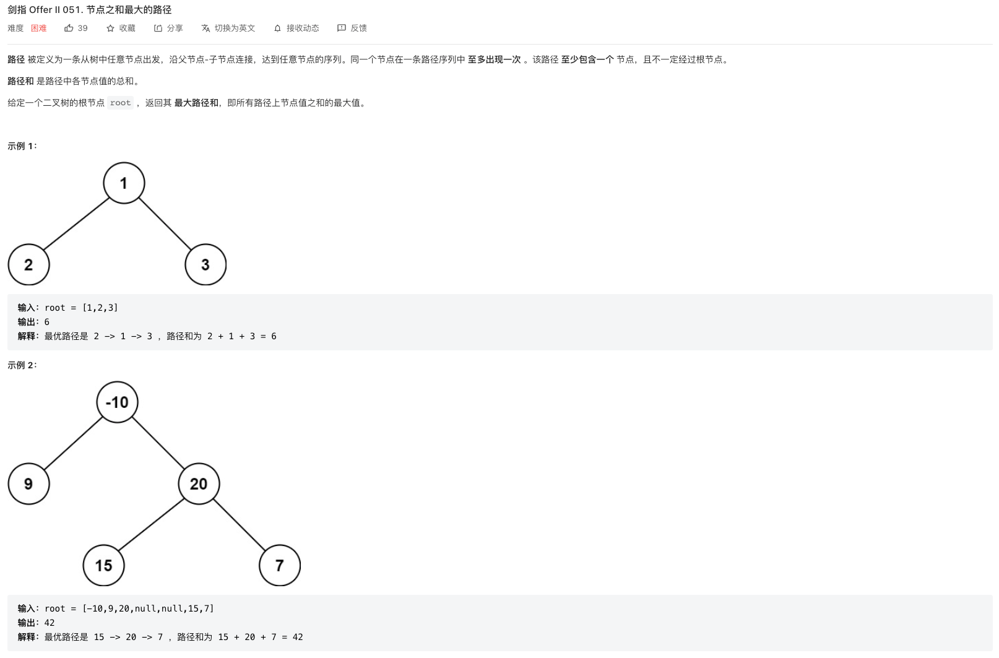
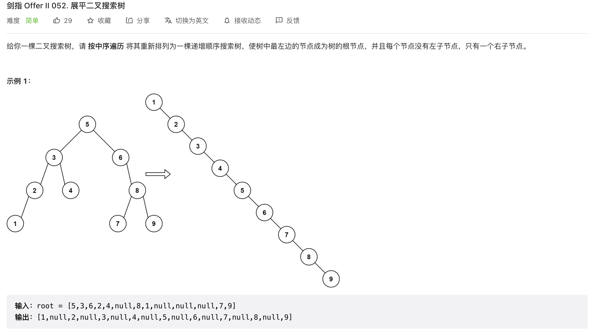
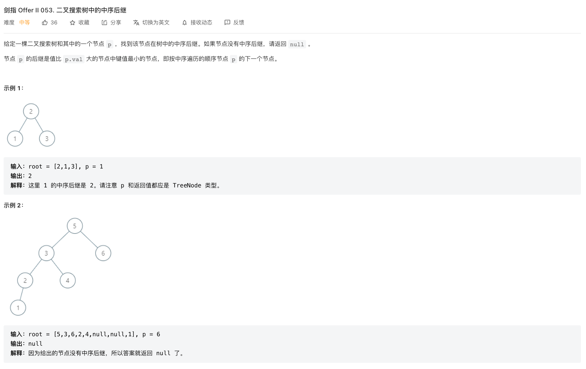
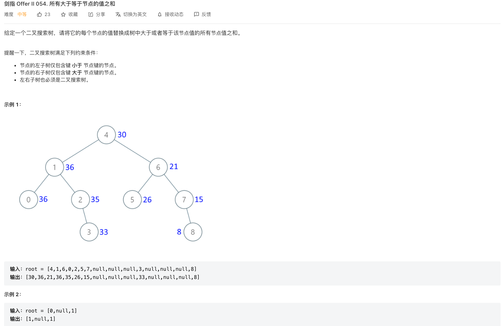

## CI.47 二叉树剪枝

### [剑指 Offer II 047. 二叉树剪枝](https://leetcode.cn/problems/pOCWxh/)



仔细思考这个题目，可以知道，一个节点能够被剪掉，取决于两个条件

- 左右两个子节点是否为空
- 节点的值是否为0

而如果一个节点能够被剪枝，则这个节点的所有子节点都一定会被剪枝。也就是说，一个节点n能够被剪枝，那它的两个子节点一定也能够被剪枝。

因此我们可以先对子节点进行剪枝，从叶子节点开始剪枝，这样每个节点只需要判断左右子节点为空，且当前节点值为0，就可以剪掉。

因为先要对两个子节点进行处理，然后才对父节点处理，这个思路可以采用后序遍历来实现。

```js
/**
 * Definition for a binary tree node.
 * function TreeNode(val, left, right) {
 *     this.val = (val===undefined ? 0 : val)
 *     this.left = (left===undefined ? null : left)
 *     this.right = (right===undefined ? null : right)
 * }
 */
/**
 * @param {TreeNode} root
 * @return {TreeNode}
 */
var pruneTree = function (root) {
  if (!root) return root;
  root.left = pruneTree(root.left);
  root.right = pruneTree(root.right);
  if (!root.left && !root.right && root.val === 0) return null;
  return root;
};

```

C++ 递归实现

```c++
/**
 * Definition for a binary tree node.
 * struct TreeNode {
 *     int val;
 *     TreeNode *left;
 *     TreeNode *right;
 *     TreeNode() : val(0), left(nullptr), right(nullptr) {}
 *     TreeNode(int x) : val(x), left(nullptr), right(nullptr) {}
 *     TreeNode(int x, TreeNode *left, TreeNode *right) : val(x), left(left), right(right) {}
 * };
 */
class Solution {
public:
    TreeNode* pruneTree(TreeNode* root) {
        if(root == nullptr) return root;
        root->left = pruneTree(root->left);
        root->right = pruneTree(root->right);
        if(root->left == nullptr && root->right == nullptr && root->val == 0) return nullptr;
        return root;
    }
};
```


## CI.48 序列化与反序列化二叉树

### [剑指 Offer II 048. 序列化与反序列化二叉树](https://leetcode.cn/problems/h54YBf/)



反序列化的时候，我们希望从头开始去解析字符串，并且按照 parent -> left -> right的顺序，也就是中序遍历顺序。这样我们可以知道第一个元素就是父节点，后面两个元素是左右节点。

对于子节点又包含子节点的场景，序列化出来的字符串就是 `parent -> sereialize(left) -> serialize(right)` 的形式，反序列化的时候，也采用递归的形式来解析左右子节点即可。

序列化的时候，按照中序遍历的顺序，将元素转换成字符串，每个元素之间使用逗号分隔。对于空节点，采用#代替，这样可以知道哪些节点是叶子节点。

知道了哪些节点是叶子节点以后，就可以确定出一个节点的左子树、右子树的边界了。

```js
/**
 * Definition for a binary tree node.
 * function TreeNode(val) {
 *     this.val = val;
 *     this.left = this.right = null;
 * }
 */

/**
 * Encodes a tree to a single string.
 *
 * @param {TreeNode} root
 * @return {string}
 */
const DELIMITER = ',', EMPTY = '#';
var serialize = function (root) {
  if (!root) return EMPTY;
  let result = '';
  result += root.val;
  result += (DELIMITER + serialize(root.left));
  result += (DELIMITER + serialize(root.right));
  return result;
};

/**
 * Decodes your encoded data to tree.
 *
 * @param {string} data
 * @return {TreeNode}
 */
var deserialize = function (data) {
  if (data === EMPTY) return null;
  const dataList = data.split(DELIMITER);
  return dfs(dataList);
};

/**
 * 
 * @param {String[]} dataList 
 * @returns 
 */
function dfs(dataList) {
  const item = dataList.shift();
  if (item === EMPTY) return null;
  const val = Number(item);
  const n = new TreeNode(val);
  n.left = dfs(dataList);
  n.right = dfs(dataList);
  return n;
}

/**
 * Your functions will be called as such:
 * deserialize(serialize(root));
 */
```


## CI.49 从根节点到叶节点的路径数字之和

### [剑指 Offer II 049. 从根节点到叶节点的路径数字之和](https://leetcode.cn/problems/3Etpl5/)



数字是根节点在前，叶子结点在后进行组合的，也就是说根节点应该先出现，然后才是后面的叶子节点。这样可以联想到前序遍历操作。

每个节点还需要之前前面路径的数字，也就是说递归操作需要接收一个参数，参数就是前面路径组成的数字

```js
function cb(root, sum){
  sum = sum * 10 + root.val;
  cb(root.left, sum);
  cb(root.right, sum);
}
```

另外需要考虑节点为空的时候执行递归操作的时候，预期应该返回的是0，表示这条路径没有数字组成。

```js
/**
 * Definition for a binary tree node.
 * function TreeNode(val, left, right) {
 *     this.val = (val===undefined ? 0 : val)
 *     this.left = (left===undefined ? null : left)
 *     this.right = (right===undefined ? null : right)
 * }
 */
/**
 * @param {TreeNode} root
 * @return {number}
 */
var sumNumbers = function (root) {
  if (!root) return 0;
  return add(root, 0);
};

function add(current, sum) {
  if (!current) return 0;
  sum = sum * 10 + current.val;
  if (!current.left && !current.right) return sum;
  let left = add(current.left, sum);
  let right = add(current.right, sum);
  return left + right;
}
```

## CI.50 向下的路径节点之和

### [剑指 Offer II 050. 向下的路径节点之和](https://leetcode.cn/problems/6eUYwP/)



这个题目要求的是任意一段路径数字之和，最简单的方法就是暴力检索，把所有路径之和计算出来。但是这种情况复杂度太高。

像这种任意一段区间的数字之和的问题，之前也有遇到，可以联想到前缀和的思路。

我们可以把从根节点$R$开始，到某个节点$I$之前的路径之和$sum[i]$求解出来，然后假设在节点i之前，存在某个节点$J$，满足从$J$ 到$I$这段路径之和，恰好就是目标值K。

也就是说$P_j + P{j+1} + ... + P_i = K$，又因为$P_j + P{j+1} + ... + P_i = sum[i] - sum[j-1]$，也即是说满足$sum[i] - sum[j-1] = K$

此时得到$J$节点存在的条件是$sum[j-1] = sum[i] - K$

所以，我们可以对树进行遍历，从$R$到$I$之间的前缀和，然后可以知道，在节点$I$之前，满足某一段路径之和为K的路径的数量，就是满足$sum[j-1] = K$的$J$的数量。

```js
/**
 * Definition for a binary tree node.
 * function TreeNode(val, left, right) {
 *     this.val = (val===undefined ? 0 : val)
 *     this.left = (left===undefined ? null : left)
 *     this.right = (right===undefined ? null : right)
 * }
 */
/**
 * @param {TreeNode} root
 * @param {number} targetSum
 * @return {number}
 */
var pathSum = function (root, targetSum) {
  const sumToCount = new Map();
  sumToCount.set(0, 1);
  return count(root, targetSum, sumToCount, 0);

};
function count(root, target, sumToCount, sum) {
  if (!root) return 0;
  sum += root.val;
  let result = sumToCount.get(sum - target) || 0;
  const prevPathCount = sumToCount.get(sum) || 0;
  sumToCount.set(sum, prevPathCount + 1);
  result += count(root.left, target, sumToCount, sum);
  result += count(root.right, target, sumToCount, sum);
  sumToCount.set(sum, prevPathCount);
  return result;
}
```

因为遍历完节点的左右子树后，路径中已经不会再使用节点n了，所以在遍历子树前将n对应的sum的次数加一，遍历后将次数减一。

```js
  sumToCount.set(sum, prevPathCount + 1);
  result += count(root.left, target, sumToCount, sum);
  result += count(root.right, target, sumToCount, sum);
  sumToCount.set(sum, prevPathCount);
```


## CI.51 节点之和最大的路径

### [剑指 Offer II 051. 节点之和最大的路径](https://leetcode.cn/problems/jC7MId/)



对于根节点root而言，最大值可能有三种情况：

- 不经过root，在左子树中的某个路径
- 不经过root，在右子树的某个路径
- 经过root的某个路径

所以需要求出三种情况来比较最大值。

要求出经过root的路径的最大值，需要先知道两边子树路径中，经过root的路径里的最大值，也就是说得按照后序遍历的方式来遍历。

对于每一次遍历需要求解两个值

- 以current为根节点的树中的节点路径之和的最大值currentMaxSum，用来和已经算出来的maxSum比较，取大者
- 经过current的路径里，路径之和最大的某条路径的和，这个需要返回给父节点，父节点根据这个来判断是否要将这个路径包含在内。

在求解currentMaxSum的时候，如果左右子节点的值小于0，则取0，表示路径不包含对应的子节点，这样可以减少判断。

```js
/**
 * Definition for a binary tree node.
 * function TreeNode(val, left, right) {
 *     this.val = (val===undefined ? 0 : val)
 *     this.left = (left===undefined ? null : left)
 *     this.right = (right===undefined ? null : right)
 * }
 */
/**
 * @param {TreeNode} root
 * @return {number}
 */
var maxPathSum = function (root) {
  let maxSum = -Infinity;
  function core(current) {
    if (!current) return 0;
    const left = Math.max(core(current.left), 0);
    const right = Math.max(core(current.right), 0);
    // root , left->root, left->root->right, root->right 这四种情况的最大值
    // 也就是以current为跟的情况的最大的路径和
    maxSum = Math.max(maxSum, current.val + left + right);
    // 返回值是包含了root的情况: root->left, root->right 的最大值，用来给父节点判断左右子树的最大值
    const ret = current.val + Math.max(left, right);
    return ret;
  }
  core(root);
  return maxSum;
};
```

- 时间复杂度：$O(N)$，其中 N 是二叉树中的节点个数。对每个节点访问不超过 22 次。

- 空间复杂度：$O(N)$，其中 N 是二叉树中的节点个数。空间复杂度主要取决于递归调用层数，最大层数等于二叉树的高度，最坏情况下，二叉树的高度等于二叉树中的节点个数。

## CI.52 展平二叉搜索树

### [剑指 Offer II 052. 展平二叉搜索树](https://leetcode.cn/problems/NYBBNL/)



题目的要求实际就是将二叉搜索树按照中序遍历的顺序生成一个链表，只需要按照中序遍历，将节点依次连接成链表即可。

具体的遍历操作如下

```js
let prev;
function cb(root){
  tail.right = root;
  root.left = null;
  tail = root;
}
```

实现代码如下

```js
/**
 * Definition for a binary tree node.
 * function TreeNode(val, left, right) {
 *     this.val = (val===undefined ? 0 : val)
 *     this.left = (left===undefined ? null : left)
 *     this.right = (right===undefined ? null : right)
 * }
 */
/**
 * @param {TreeNode} root
 * @return {TreeNode}
 */
var increasingBST = function (tree) {
  const dummy = new TreeNode(-1);
  let tail = dummy;
  function inorder(root) {
    if (!root) return;
    inorder(root.left);
    tail.right = root;
    root.left = null;
    tail = root;
    inorder(root.right);
  }
  inorder(tree);
  return dummy.right;
};
```


## Ci.53 二叉搜索树中的中序后继

### [剑指 Offer II 053. 二叉搜索树中的中序后继](https://leetcode.cn/problems/P5rCT8/)



所谓节点n的中序后继就是按照中序遍历顺序，位于节点n后面的节点。

这里最简单的方法就是对树进行中序遍历，直接查找n后面的节点，复杂度为$O(n)$。

还有一种思路是，根据二叉搜索树的特性，先找到节点n，然后再找到子树`n.right`中最小的一个节点，整体复杂度为$O(h)$，h为树的高度。

```js
/**
 * Definition for a binary tree node.
 * function TreeNode(val) {
 *     this.val = val;
 *     this.left = this.right = null;
 * }
 */
/**
 * @param {TreeNode} root
 * @param {TreeNode} p
 * @return {TreeNode}
 */
var inorderSuccessor = function (root, p) {
  if (!root || !p) return null;
  let current = root, prev = null;
  while (current) {
    if (current.val === p.val) break;
    // 此时current就是current.left的中序后继
    if (p.val < current.val) {
      prev = current;
      current = current.left
    } else current = current.right;
  }
  if (!current) return null;
  // 此时的中序后继是父节点
  if (!current.right) return prev;
  current = current.right;
  while (current.left) {
    current = current.left;
  }
  return current;
};
```

上面的代码还可以将`current.val === p.val`和`current.val < p.val`两种场景统一，都是往`current.right`中继续查找满足`current.val > p.val`的最小的一个值。

而找到`current.val > p.val`的节点后，只需要继续往current的左子树找，看还有没有节点满足`current.val > p.val`，如果current左子树有另外一个节点X也满足`x.val > p.val`，那p的后继节点应该是X，因为X比current更小。

优化后的代码如下

```js
/**
 * Definition for a binary tree node.
 * function TreeNode(val) {
 *     this.val = val;
 *     this.left = this.right = null;
 * }
 */
/**
 * @param {TreeNode} root
 * @param {TreeNode} p
 * @return {TreeNode}
 */
var inorderSuccessor = function (root, p) {
  if (!root || !p) return null;
  let current = root, prev = null;
  while (current) {
    if (p.val < current.val) {
      prev = current;
      current = current.left
    } else current = current.right;
  }
  return prev;
};
```


## CI.54 所有大于等于节点的值之和

### [剑指 Offer II 054. 所有大于等于节点的值之和](https://leetcode.cn/problems/w6cpku/)



题目的意思，二叉搜索中的，对某个节点n而言，大于等于节点n的值的节点，就是节点n 和节点n的右子树。所以题目的意思就是要求出每个节点的右子树之和。

更清晰的说，我们假设对树进行中序遍历后得到了一个数组，那题目就是要求数组中每个元素后面的所有元素之和。

但是按照中序遍历的顺序，我们值能从节点值小的位置开始遍历，这个时候并不能知道在它后面的节点值之和，因为这些节点还没有被遍历到。

而如果我们能够从二叉树最右边的一个节点开始遍历，也就是先遍历右子树，然后再往左子树方向去遍历，按照 right -> root -> left这样的顺序，我们就可以将遍历过的每个节点的值求和。

这样，在遍历到某个节点n的时候，比n大的节点的值之和已经计算出来了，我们只需要再加上当前节点值，就是要求的目标值了。

按照这个思路，我们只需要改一下中序遍历的顺序，将左右子树的遍历顺序颠倒一下来遍历即可。

```js
/**
 * Definition for a binary tree node.
 * function TreeNode(val, left, right) {
 *     this.val = (val===undefined ? 0 : val)
 *     this.left = (left===undefined ? null : left)
 *     this.right = (right===undefined ? null : right)
 * }
 */
/**
 * @param {TreeNode} tree
 * @return {TreeNode}
 */
var convertBST = function (tree) {
  let sum = 0;
  function inorder(root) {
    if (!root) return;
    inorder(root.right);
    sum += root.val;
    root.val = sum;
    inorder(root.left);
  }
  inorder(tree);
  return tree;
};
```

- 时间复杂度：每个节点只遍历一次，复杂度为$O(n)$
- 空间复杂度：递归算法，最大的递归深度就是树的高度，即$O(h)$

