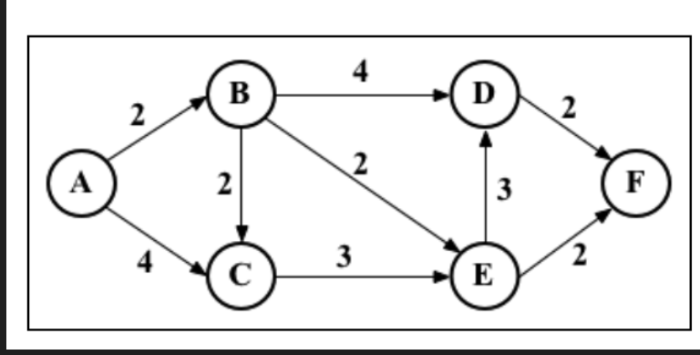
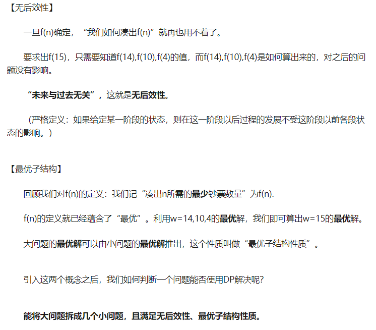
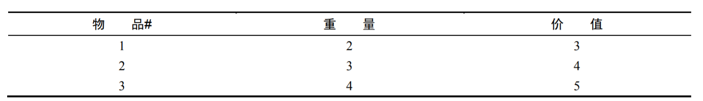
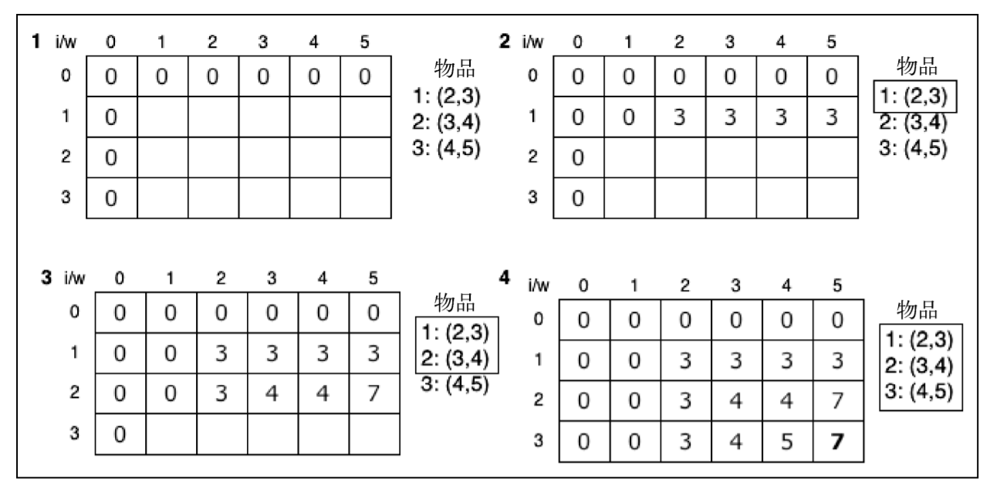
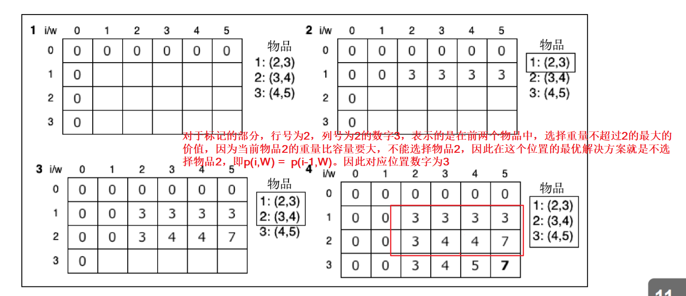

# 动态规划

## 基本解释

### 什么是动态规划

动态规划是**将复杂问题分解成多个更小的子问题来解决**的优化策略

假设从一个问题的起点`src`出发，到达到一个问题的终点`dest`，从起点到终点之间的路径中，会经过很多个的中间节点，然后要找到从起点到终点的一个最优的路径。

动态规划思想是，如果要到达终点`dest`，必须要经过的节点有`A`,`B`，那问题就可以转换成求解起点`src`到`A`、`B`的最优路径，加上`A`,`B`各自到终点`dest`的路径

例如下面的例子中，我们要求解`A`到`F`的最优路径，因为到达`F`，必须要经过`D`和`E`，且`D`到`F`到代价是2,`E`到`F`的代价也是2，则只需要求解`A`到`D`、`E`的最优路径`f(D)`、`f(E)`，然后最优路径就是 `min{f(D)+2,f(E)+2}`
这样就把一个大的复杂的问题，分解成小的子问题来解决了。



### 什么时候用动态规划

知乎上看到的一个解释：  



一些动态规划的著名例子：
- 背包问题
- 最长公共子序列
- 矩阵链相乘
- 硬币找零
- 图的全源最短路径

## 硬币找零问题

### 问题描述

硬币系统中`coins`中，共包括有多个不同面额的硬币`[c1,c2,c3,...cn]`，使用这个硬币系统来将凑出某个数额`amount`，要求使用的硬币的数量取最小值。

### 解决思路
凑出数额为`amount`的金额需要用到的最少的硬币组合为`f(amount)`

对于具体的数额`amount`，一定是由小于或等于这个数额的硬币组成的。在选择了某个金额为`n`的硬币coin后，剩余的数额为`balance = amount-n`，此时凑出数额`amount`所需的硬币组合即为`f(amount-coin)+coin`，只需要遍历一下所有的硬币，对于小于`amount`的硬币，计算一下`f(amount-coin)+coin`所有可能取值，选择最优即可。

也即得到一个公式：`f(amount) = f(amount-coin) + coin`

最优解的判定条件是硬币组合数组中，数组的长度最短为最优。

### 代码实现

```ts
class CoinChange {

  private readonly cache: { [k: number]: number[] } = {}
  constructor(protected coins: number[], protected amount?: number) {
  }
  setAmount(amount: number) {
    this.amount = amount;
  }
  makeChange(amount: number): number[] {
    if (amount <= 0) {
      return []
    }
    if (this.cache[amount]) {
      return this.cache[amount]
    }
    let i = -1;
    let change: number[] = []
    let balanceChange: number[] = []
    while (++i < this.coins.length) {
      const coin = this.coins[i]
      const balance = amount - coin;
      if (balance >= 0) {
        balanceChange = this.makeChange(balance)
        if (
          (balanceChange.length < change.length - 1 || !change.length) &&
          (balanceChange.length || !balance)
        ) {
          change = [coin].concat(balanceChange)
        }
      }
    }
    this.cache[amount] = change;
    return change;
  }
}
```

在`while`循环内，对`balance >=0`进行判断是为了选择金额小于要凑出的数额的硬币。

`change`变量存放的就是计算得到的最优解，`balanceChange`则是`f(amount-coin)`。
比较 `balanceChange.length < change.length - 1 ` 是为了比较选择当前的硬币的组合是否要比已经计算得到的暂时的最优解更好，当前硬币的组合所使用的硬币组合是`coin + balanceChange`，所以比较长度时候`change.length - 1`

`balanceChange.length || !balance` 考虑的是恰好 `amount = coin`的情况

`!change.length` 是第一次循环会满足的条件

## 背包问题（0-1版本）

### 问题描述
给定一个固定大小、能够携带重量为`W`的背包，以及一组有价值和重量的物品，找出一个最佳方案，使得装入到背包中的物品总重量不超过`W`且总价值最大。
物品都是完整的物品，且同一个物品不能重复选择。

### 解决思路
假设物品数量有`n`个，背包容量为`C`。
采用一个*n+1* 行 *C+1* 列的二维数组来存储问题的解决方案，矩阵的第一行和第一列都置为0。

采用动态规划来解决这个问题，关键是要找到复杂问题下的子问题。
我们从第一个物品开始进行分析，一直分析到最后一个物品。每个物品只有选择和不选择两种情况。
假设在分析第*i*个物品时候，背包容量剩余为`W`，其中 ` 1<= W <= C`。则如果选择了第*i*个物品，背包容量就会减少为`W-weight`，同时，在前*i-1*个物品中选择物品的时候，对应的背包容量就是`W-weight`了。而如果不选择当前物品，则背包容量不会减少。

对于背包容量为`W`,在前i个物品中选择出总重量不超过背包容量，且价值最大的最优的解决方案，记为`p(i,W)`，则选择了当前物品*i*的话，当前的解决方案就是`p(i,W) = p(i-1,W-weight) + value(i)`，而不选择当前物品，则解决方案就是`p(i,W) = p(i-1,W)`，也即就是物品都从前面*i-1*个中选择。

只需要比较`p(i-1,W)`和`p(i-1,W-weight) + value(i)`两种方案，哪一种的价值更大，即可得到最优的解决方案。

因此只需要做一下遍历，把每一组的(i,W) 组合对应的最优解决方案算一下

```ts
for (let i = 0; i <= goodsCount; i++) {
  for (let weight = 0; weight <= capacity; weight++) {
    // to do 
  }
}
```

### 循环实现

循环方式实现，是通过填写一个二维表来记录每一组(i,W)下最优解决方案对应的最大价值和对应选择的物品。

二维表的第*i*行，*w*列，表示的是在*前i个*物品中选择重量不超过*w*，能够取得的最大价值。


```ts
interface IGoodInfo {
  weight: number,
  value: number,
}
class Knapsack {
  constructor() {
  }

  loop(goodsList: IGoodInfo[], capacity: number): any[] {
    const goodsCount = goodsList.length;
    const matrix = []
    const selectedMatrix = []
    for (let i = 0; i <= goodsCount; i++) {
      matrix[i] = []
      selectedMatrix[i] = []
    }
    for (let i = 0; i <= goodsCount; i++) {
      for (let weight = 0; weight <= capacity; weight++) {
        if (i === 0 || weight === 0) { 
          matrix[i][weight] = 0;
          selectedMatrix[i][weight] = [];
        } else if (goodsList[i - 1].weight <= weight) {
          const currentGoods = goodsList[i - 1]
          const pickCurrent = matrix[i - 1][weight - currentGoods.weight] + currentGoods.value;
          const notPickCurrent = matrix[i - 1][weight];
          // 不选当前物品 与 选了当前物品 哪一种情况下的价值最大
          if (pickCurrent > notPickCurrent) {
            matrix[i][weight] = pickCurrent;
            selectedMatrix[i][weight] = (selectedMatrix[i - 1][weight - currentGoods.weight] || []).concat([currentGoods])
          } else {
            matrix[i][weight] = notPickCurrent;
            selectedMatrix[i][weight] = selectedMatrix[i - 1][weight] || []
          }
        } else {
          matrix[i][weight] = matrix[i - 1][weight]
          selectedMatrix[i][weight] = selectedMatrix[i - 1][weight] || []
        }
      }
    }
    return selectedMatrix[goodsCount][capacity];
  }
}
```

代码中主要分析过程在于后面的`for`循环：
```ts
    for (let i = 0; i <= goodsCount; i++) {
      for (let weight = 0; weight <= capacity; weight++) {
        if (i === 0 || weight === 0) { 
          matrix[i][weight] = 0;
          selectedMatrix[i][weight] = [];
        } else if (goodsList[i - 1].weight <= weight) {
          const currentGoods = goodsList[i - 1]
          const pickCurrent = matrix[i - 1][weight - currentGoods.weight] + currentGoods.value;
          const notPickCurrent = matrix[i - 1][weight];
          // 不选当前物品 与 选了当前物品 哪一种情况下的价值最大
          if (pickCurrent > notPickCurrent) {
            matrix[i][weight] = pickCurrent;
            selectedMatrix[i][weight] = (selectedMatrix[i - 1][weight - currentGoods.weight] || []).concat([currentGoods])
          } else {
            matrix[i][weight] = notPickCurrent;
            selectedMatrix[i][weight] = selectedMatrix[i - 1][weight] || []
          }
        } else {
          matrix[i][weight] = matrix[i - 1][weight]
          selectedMatrix[i][weight] = selectedMatrix[i - 1][weight] || []
        }
      }
    }
```
首先对于`i===0 || weight === 0`的位置，表示要么是没有物品可以选择（i===0)，要么背包没有容量（weight === 0)

对于`currentGoods.weight <= weight`，表示的是当前物品的重量是小于等于背包剩余的容量的，物品是可以被选择的，因此去分析，选择当前物品和不选择当前物品两种情况下，那种方案的价值最大，作为最优方案：

```ts
const currentGoods = goodsList[i - 1]
const pickCurrent = matrix[i - 1][weight - currentGoods.weight] + currentGoods.value;
const notPickCurrent = matrix[i - 1][weight];
// 不选当前物品 与 选了当前物品 哪一种情况下的价值最大
if (pickCurrent > notPickCurrent) {
  matrix[i][weight] = pickCurrent;
  selectedMatrix[i][weight] = (selectedMatrix[i - 1][weight - currentGoods.weight] || []).concat([currentGoods])
} else {
  matrix[i][weight] = notPickCurrent;
  selectedMatrix[i][weight] = selectedMatrix[i - 1][weight] || []
}
```
对于当前物品重量超过了背包剩余容量的话，也是不能选择当前物品的，因此当前(i,W)的组合的最优方案就是不选择当前物品时候的最优方案，即`p(i,W) = p(i-1,W)`

对于如下的例子，得到的二维表如图所示：






二维表的意义：




### 递归实现

```ts
interface IGoodInfo {
  weight: number,
  value: number,
}
class Knapsack {
  constructor() {
  }

  recursive(goodsList: IGoodInfo[], capacity: number): IGoodInfo[] {
    if (capacity <= 0) {
      return []
    }
    const goodsCount = goodsList.length;
    let target: IGoodInfo[] = []
    let maxValue = 0;
    for (let i = 0; i < goodsCount; i++) {
      const goods = goodsList[i];
      if (goods.weight <= capacity) {
        const otherGoodsList = this.recursive(goodsList.slice(i + 1), capacity - goods.weight)
        const value = otherGoodsList.reduce((total, current) => total + current.value, 0)
        if (
          ((value + goods.value) > maxValue || !maxValue)
        ) {
          maxValue = value + goods.value;
          target = [goods].concat(otherGoodsList)
        }
      }
    }
    return target;
  }
}
```


## 参考
- [知乎-什么是动态规划（Dynamic Programming）？动态规划的意义是什么](https://www.zhihu.com/question/23995189)