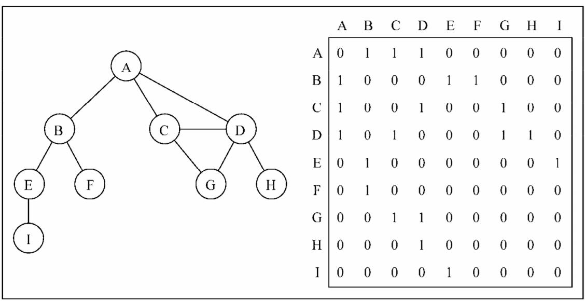
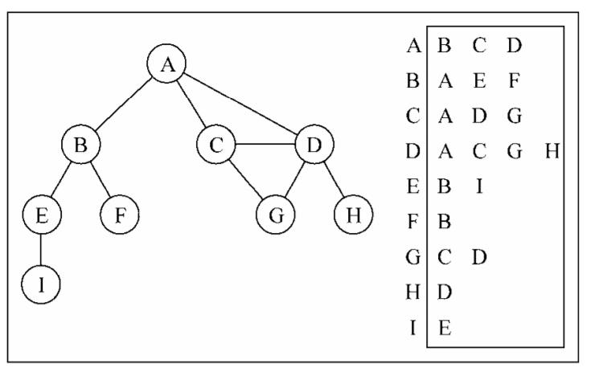
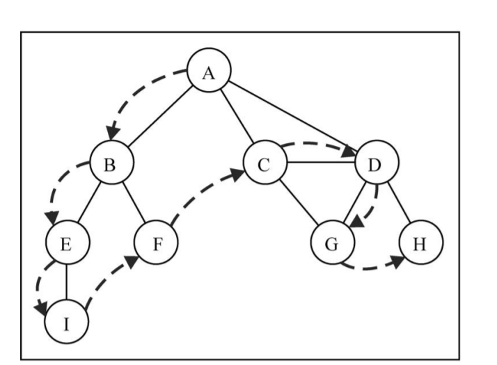

# 图

## 表示方法

### 邻接矩阵

用一个 **二维数组**来表示一个图，数组中为 1 的位置`a[i][j]`表示对应的两个点`i 、 j`是连通的



### 邻接表

用一个字典来表示图中的一个顶点的所有的相邻顶点列表



### 关联矩阵

// 


## BFS（广度优先遍历）

### 遍历算法

- 从给定的入口 `v` 开始，把入口 `v`压入到队列中。
- 在队列中弹出一个顶点（遍历这个顶点），同时把这个顶点的所有邻接点压入到队列中
- 重复在队列中弹出顶点进行顶点遍历，以及把顶点的邻接点压入到队列中，直到队列为空。
- 已经压入到队列、或者是已经遍历过的邻接点，不再压入到队列，因此需要对遍历状态进行标记（未访问、已入队、已遍历）


```ts
class Graph<T> {
  private verticeList: T[];
  private linkMap: Map<T, T[]>;
  constructor() {
    this.verticeList = [];
    this.linkMap = new Map();
  }
  addVertice(v: T) {
    this.verticeList.push(v);
    this.linkMap.set(v, []);
  }
  addEdge(src: T, dest: T) {
    this.linkMap.get(src).push(dest)
    this.linkMap.get(dest).push(src)
  }

  BFS(v: T, callback?: ICallback<T>) {
    const queue = new Queue<T>();
    const traverseMap = new Map<T, ITraverseType>();
    queue.enqueue(v);
    while (!queue.empty()) {
      const entry = queue.dequeue();
      const adjacentPoints = this.linkMap.get(entry);
      adjacentPoints.forEach(item => {
        const type = traverseMap.get(item);
        if (!type) { // 还没有压入队列中的顶点
          queue.enqueue(item)
          traverseMap.set(item, ITraverseType.FOUND)
        }
      })
      traverseMap.set(entry, ITraverseType.TRAVERSED)
      callback && callback(entry);
    }
  }
}

export default Graph;
```

### 最短路径

**基于边的数量的最短路径**

在进行`BFS`遍历时候，记录下入口顶点到每一个点的距离。每次走一条边，则距离数加上一
最短的距离就是**不重复的距离**，即每条需要走的边都只走一次。在`BFS`遍历中，当把顶点压入队列中的时候，先判断顶点时候已经在队列中了（通过遍历状态来判断），只把**没有入队，也没有遍历过的顶点**压入队中。

遍历过程中还可以记录下每个顶点访问过程中的**先驱节点**，这样可以得到从一个顶点到另外一个顶点所经过的路径。

路径中经过的点一次压入到一个 **栈**中，最后再依次出栈则可得到一个顶点到另外一个顶点的最短路径。

```ts
import Graph, { ITraverseType } from "./Graph";
import Queue from "../Queue/Queue";
import Stack from "../Stack/Stack";

class GraphPath<T> extends Graph<T> {
  /**
   * 广度优先遍历查找路径
   * @param v 广度优先遍历的入口顶点
   */
  BFS(v: T) {
    const queue = new Queue<T>();
    queue.enqueue(v);
    const distances = new Map<T, number>();
    const precursors = new Map<T, T>();
    const traverseMap = new Map<T, ITraverseType>();
    distances.set(v, 0)
    precursors.set(v, null);
    while (!queue.empty()) {
      const entry = queue.dequeue();
      this.linkMap.get(entry).forEach(item => {
        if (!traverseMap.get(item)) {
          queue.enqueue(item)
          traverseMap.set(item, ITraverseType.FOUND)
          precursors.set(item, entry);
          distances.set(item, (distances.get(entry) || 0) + 1)
        }
      })
      traverseMap.set(entry, ITraverseType.TRAVERSED);
    }
    return {
      distances,
      precursors
    }
  }

  /**
   * 查找从一个顶点到另外一个顶点的最短路径
   * @param src 起点
   * @param dest 终点
   */
  path(src: T, dest: T) {
    const { distances, precursors } = this.BFS(src);
    const stack = new Stack<T>();
    let v = dest;
    while (v !== src) {
      stack.push(v)
      v = precursors.get(v)
    }
    stack.push(v)
    let str = ''
    str += stack.pop();
    while (!stack.isEmpty()) {
      str += (' -> ' + stack.pop())
    }
    return str;
  }
}

export default GraphPath;
```

## DFS 深度优先遍历

### 算法实现

对于不指定入口的深度优先遍历是从第一个添加的顶点开始作为遍历入口`entry`，遍历第一个相邻顶点`u`，然后再继续遍历`u`的相邻顶点，
一直往下直到相邻顶点没有可以继续向下遍历的顶点为止，再回退到上一个遍历的位置，遍历`entry`的其他相邻顶点。

显然这个特征是应该用一个**递归**来实现不断深入往下递归，然后再从最深处往上回退（有点点类似于树的前序遍历）



```ts
import Queue from "../Queue/Queue";

import LinkedList from '../LinkedList/LinkedList'

class Graph<T> {
  protected verticeList: T[];
  protected linkMap: Map<T, T[]>;
  constructor() {
    this.verticeList = [];
    this.linkMap = new Map();
  }

  addVertice(v: T) {
    this.verticeList.push(v);
    this.linkMap.set(v, []);
  }

  DFS(callback?: ICallback<T>) {
    const traverseMap = new Map<T, ITraverseType>();
    for (let i = 0; i < this.verticeList.length; i++) {
      if (!traverseMap.get(this.verticeList[i])) {
        this.visit(this.verticeList[i], traverseMap, callback)
      }
    }
  }

  private visit(vertice: T, traverseMap: Map<T, ITraverseType>, callback?: ICallback<T>) {
    callback && callback(vertice);
    traverseMap.set(vertice, ITraverseType.FOUND);
    const adjacentPoints = this.linkMap.get(vertice);
    for (let i = 0; i < adjacentPoints.length; i++) {
      const item = adjacentPoints[i];
      if (!traverseMap.get(item)) {
        this.visit(item, traverseMap, callback)
      }
    }
    traverseMap.set(vertice, ITraverseType.TRAVERSED);
  }
}

export default Graph;
```

从 `visit`方法的逻辑可以看出，一个顶点`v`的相邻顶点的遍历顺序，是按照在邻接表中的先后顺序进行遍历的，也就是按照**与`v`连接的先后顺序**进行遍历的。