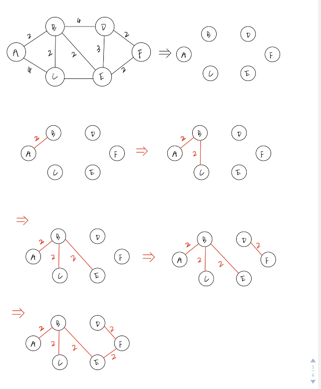

# 图

## 表示方法

### 邻接矩阵

用一个 **二维数组**来表示一个图，数组中为 1 的位置`a[i][j]`表示对应的两个点`i 、 j`是连通的


### 邻接表

用一个字典来表示图中的一个顶点的所有的相邻顶点列表


### 关联矩阵

// 


## BFS（广度优先遍历）

### 遍历算法

- 从给定的入口 `v` 开始，把入口 `v`压入到队列中。
- 在队列中弹出一个顶点（遍历这个顶点），同时把这个顶点的所有邻接点压入到队列中
- 重复在队列中弹出顶点进行顶点遍历，以及把顶点的邻接点压入到队列中，直到队列为空。
- 已经压入到队列、或者是已经遍历过的邻接点，不再压入到队列，因此需要对遍历状态进行标记（未访问、已入队、已遍历）


```ts
class Graph<T> {
  private verticeList: T[];
  private linkMap: Map<T, T[]>;
  constructor() {
    this.verticeList = [];
    this.linkMap = new Map();
  }
  addVertice(v: T) {
    this.verticeList.push(v);
    this.linkMap.set(v, []);
  }
  addEdge(src: T, dest: T) {
    this.linkMap.get(src).push(dest)
    this.linkMap.get(dest).push(src)
  }

  BFS(v: T, callback?: ICallback<T>) {
    const queue = new Queue<T>();
    const traverseMap = new Map<T, ITraverseType>();
    queue.enqueue(v);
    while (!queue.empty()) {
      const entry = queue.dequeue();
      const adjacentPoints = this.linkMap.get(entry);
      adjacentPoints.forEach(item => {
        const type = traverseMap.get(item);
        if (!type) { // 还没有压入队列中的顶点
          queue.enqueue(item)
          traverseMap.set(item, ITraverseType.FOUND)
        }
      })
      traverseMap.set(entry, ITraverseType.TRAVERSED)
      callback && callback(entry);
    }
  }
}

export default Graph;
```

### 最短路径

**基于边的数量的最短路径**

在进行`BFS`遍历时候，记录下入口顶点到每一个点的距离。每次走一条边，则距离数加上一
最短的距离就是**不重复的距离**，即每条需要走的边都只走一次。在`BFS`遍历中，当把顶点压入队列中的时候，先判断顶点时候已经在队列中了（通过遍历状态来判断），只把**没有入队，也没有遍历过的顶点**压入队中。

遍历过程中还可以记录下每个顶点访问过程中的**先驱节点**，这样可以得到从一个顶点到另外一个顶点所经过的路径。

路径中经过的点一次压入到一个 **栈**中，最后再依次出栈则可得到一个顶点到另外一个顶点的最短路径。

```ts
import Graph, { ITraverseType } from "./Graph";
import Queue from "../Queue/Queue";
import Stack from "../Stack/Stack";

class GraphPath<T> extends Graph<T> {
  /**
   * 广度优先遍历查找路径
   * @param v 广度优先遍历的入口顶点
   */
  BFS(v: T) {
    const queue = new Queue<T>();
    queue.enqueue(v);
    const distances = new Map<T, number>();
    const precursors = new Map<T, T>();
    const traverseMap = new Map<T, ITraverseType>();
    distances.set(v, 0)
    precursors.set(v, null);
    while (!queue.empty()) {
      const entry = queue.dequeue();
      this.linkMap.get(entry).forEach(item => {
        if (!traverseMap.get(item)) {
          queue.enqueue(item)
          traverseMap.set(item, ITraverseType.FOUND)
          precursors.set(item, entry);
          distances.set(item, (distances.get(entry) || 0) + 1)
        }
      })
      traverseMap.set(entry, ITraverseType.TRAVERSED);
    }
    return {
      distances,
      precursors
    }
  }

  /**
   * 查找从一个顶点到另外一个顶点的最短路径
   * @param src 起点
   * @param dest 终点
   */
  path(src: T, dest: T) {
    const { distances, precursors } = this.BFS(src);
    const stack = new Stack<T>();
    let v = dest;
    while (v !== src) {
      stack.push(v)
      v = precursors.get(v)
    }
    stack.push(v)
    let str = ''
    str += stack.pop();
    while (!stack.isEmpty()) {
      str += (' -> ' + stack.pop())
    }
    return str;
  }
}

export default GraphPath;
```

## DFS 深度优先遍历

### 算法实现

对于不指定入口的深度优先遍历是从第一个添加的顶点开始作为遍历入口`entry`，遍历第一个相邻顶点`u`，然后再继续遍历`u`的相邻顶点，
一直往下直到相邻顶点没有可以继续向下遍历的顶点为止，再回退到上一个遍历的位置，遍历`entry`的其他相邻顶点。

显然这个特征是应该用一个**递归**来实现不断深入往下递归，然后再从最深处往上回退（有点点类似于树的前序遍历）


```ts
import Queue from "../Queue/Queue";

import LinkedList from '../LinkedList/LinkedList'

class Graph<T> {
  protected verticeList: T[];
  protected linkMap: Map<T, T[]>;
  constructor() {
    this.verticeList = [];
    this.linkMap = new Map();
  }

  addVertice(v: T) {
    this.verticeList.push(v);
    this.linkMap.set(v, []);
  }

  DFS(callback?: ICallback<T>) {
    const traverseMap = new Map<T, ITraverseType>();
    for (let i = 0; i < this.verticeList.length; i++) {
      if (!traverseMap.get(this.verticeList[i])) {
        this.visit(this.verticeList[i], traverseMap, callback)
      }
    }
  }

  private visit(vertice: T, traverseMap: Map<T, ITraverseType>, callback?: ICallback<T>) {
    callback && callback(vertice);
    traverseMap.set(vertice, ITraverseType.FOUND);
    const adjacentPoints = this.linkMap.get(vertice);
    for (let i = 0; i < adjacentPoints.length; i++) {
      const item = adjacentPoints[i];
      if (!traverseMap.get(item)) {
        this.visit(item, traverseMap, callback)
      }
    }
    traverseMap.set(vertice, ITraverseType.TRAVERSED);
  }
}

export default Graph;
```

从 `visit`方法的逻辑可以看出，一个顶点`v`的相邻顶点的遍历顺序，是按照在邻接表中的先后顺序进行遍历的，也就是按照**与`v`连接的先后顺序**进行遍历的。

### 遍历时间

在`DFS`遍历时同时记录下从入口 `entry`开始，到每个顶点的发现的时间、完成遍历的时间和节点的前驱节点。

需要一个变量`time`来记录遍历的时间，在最开始遍历前置为0，然后传入到递归函数中，每次经过一条边，则对应的时间加一。

```ts
class GraphPath<T> extends Graph<T> {

  /**
   * DFS遍历，同时记录下从入口点`v`开始到每一个点`u`的发现的时间、完成遍历的时间和前驱节点
   */
  DFS() {
    const traverseMap = new Map<T, ITraverseType>();
    const discoverTime = new Map<T, number>();
    const finishTime = new Map<T, number>();
    const precursors = new Map<T, T>();
    let time = 0;
    for (let i = 0; i < this.verticeList.length; i++) {
      const v = this.verticeList[i];
      if (!traverseMap.get(v)) {
        // 记录下每个入口遍历完成的时间，算入到其他入口发现的时间中
        time = this.visit({ v, time, traverseMap, precursors, discoverTime, finishTime })
      }
    }
    return {
      discoverTime,
      finishTime,
      precursors
    }
  }

  /**
   * DFS递归遍历
   * @param param0 
   */
  visit(
    {
      v,
      traverseMap,
      discoverTime,
      finishTime,
      time,
      precursors
    }: {
      v: T,
      traverseMap: Map<T, ITraverseType>,
      discoverTime: Map<T, number>,
      finishTime: Map<T, number>,
      time: number,
      precursors: Map<T, T>
    }
  ) {
    traverseMap.set(v, ITraverseType.FOUND);
    discoverTime.set(v, ++time);
    this.linkMap.get(v).forEach(item => {
      if (!traverseMap.get(item)) {
        precursors.set(item, v);
        // 记录下遍历入口 `v`的每一个邻接点遍历消耗的时间，这个时间需要算到顶点`v`的遍历时间中
        time = this.visit({ v: item, traverseMap, discoverTime, finishTime, time, precursors })
      }
    })
    finishTime.set(v, ++time)
    return time;
  }
}

```


应该要注意到，递归函数要把 `time`变量作为返回值，用来修改递归入口处的`time`，这样才能某个顶点完成遍历的时间。
如下代码所示：
```ts
    this.linkMap.get(v).forEach(item => {
      if (!traverseMap.get(item)) {
        precursors.set(item, v);
        // 记录下遍历入口 `v`的每一个邻接点遍历消耗的时间，这个时间需要算到顶点`v`的遍历时间中
        time = this.visit({ v: item, traverseMap, discoverTime, finishTime, time, precursors })
      }
    })
    finishTime.set(v, ++time)
    return time;
```

同时还要记录每一个入口遍历时间，算入到其他入口被发现（等待）的时间中，所以在`DFS`中还需要把递归遍历了每个入口的时间记录下来，作为下一个入口遍历的 `time`，这样才能记录下相互之间不连通（没有连通路径）的点被发现、遍历完成的时间

如下代码所示：

```ts
    for (let i = 0; i < this.verticeList.length; i++) {
      const v = this.verticeList[i];
      if (!traverseMap.get(v)) {
        // 记录下每个入口遍历完成的时间，算入到其他入口发现的时间中
        time = this.visit({ v, time, traverseMap, precursors, discoverTime, finishTime })
      }
    }
```

## Dijkstra 算法

`Dijkstra`算法是用来计算**单个源点src**到图中其他顶点的最短的距离。

顶点之间的边带有一个用来表示两个点之间的距离的权值，图的表示通过一个权值矩阵来进行描述。权值为0表示两个点对应方向的路径是不可达的。


```ts
const data = [
  [0, 2, 4, 0, 0, 0],
  [0, 0, 2, 4, 2, 0],
  [0, 0, 0, 0, 3, 0],
  [0, 0, 0, 0, 0, 2],
  [0, 0, 0, 3, 0, 2],
  [0, 0, 0, 0, 0, 0]
];
```

算法的核心就是,每次找到离源点`src`最近的、还没有遍历过的点，记下这个顶点`v`的索引 `min`，然后遍历这个顶点`v`的没有遍历过的邻接点 `u`，
得到源点 `src`到`u`的距离就是源点 `src`到 `v`的距离加上 `v`到 `u`的距离，然后和之前已经从其他顶点路径计算得到的这个顶点 `u`距离进行比较，
选取较短的一段距离。

核心代码实现如下：
```ts
    for (let i = 0; i < verticeCount - 1; i++) {
      const min = this.getMinDistanceIndex(distancesToSrc, visited);
      visited[i] = true;
      const adjacentDistancesOfMin = this.graphMatrix[min];
      for (let v = 0; v < adjacentDistancesOfMin.length; v++) {
        const hasPath = adjacentDistancesOfMin[v] !== 0;
        const newPathDistance = distancesToSrc[min] + adjacentDistancesOfMin[v]
        const isShorterPath = newPathDistance < distancesToSrc[v];
        if (!visited[v] && hasPath && isShorterPath) {
          distancesToSrc[v] = newPathDistance;
        }
      }
    }
```

从代码中可以看到，代码每次循环都会获取到一个**新的、还未遍历过（邻接点）的、到源点距离最短**的点`v`，然后就去计算源点到这个点`v`的**还没有访问过的**
邻接点的距离，与已经计算得到过的距离进行比较，就得到较短的距离。

### 完整代码

```ts
class Digraph<T> {
  protected graphMatrix: number[][];
  constructor(matrix: number[][]) {
    this.graphMatrix = matrix;
  }
  Dijkstra(src: number) {
    const distancesToSrc = this.graphMatrix.map(_ => Infinity);
    const visited = this.graphMatrix.map(_ => false);
    const verticeCount = this.graphMatrix.length;
    distancesToSrc[src] = 0;
    for (let i = 0; i < verticeCount - 1; i++) {
      const min = this.getMinDistanceIndex(distancesToSrc, visited);
      visited[i] = true;
      const adjacentDistancesOfMin = this.graphMatrix[min];
      for (let v = 0; v < adjacentDistancesOfMin.length; v++) {
        const hasPath = adjacentDistancesOfMin[v] !== 0;
        const newPathDistance = distancesToSrc[min] + adjacentDistancesOfMin[v]
        const isShorterPath = newPathDistance < distancesToSrc[v];
        if (!visited[v] && hasPath && isShorterPath) {
          distancesToSrc[v] = newPathDistance;
        }
      }
    }
    return distancesToSrc;
  }

  getMinDistanceIndex(distances: number[], visited: boolean[]) {
    let minDistance = Infinity, minDistanceIndex = -1;
    for (let i = 0; i < distances.length; i++) {
      if (!visited[i] && distances[i] <= minDistance) {
        minDistance = distances[i];
        minDistanceIndex = i;
      }
    }
    return minDistanceIndex;
  }
}

```

## Floyd-Warshall算法

*Floyd-Warshall* 算法用于查找每个源点 `v` 到其他所有节点的最短路径（距离），得到的结果应该是一个 n*n 二维数据,`n` 是节点的个数

数据的第 `i` 行存储的是第`i`个源点到其他所有节点的最短路径。

第`i`行第`j`列的数值表示的就是图中第 `i` 个源点到 第 `j`个源点的最短路径

算法的核心就是对源点进行逐一遍历，每个源点 `v` ，在遍历时候，都再去逐一看 `distance` 数组里面，之前已经计算到的第 `i` 个源点到第 `j`个源点的最短距离，与源点 `i` 到当前源点 `v` 的距离加上 `v`到 `j` 的距离之和相比，哪一条路径更短。


因此，每个源点都需要对存储距离的二维数组 `distance`进行一次遍历，因此会有三层的`for`循环。

核心思想就是看一下`distance`中已经得到的第`i`个节点到第`j`个节点的路径，如果改成先从`i`到 `v`，再从`v`到`j` 以后，新的路径会不会更短一些，如果更短就这新路径作为`i`到`j`的最短路径

```ts
class Digraph<T> {
  protected graphMatrix: number[][];
  constructor(matrix: number[][]) {
    this.graphMatrix = matrix;
  }
  FloydWarshall() {
    const len = this.graphMatrix.length;
    const distance = [];
    for (let i = 0; i < len; i++) {
      distance[i] = []
      for (let j = 0; j < len; j++)distance[i][j] = this.graphMatrix[i][j];
    }
    // 最外层的循环遍历的是节点
    for (let k = 0; k < len; k++) { 
      // 里面两层循环遍历的是 distance 数组
      for (let i = 0; i < len; i++) {
        for (let j = 0; j < len; j++) {
          if (distance[i][k] + distance[k][j] < distance[i][j]) {
            distance[i][j] = distance[i][k] + distance[k][j]
          }
        }
      }
    }

  }
}

```

## MST 最小生成树

### Prim算法

*Prim*算法求一个**加权无向连通图**的最小生成树，它能找出一个边的子集，使得
其构成的树包含图中所有顶点，且边的权值之和最小。

#### 算法核心
通过`parent`数组来存储最小生成树中每个节点的父节点，`weight`数组存储某个节点`v`，从`v`的父节点到`v`的边的权值。`visited`用于存储每个节点是否已经遍历过（邻接点）

每次找出还没遍历的、从父节点到这个节点的权重值最小的一个节点`v`，遍历这个节点的所有邻接点`u`，比较一下`v`到`u`的边的权值，与已经存储的从其他顶点到`u`的边的权值的大小，取权值小的作为到达`u`的最短权值，而对应的顶点就作为最小生成树中`u`的父节点。

#### 图的结构
对于一个含有*n*个节点的无向加权连通图，通过一个`n*n`的权值矩阵*M*来表是这个图，矩阵中的第i行第j列的元素*w*表示的就是第*i*个顶点到第*j*个顶点的边的权值，权值为0表示两个顶点之间没有边连接。


```ts
const weight = [
  [0, 2, 4, 0, 0, 0],
  [2, 0, 2, 4, 2, 0],
  [4, 2, 0, 0, 3, 0],
  [0, 4, 0, 0, 3, 2],
  [0, 2, 3, 3, 0, 2],
  [0, 0, 0, 2, 2, 0]];
```
#### 算法返回值
算法执行完的返回值是一个包括了一个`parent`属性和一个`weight`属性的对象。
`parent`属性是一个有`n`个元素的数组，表示每个节点对应的父节点的编号
`weight`属性是有`n`个元素的数组，表示每个节点与其父节点之间的边的权值

#### 完整算法

```ts
class WeightGraph<T> {
  protected graph: number[][];
  protected readonly NO_PARENT: number = -1;
  constructor(weight = []) {
    this.graph = weight;
  }

  /**
   * 求解无向加权图的最小生成树的Prim算法
   */
  Prim() {
    // 存储最小生成树中每个节点的父节点
    const parent: number[] = [];
    // 存储每个节点从其父节点到这个节点的边的权重
    const weight: number[] = [];
    const visited: boolean[] = [];
    const length = this.graph.length;
    for (let i = 0; i < length; i++) {
      weight[i] = i === 0 ? 0 : Infinity;
      parent[i] = i === 0 ? this.NO_PARENT : null;
      visited[i] = false;
    }
    for (let i = 0; i < length; i++) {
      // 还未遍历过的邻接点的、到其父节点的边的权重最小的顶点
      const minWeightVertice = this.getMinWeightVertice(weight, visited)
      visited[minWeightVertice] = true;
      const adjacentWeightList = this.graph[minWeightVertice];
      for (let i = 0; i < adjacentWeightList.length; i++) {
        if (
          !visited[i] &&
          adjacentWeightList[i] !== 0 &&
          adjacentWeightList[i] < weight[i]
        ) {
          parent[i] = minWeightVertice;
          weight[i] = adjacentWeightList[i];
        }
      }
    }
    return {
      parent,
      weight,
    }
  }

  getMinWeightVertice(weight: number[], visited: boolean[]) {
    let minWeight = Infinity, minWeightIndex = -1;
    for (let i = 0; i < weight.length; i++) {
      if (!visited[i] && weight[i] <= minWeight) {
        minWeight = weight[i];
        minWeightIndex = i;
      }
    }
    return minWeightIndex;
  }
}
```
### Kruskal算法

#### 核心思想
假设连通网G=（V，E），令最小生成树的初始状态为只有n个顶点而无边的非连通图T=（V，{}）
图中每个顶点自成一个连通分量。在E中选择代价最小的边，若该边依附的顶点分别在T中不同的连通分量上，则将此边加入到T中；否则，舍去此边而选择下一条代价最小的边。
依此类推，直至T中所有顶点构成一个连通分量为止。


#### 图结构
和`Prim`算法一样，无向加权连通图通过一个*权值矩阵* 来表示图的结构
对于一个含有*n*个节点的无向加权连通图，通过一个`n*n`的权值矩阵*M*来表是这个图，矩阵中的第i行第j列的元素*w*表示的就是第*i*个顶点到第*j*个顶点的边的权值，权值为0表示两个顶点之间没有边连接。


```ts
const weight = [
  [0, 2, 4, 0, 0, 0],
  [2, 0, 2, 4, 2, 0],
  [4, 2, 0, 0, 3, 0],
  [0, 4, 0, 0, 3, 2],
  [0, 2, 3, 3, 0, 2],
  [0, 0, 0, 2, 2, 0]];
```

#### 完整代码

```ts
class WeightGraph<T> {
  protected graph: number[][];
  protected readonly NO_PARENT: number = -1;
  constructor(weight = []) {
    this.graph = weight;
  }

  /**
   * 求解加权无向连通图的最小生成树的贪心算法
   */
  Kruskal() {
    let edgeCount = 0;
    // 最小生成树中每个点的邻接点列表
    const adjacentList: number[][] = []
    const weight: number[][] = [];
    const length = this.graph.length;
    // deep clone
    for (let i = 0; i < length; i++) {
      weight[i] = [];
      adjacentList[i] = []
      for (let j = 0; j < length; j++) {
        weight[i][j] = this.graph[i][j];
      }
    }

    // n个点最终形成 n-1 条边
    while (edgeCount < length - 1) {
      let edgeStart, edgeEnd;
      for (let i = 0, min = Infinity; i < length; i++) {
        for (let j = 0; j < length; j++) {
          if (weight[i][j] < min && weight[i][j] !== 0) {
            min = weight[i][j];
            edgeStart = i;
            edgeEnd = j;
          }
        }
      }
      if (this.connect(edgeStart, edgeEnd, adjacentList)) {
        edgeCount++;
      }
      // 已经找出的最小权值的边的两个顶点不需要再找
      weight[edgeStart][edgeEnd] = weight[edgeEnd][edgeStart] = Infinity;
    }
    return adjacentList;
  }

  connect(start: number, end: number, adjacentList: number[][]) {
    if (start !== end) {
      adjacentList[start].push(end)
      adjacentList[end].push(start)
      return true;
    }
    return false;
  }
}
```

代码中通过`adjacentList`二维数组来存储最后得到的最小生成树中的每一个顶点的所有邻接点
`weight`是对用于表示图结构的权值矩阵的一个深拷贝，每次将找出的最短边的两个顶点之间的边的权值置为`Infinity`，避免后面又重复找到这条边。

`n`个顶点的图，最终的最小生成树应该是包含了有`n-1`条边的，通过变量`edgeCount`来存储已经得到的最小生成树的边的数量，当`edgeCount`数量达到了`n-1`，则最小生成树已经构建完成。

对于上面的图，执行算法，大概过程如图

