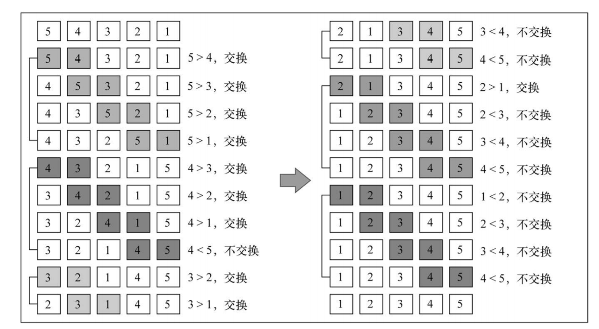
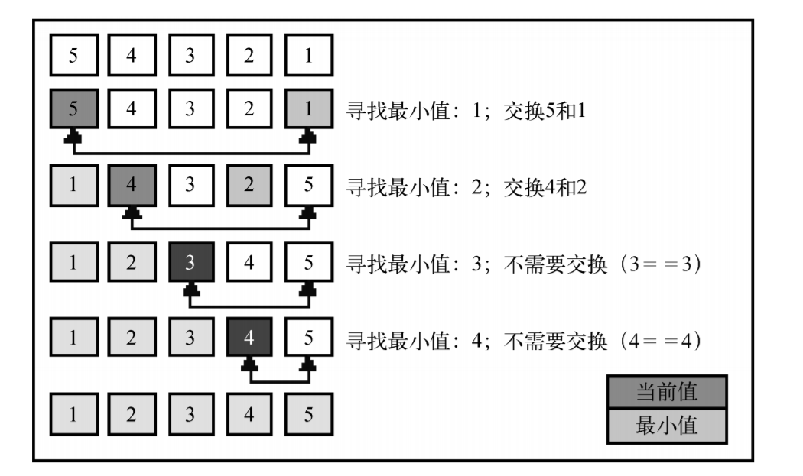
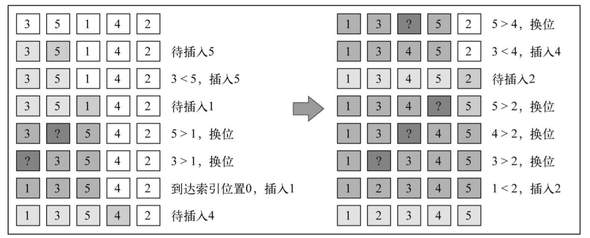
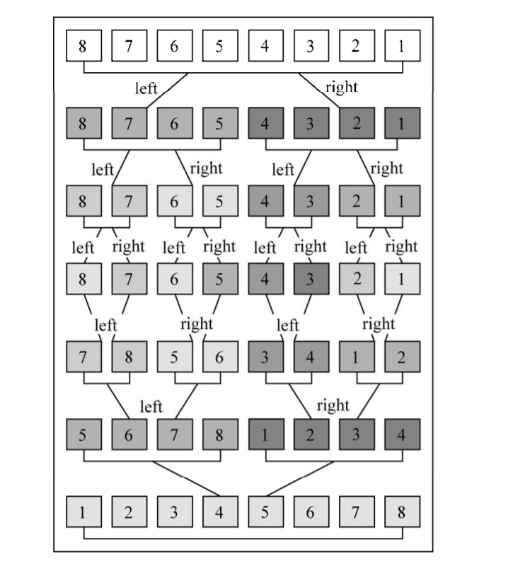

# 排序算法

## 冒泡排序

### 算法核心
**冒泡排序**算法中，`data`数组存储待排序的数据，如果数组中含有`n`个元素，需要进行`n`次循环遍历来确定排序后的数组上的`n`个位置上的元素，遍历一次确定一个位置。
每次遍历确定某个位置时候，从数组最开头开始遍历，对于升序排序，则把找出的最大的元素放到最后面，如果是降序排序，则把找出的最小的元素放到最后面。

因此一个完整冒泡排序需要两个循环，外层循环需要执行`n`次，用于确定排序后的数组的`n`个位置上的对应元素，内层循环用于找出本次循环的最小或最大的元素。



### 代码实现

```ts
import AbstractSort from "./AbstractSort";
import BaseSort from "./BaseSort";
import { mockArray } from "./utils/mock";
import { deepClone } from "./utils/copy";

class BubbleSort<T> extends BaseSort<T> implements AbstractSort<T> {
  protected data: T[]
  constructor(data: T[]) {
    super();
    this.data = data;
  }
  sort(ascend: boolean = false): T[] {
    const data = deepClone(this.data);
    return ascend ? this.ascendingSort(data) : this.descendingSort(data)
  }

  descendingSort(data: T[]): T[] {
    for (let i = 0; i < data.length; i++) {
      for (let j = 0; j < data.length - i - 1; j++) {
        if (data[j] < data[j + 1]) {
          [data[j + 1], data[j]] = [data[j], data[j + 1]]
        }
      }
    }
    return data
  }

  ascendingSort(data: T[]): T[] {
    for (let i = 0; i < data.length; i++) {
      for (let j = 0; j < data.length - i - 1; j++) {
        if (data[j] > data[j + 1]) {
          [data[j + 1], data[j]] = [data[j], data[j + 1]]
        }
      }
    }
    return data
  }
}
```

### 测试
通过统一编写一个测试函数来进行验证：

```ts
// utils/validate.ts

import AbstractSort from "../AbstractSort";
import { mockArray } from "./mock";
import { deepClone } from "./copy";

export function test<T>(
  Ctor: { new(T): AbstractSort<T> },
  {
    ascend
  }: {
    ascend?: boolean
  }
): any {
  const log = console.log;
  const numberSample = mockArray({ length: 10 });
  const objSample = deepClone(numberSample.map(num => ({ data: { value: num } })))
  const numberSorter = new Ctor(numberSample);
  log(`[=====[number sample]=====]`)
  log(`raw data: `, numberSample)
  log(`sorted data: `, numberSorter.sort({ ascend }))
  const objSorter = new Ctor(objSample);
  log(`[=====[object sample]=====]`)
  log(`raw data: `, objSample)
  log(`sorted data: `, objSorter.sort({ ascend, key: 'data.value' }))
}
```

只需要传入具体的类的构造器即可。

## 选择排序
### 算法核心
选择排序算法和冒泡排序算法有些类似，都是基于*排序后的数组中的位置*的遍历，即第`i`次循环，是要找到在排好序后的数组中，位列第`i`个位置的元素，而不是去看当前元素在整个数组中排第几。
（就是相当于是看当前这张椅子是谁坐的，而不是看某个人要坐哪张椅子）

算法也是通过两次遍历，外层遍历是遍历当前排到了第几个位置，用变量`minIndex`来标记，然后在内层循环中去找到属于这个位置的元素，放到这个位置上。

排序都是从最小的位置开始排，对于**升序排序**，最小的位置就是第一个索引，`minIndex`只需要从第一个位置一直循环变到最后一个位置即可
对于**降序排序**，最小位置则是最后一个索引位置，`minIndex`只需要从最后一个位置循环变到第一个位置即可。

和冒泡排序类似，已经确定了位置的元素就不需要再参与后面的排序了，所以内层循环的开始位置`j`初始值都是`minIndex`，只是在升序排序中，是判断`j++ < length`，在降序排序中，判断`--j >=0`



### 代码实现

```ts
import AbstractSort, { ISortParam } from "./AbstractSort";
import BaseSort from "./BaseSort";
import { deepClone } from "./utils/copy";
import { getValue } from "./utils/key";
import { test } from "./utils/validate";

class SelectionSort<T> extends BaseSort<T> implements AbstractSort<T> {
  protected data: T[]
  constructor(data: T[]) {
    super();
    this.data = data;
  }
  sort({ key, ascend }: ISortParam): T[] {
    const data = deepClone(this.data)
    return ascend ? this.ascendingSort(data, key) : this.descendingSort(data, key)
  }
  ascendingSort(data: T[], key?: string) {
    let i = -1;
    while (++i < data.length) {
      let minIndex = i;
      let j = minIndex;
      while (++j < data.length) {
        const [v1, v2] = key
          ? [getValue(data[minIndex], key), getValue(data[j], key)]
          : [data[minIndex], data[j]]
        if (v1 > v2) {
          this.swap(data, minIndex, j)
        }
      }
    }
    return data;
  }

  descendingSort(data: T[], key?: string) {
    let i = -1;
    while (++i < data.length) {
      let minIndex = data.length - 1 - i;
      let j = minIndex;
      while (--j >= 0) {
        const [v1, v2] = key
          ? [getValue(data[minIndex], key), getValue(data[j], key)]
          : [data[minIndex], data[j]]
        if (v1 > v2) {
          this.swap(data, minIndex, j)
        }
      }
    }
    return data;
  }
  swap(source: T[], index1: number, index2: number) {
    [source[index1], source[index2]] = [source[index2], source[index1]]
  }
}
```

## 插入排序

### 算法核心
插入排序算法的核心是，从数组第二个元素开始遍历（第一个认为是已经就是排过序的），每个元素的左边是前面已经排好序的序列，现在只需要把当前元素和前面的元素进行比较，找到当前元素应该放置的位置即可。

如果是升序排序，则当前待排序的元素的左边就是一个前面已经排好的升序序列，因此当前元素只要去和前面的排好序的序列元素进行比较，只要符合`current > prev`则意味着不再需要往前去比较了，这个位置就是当前元素的目标位置。

如果是降序排序，则当前待排元素的左边就是一个已经排好序的降序序列，因此只需要满足`current < prev`，则不需要再往前去比较了，这个位置就是当前元素的目标位置。

升序和降序分别需要考虑一下，当前元素就是最小、最大元素的情况。



### 代码实现

```ts
import BaseSort from "./BaseSort";
import AbstractSort, { ISortParam } from "./AbstractSort";
import { deepClone } from "./utils/copy";
import { getValue } from "./utils/key";
import { test } from "./utils/validate";

class InsertSort<T> extends BaseSort<T> implements AbstractSort<T> {
  protected data: T[]
  constructor(data: T[]) {
    super();
    this.data = data;
  }
  sort({ key, ascend }: ISortParam): T[] {
    const data = deepClone(this.data)
    return ascend ? this.ascendingSort(data, key) : this.descendingSort(data, key)
  }
  ascendingSort(data: T[], key?: string) {
    let i = -1;
    while (++i < data.length) {
      let j = i;
      const current = getValue(data[i], key)
      while (--j >= 0) {
        const prev = getValue(data[j], key)
        if (current > prev) {
          this.insert(data, j + 1, i)
          break
        }
        // 当前元素就是最小的元素
        if (j == 0) {
          this.insert(data, 0, i)
        }
      }
    }
    return data;
  }

  descendingSort(data: T[], key?: string) {
    let i = -1;
    while (++i < data.length) {
      let j = i;
      const current = getValue(data[i], key)
      while (--j >= 0) {
        const prev = getValue(data[j], key)
        if (current < prev) {
          this.insert(data, j + 1, i)
          break
        }
        // 当前元素就是最大的元素
        if (j === 0) {
          this.insert(data, 0, i)
        }
      }
    }
    return data;
  }

  insert(data: T[], targetIndex: number, currentIndex: number) {
    let i = currentIndex;
    const value = data[currentIndex];
    while (--i >= targetIndex) {
      data[i + 1] = data[i]
    }
    data[targetIndex] = value;
  }
}
```

插入排序，在已经排好序的序列中插入新的元素，需要涉及到元素的移位挪动，统一封装成一个`insert`方法

```ts
  insert(data: T[], targetIndex: number, currentIndex: number) {
    let i = currentIndex;
    const value = data[currentIndex];
    while (--i >= targetIndex) {
      data[i + 1] = data[i]
    }
    data[targetIndex] = value;
  }
```

## 归并排序

### 算法核心
归并排序的核心是**分治**，将待排序的数组切分成多个较小的数组，不断缩小每一个排序的小块的元素数量，直到每一个排序的分块都只有一个元素，然后再将小数组进行合并成一个大数组，得到一个合并后排序完成的数组。

对于数组的切分，采用递归的方式，不断向下递归，对数组进行切分，直到数组只含有一个元素，不能再切分为止。然后再向上合并，两个小块合并成一个有序的大块，一直往上合并直到得到最后的完整的排好序后的数组。



### 代码实现

```ts
import AbstractSort, { ISortParam } from "./AbstractSort";
import BaseSort from "./BaseSort";
import { deepClone } from "./utils/copy";
import { getValue } from "./utils/key";
import { test } from "./utils/validate";

class MergeSort<T> extends BaseSort<T> implements AbstractSort<T> {
  protected data: T[]
  constructor(data: T[]) {
    super();
    this.data = data;
  }
  sort({ key, ascend }: ISortParam): T[] {
    const data = deepClone(this.data);
    return this.mergeSort(data, { key, ascend })
  }

  mergeSort(data: T[], params: ISortParam): T[] {
    if (data.length === 1) return data;
    const bound = Math.floor(data.length / 2)
    const [left, right] = [data.slice(0, bound), data.slice(bound)]
    return this.merge(this.mergeSort(left, params), this.mergeSort(right, params), params)
  }

  merge(left: T[], right: T[], { key, ascend }: ISortParam): T[] {
    const result = []
    let i = 0, j = 0;
    while (i < left.length && j < right.length) {
      const [vleft, vright] = [getValue(left[i], key), getValue(right[j], key)]
      if (vleft > vright) {
        ascend ? result.push(right[j++]) : result.push(left[i++])
      } else {
        ascend ? result.push(left[i++]) : result.push(right[j++])
      }
    }
    while (i < left.length) {
      result.push(left[i++])
    }
    while (j < right.length) {
      result.push(right[j++])
    }
    return result;
  }
}
```