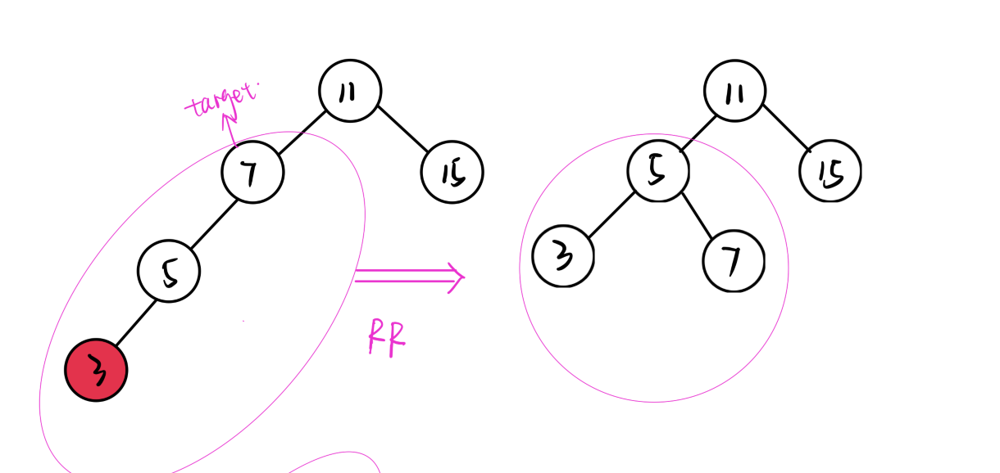
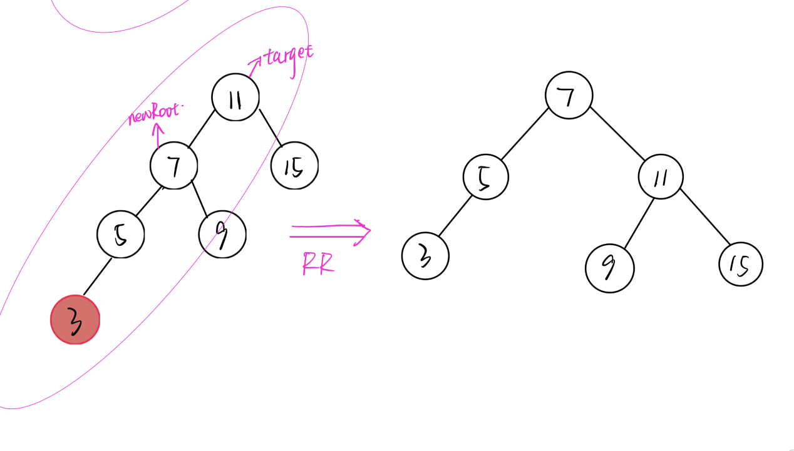
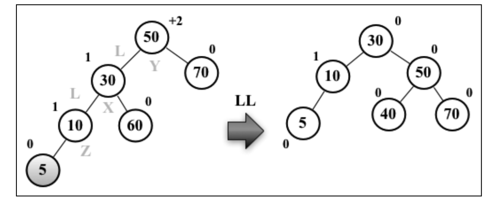
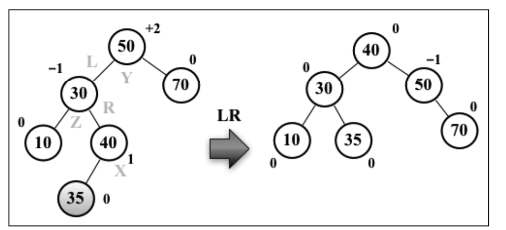
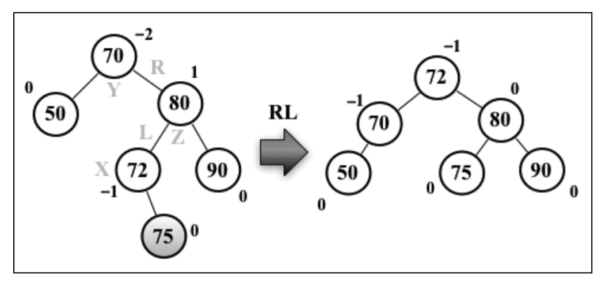

# AVL(Adelson-Velskii-Landi) 自平衡树

## 特点
AVL树是一种自平衡树。添加或移除节点时，AVL树会尝试自平衡。

**任意一个节点（不论深度）的左子树和右子树高度最多相差1。**

## 节点平衡

### 向左单旋(RR)

非根节点的平衡：




根节点平衡：



```ts
/**
 *  向左的单旋右子树。目标节点右子树高度比左子树高度高（超过1），高出部分在目标节点的右节点(R)的右子树(R)
 * @param target 要平衡的子树的根节点
 * @returns 返回平衡后的子树的根节点
 */
private RR(target: BinaryTreeNode<T>): BinaryTreeNode<T> {
  const newRoot = target.right;
  target.right = newRoot.left;
  newRoot.left = target;
  return newRoot;
}
```
目标节点（不平衡的节点）`target` 的右子树的高度比左子树的高度高出了超过1个节点，因此需要向左旋转目标节点的右子树

旋转时候，目标节点`target`的右节点（直接节点）`newRoot`，旋转到原本目标节点的位置上，目标节点则变成`newRoot` 的左节点，而`newRoot`的左节点则成为`target`的右节点

```ts
target.right = newRoot.left;
newRoot.left = target;
```

最后返回 `newRoot` ，作为旋转平衡后的子树的根节点

### 向右单旋(LL)



```ts
/**
 * 向右的单旋左子树。目标节点左子树高度比右子树高度高（超过1），且高出的部分在目标节点的左节点(L)的左侧子树(L)
 * @param target 要平衡的子树的根节点
 * @returns 返回平衡后的子树的根节点
 */
private LL(target: BinaryTreeNode<T>): BinaryTreeNode<T> {
  const newRoot = target.left;
  target.left = newRoot.right;
  newRoot.right = target;
  return newRoot;
}
```

目标节点`target`的左子树高度比右子树的高度高出了超过1个节点，需要向右旋转左子树。

旋转时候，目标节点`target`的左节点`newRoot`旋转到原本目标节点`target`的位置上，成为树的新的根节点，`target`成为`newRoot`的右节点，`newRoot`的右节点成为`target`的左节点
```ts
target.left = newRoot.right;
newRoot.right = target;
```

最后返回旋转平衡后的新的根节点`newRoot`，用来接到原本`target`的位置上

### 向右双旋(LR)



```ts
/**
 * 向右双旋目标节点的左子树。目标节点左子树高度高于右子树，且高出部分在目标节点左节点(L)的右子树(R)上
 * @param target 
 */
private LR(target: BinaryTreeNode<T>): BinaryTreeNode<T> {
  target.left = this.RR(target.left);
  const e = this.LL(target);
  return e;
}
```


### 向左双旋(RL)



```js

/**
 * 向左双旋目标节点的右子树。目标节点右子树高度高出左子树超过1，高出部分在目标节点右节点(R)的左子树(L)
 * @param target 
 */
private RL(target: BinaryTreeNode<T>): BinaryTreeNode<T> {
  target.right = this.LL(target.right);
  const e = this.RR(target);
  return e;
}
```

### 节点平衡统一封装

```ts
// height方法
/**
 * 获取一棵树的高度
 * @param root 树（子树）的根节点，为`null`时返回 -1
 */
private height(root: BinaryTreeNode<T>): number {
  if (!root) return -1;
  return Math.max(this.height(root.left), this.height(root.right)) + 1;
}
```

```ts
/**
 * 平衡子树，如果需要平衡，说明新插入的节点插入到了目标节点的子节点而不是目标节点上
 * @param target 要平衡的节点
 */
private balance(target: BinaryTreeNode<T>, element: BinaryTreeNode<T>, position?: IBalancePosition): BinaryTreeNode<T> {
  if (this.height(target.left) - this.height(target.right) > 1) {
    if (element.data < target.left.data) { //LL
      return this.LL(target)
    } else { // LR
      return this.LR(target)
    }
  } else if (this.height(target.right) - this.height(target.left) > 1) {
    if (element.data > target.right.data) { //RR
      return this.RR(target)
    } else { // RL
      return this.RL(target)
    }
  }
  return target;
}
```