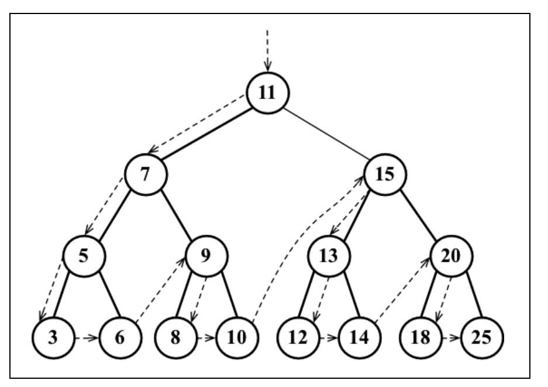
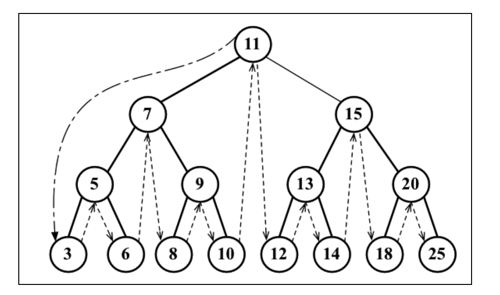
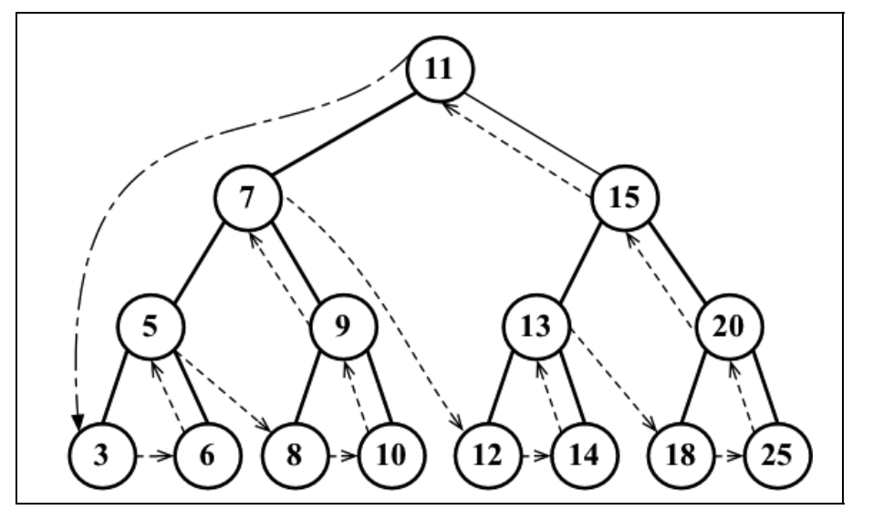
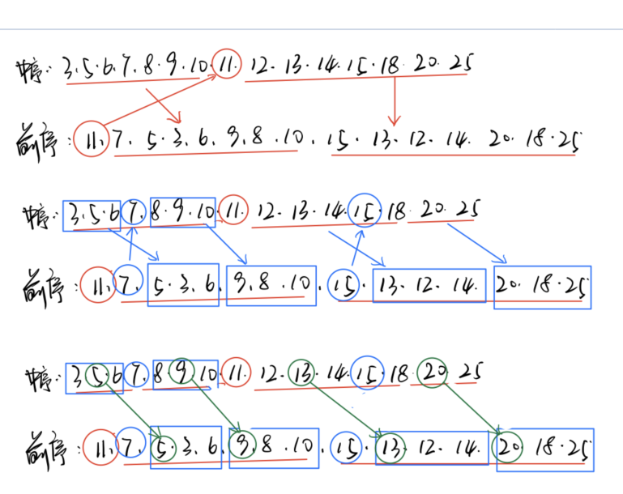

# Tree

## 遍历

### 前序遍历

#### 描述
前序遍历中，即遍历时，根节点在左孩子和右孩子前面被遍历。对于一个带有左节点和右节点的元素`element`，遍历的顺序是` element -> element.left -> element.right`



前序遍历输出序列中，第一个元素是整棵树的根节点。

#### 递归实现

递归实现前序遍历，只需要先遍历根节点，然后再对左子树做前序遍历，最后对右子树做前序遍历。

```ts
cb && cb(element);
this.preOrderTraverseElement(element.left, cb);
this.preOrderTraverseElement(element.right, cb);
```

具体代码实现如下：
```ts
import AbstractSearchTree from "../AbstractSearchTree";
import BinaryTreeNode from "./BinaryTreeNode";
import { TreeNodeCallBack } from "./interface";

export default class BinarySearchTree<T> implements AbstractSearchTree<T>{
  protected root: BinaryTreeNode<T> = null as any;
  protected readonly LEFT: number = -1;
  protected readonly RIGHT: number = 1;
  protected readonly NONE: number = 0;

  /**
   * 前序遍历，父节点 --> 左节点 --> 右节点
   * @param element 
   * @param cb 
   */
  private preOrderTraverseElement(element: BinaryTreeNode<T>, cb: TreeNodeCallBack<T>): void {
    if (element !== null && element !== undefined) {
      cb && cb(element);
      this.preOrderTraverseElement(element.left, cb);
      this.preOrderTraverseElement(element.right, cb);
    }
  }

  /**
   * 前序遍历
   * @param cb 遍历每个节点执行的回调函数
   */
  preOrderTraverse(cb?: TreeNodeCallBack<T>): void {
    cb = cb || (item => console.log(item && item.data));
    this.preOrderTraverseElement(this.root, cb);
  }
}

```

#### 非递归实现

前序遍历可以通过循环来实现非递归遍历。

通过一个*栈* 来存储等待访问的节点，每次取出栈顶元素遍历，然后依次把元素的右节点和左节点压入栈中。

循环遍历直到栈为空即可。

```ts
  /**
   * 前序遍历的非递归实现
   * @param element 
   * @param cb 
   */
  private preOrderTraverseByLoop(element: BinaryTreeNode<T>, cb?: TreeNodeCallBack<T>): void {
    const stack: BinaryTreeNode<T>[] = []
    element && stack.push(element)
    while (stack.length > 0) {
      const current = stack.pop()
      cb && cb(current)
      current && current.right && stack.push(current.right)
      current && current.left && stack.push(current.left)
    }
  }

```

### 中序遍历

#### 描述
中序遍历是根节点在左子树和右子树中间被遍历。 `element.left -> element -> element.right`



中序遍历结果中，第一个元素是整棵树最左边的节点。

输出序列中，树的根节点`root`左侧的所有节点都是在根节点的左子树。

#### 递归实现

递归实现中序遍历，只需要先对左子树进行中序遍历，再处理根节点，最后对右子树进行中序遍历即可。

```ts
  this.inOrderTraverseElement(element.left, cb);
  cb && cb(element);
  this.inOrderTraverseElement(element.right, cb);
```

具体代码如下：

```ts
import AbstractSearchTree from "../AbstractSearchTree";
import BinaryTreeNode from "./BinaryTreeNode";
import { TreeNodeCallBack } from "./interface";

export default class BinarySearchTree<T> implements AbstractSearchTree<T>{
  protected root: BinaryTreeNode<T> = null as any;
  protected readonly LEFT: number = -1;
  protected readonly RIGHT: number = 1;
  protected readonly NONE: number = 0;

  /**
   * 中序递归遍历, 左节点 --> 父节点 --> 右节点
   * @param element 
   * @param cb 
   */
  private inOrderTraverseElement(element: BinaryTreeNode<T>, cb: TreeNodeCallBack<T>): void {
    if (element !== null && element !== undefined) {
      this.inOrderTraverseElement(element.left, cb);
      cb && cb(element);
      this.inOrderTraverseElement(element.right, cb);
    }
  }

  /**
   * 中序遍历
   * @param cb 遍历每个节点执行的回调函数
   */
  inOrderTraverse(cb?: TreeNodeCallBack<T>): void {
    cb = cb || (item => console.log(item && item.data));
    this.inOrderTraverseElement(this.root, cb);
  }
}

```

#### 非递归实现
中序遍历通过循环来实现非递归遍历，也是通过一个*栈* 来存放等待遍历的节点。
中序遍历是先遍历左节点，再遍历根节点，最后遍历右节点。
因此先判断节点是否存在，存在的时候则将节点压入栈中等待遍历，然后先去遍历节点的左子树。

左子树遍历完后，再从栈中把根节点取出来，处理根节点。

根节点也处理完后，再去处理右子树。

```ts
  /**
   * 中序遍历的非递归实现
   * @param root 
   * @param cb 
   */
  private inOrderTraverseByLoop(root: BinaryTreeNode<T>, cb?: TreeNodeCallBack<T>): void {
    const stack: BinaryTreeNode<T>[] = []
    let element: BinaryTreeNode<T> = root;
    while (stack.length > 0 || (element !== null && element !== undefined)) {
      if (element) {
        stack.push(element)
        element = element.left;
      } else {
        element = stack.pop()
        cb && cb(element)
        element = element.right;
      }
    }
  }

```

### 后序遍历

#### 描述
后序遍历是根节点在左节点、右节点之后再遍历。`element.left -> element.right -> element`



后序遍历中，根节点为最后一个元素，结构为`LRD`

#### 递归实现
先后序遍历左子树，再后序遍历右子树，最后处理根节点。

```ts
  this.postOrderTraverseElement(element.left, cb);
  this.postOrderTraverseElement(element.right, cb);
  cb && cb(element);
```

具体实现：

```ts
import AbstractSearchTree from "../AbstractSearchTree";
import BinaryTreeNode from "./BinaryTreeNode";
import { TreeNodeCallBack } from "./interface";

export default class BinarySearchTree<T> implements AbstractSearchTree<T>{
  protected root: BinaryTreeNode<T> = null as any;
  protected readonly LEFT: number = -1;
  protected readonly RIGHT: number = 1;
  protected readonly NONE: number = 0;

  /**
   * 后序遍历，左节点 --> 右节点 --> 父节点
   * @param element 
   * @param cb 
   */
  private postOrderTraverseElement(element: BinaryTreeNode<T>, cb: TreeNodeCallBack<T>): void {
    if (element !== null && element !== undefined) {
      this.postOrderTraverseElement(element.left, cb);
      this.postOrderTraverseElement(element.right, cb);
      cb && cb(element);
    }
  }

  /**
   * 后序遍历
   * @param cb 遍历每个节点执行的回调函数
   */
  postOrderTraverse(cb?: TreeNodeCallBack<T>): void {
    cb = cb || (item => console.log(item && item.data));
    this.postOrderTraverseElement(this.root, cb);
  }
}

```

#### 非递归实现

```ts
  /**
   * 后序遍历非递归
   * @param root 
   * @param cb 
   */
  private postOrderTraverseByLoop(root: BinaryTreeNode<T>, cb?: TreeNodeCallBack<T>): void {
    const stack: BinaryTreeNode<T>[] = []
    const result: BinaryTreeNode<T>[] = []
    let element: BinaryTreeNode<T> = root;
    while (stack.length > 0 || (element !== null && element !== undefined)) {
      result.unshift(element)
      element && element.left && stack.push(element.left)
      element && element.right && stack.push(element.right)
      element = stack.pop()
    }
    result.forEach(item => cb && cb(item))
  }

```
### 给出两个遍历输出序列求树的结构

要从三个遍历序列中，给出两个来推导树的结构，则两个序列中一定要有一个是中序遍历的结果。

从序列来推导树的结构的过程，本质就是找出序列中那些元素是作为根节点的过程。

推导过程的关键在于中序遍历。中序遍历序列用于确定哪些元素是根节点，前序和后序序列用于确定哪些是左节点、右节点。

#### 步骤

- 从后序或前序序列中，可以马上得到树的根节点`root`
- 根据根节点`root`，将中序序列划分成两半，左子树和右子树部分
- 在前序或后序序列中，根据中序序列划分出的两半，把序列在后序、前序序列中也划分出两半，找出分界位置
- 对左子树、右子树分别进行前面的步骤（递归），找出所有根节点


#### 例子

